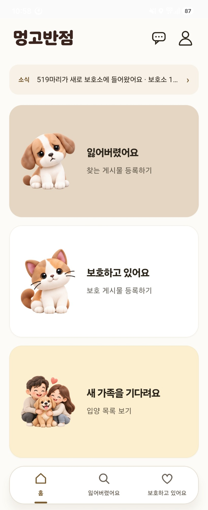
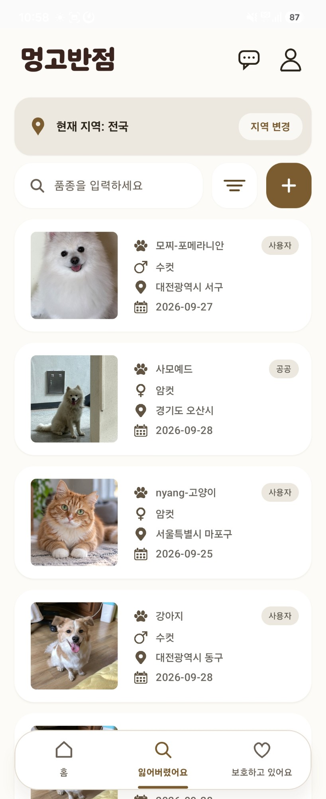
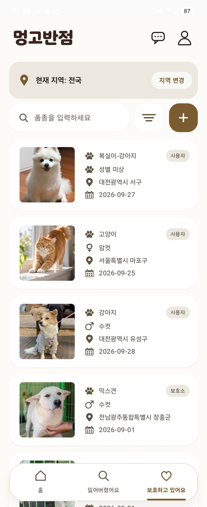
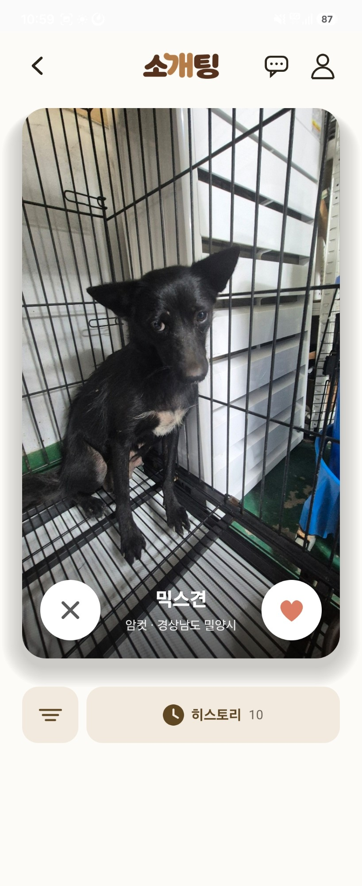
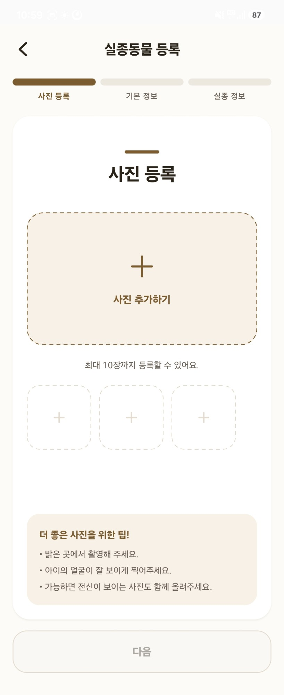
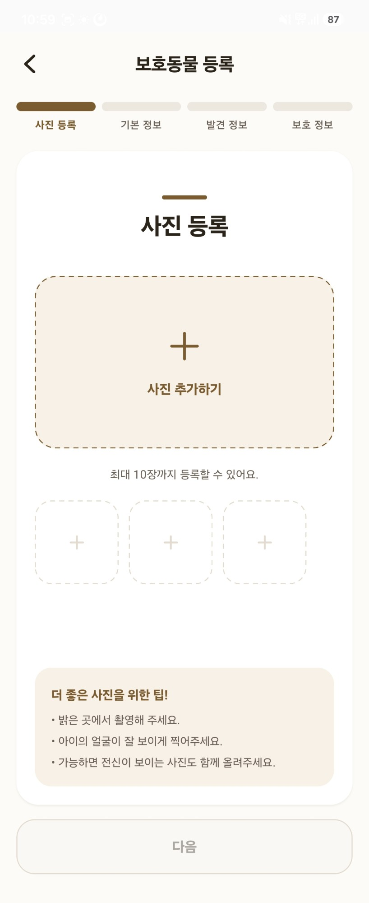
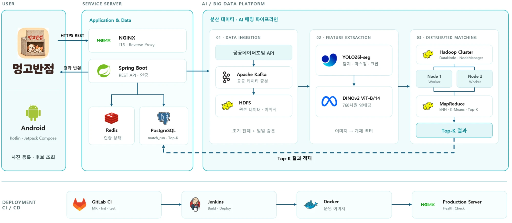

# 🐾 멍고반점 (meong-go-spot)

> **사진 한 장으로 잃어버린 가족을 찾습니다.**
> **Project Date:** 2026.08 ~ 2026.09 · **6인 팀 프로젝트**
> **Platform:** Android 앱 (Kotlin + Jetpack Compose) · Spring Boot API · Hadoop 2노드 클러스터

잃어버린 반려동물의 사진을 **전국 보호소 입소 동물(공공 데이터, 매일 갱신)** 과 AI 임베딩 유사도로 대조해, **45만 장이 넘는 보호소 사진 중에서 닮은 후보를 최대 20마리** 찾아주는 유기동물 라이프사이클(실종 → 구조 → 보호 → 입양/반환) 플랫폼입니다.

AI(YOLO26 + DINOv2)는 사진을 벡터로 바꾸는 **입력 생성 도구**이고, 수십만 벡터를 실제로 연결하는 **매칭 본체는 빅데이터 분산 처리**(Kafka · HDFS · MapReduce 5종)입니다.

---

## 📱 실제 화면

| 홈 | 잃어버렸어요 | 보호하고 있어요 |
|:---:|:---:|:---:|
|  |  |  |
| 일일 신규 입소 소식과 세 가지 진입점 | 사용자·공공 분실 신고를 지역·품종으로 탐색 | 사용자 보호 게시물과 보호소 입소 동물 |

| 새 가족을 기다려요 (소개팅) | 실종동물 등록 | 보호동물 등록 |
|:---:|:---:|:---:|
|  |  |  |
| 보호소 동물을 한 장씩 넘기며 입양 후보 찾기 | 사진 → 기본 정보 → 실종 정보 3단계 | 사진 → 기본 → 발견 → 보호 정보 4단계 |

---

## 📖 프로젝트 개요

국가는 분실 신고와 보호소 입소 데이터를 **양쪽 다** 모으고 있지만, 둘을 잇는 일은 사람이 게시판을 뒤지는 우연에 맡겨져 있습니다. (국가 시스템의 분실 신고 게시판은 전국 누적 111건 — 사실상 미사용)
멍고반점은 그 공백을 **국내 공공데이터 + 이미지 임베딩 + 분산 처리**로 채웁니다.

* **사전 등록 없이** — 이미 잃어버린 뒤에 와도 과거 입소분까지 소급 검색
* **태그 일치가 아닌 임베딩 유사도 랭킹** — "갈색 푸들"과 "적갈색 믹스"처럼 표기가 달라도 만나게 함
* **시공간 좁히기** — 같은 축종·실종일 이후 입소·같은 지역으로 후보를 먼저 줄이고 그 안에서 순위 매김

### 💡 주요 기능

| 기능 | 설명 |
|---|---|
| 🔍 **실종 동물 후보 찾기** | 본인 실종 게시물에서 분석을 요청하면 사용자 보호 게시물 + 공공 보호소 동물 중 닮은 후보 최대 20마리를 비동기로 제시 |
| 📰 **일일 입소 요약** | 매일 22:30 증분 적재가 성공하면 신규 보호동물 수·보호소 수를 FCM 푸시와 홈 소식으로 안내 |
| 💞 **입양 소개팅** | 보호소 동물을 카드로 넘기며 좋아요/넘김, 넘긴 동물은 서버에 기록해 다시 나오지 않게 하고 히스토리로 되돌아보기 |
| 📝 **실종·보호 게시물** | 사진 1~10장 업로드(서버에서 형식 검증·EXIF 제거·정규화 후 HDFS 저장), 정확한 위치는 기본 비공개 |
| 💬 **1:1 채팅** | 게시물 기반 대화, 메시지와 알림 Outbox를 한 트랜잭션에 저장해 푸시 장애가 메시지를 잃지 않게 함 |

---

## 🏗️ 아키텍처 — 람다(Lambda)

매칭은 쌍(pair) 단위 연산이라 계산량이 n²입니다. 보호소 사진 45만 장 × 768차원을 단일 DB 쿼리에 맡기지 않고, **배치(MapReduce)로 검색 자산을 사전 계산**하고 **상주 매칭 엔진이 요청마다 좁혀진 후보만 비교**하는 구조로 나눴습니다.

<p align="center">
  
</p>

**요청 흐름 (분석 버튼 → 후보 20마리)**

1. 앱이 분석을 요청하면 API는 `match_run(PENDING)`만 기록하고 **즉시 202** 반환 (무거운 계산을 기다리지 않음)
2. 매칭 worker가 `FOR UPDATE SKIP LOCKED`로 작업을 선점해 상주 엔진에 전달
3. 엔진은 질의 사진을 임베딩하고, **축종·실종일 이후·지역으로 좁힌 후보**와 코사인 유사도를 계산
4. 사진 쌍 점수의 최댓값으로 동물 점수를 내고, 임계값 0.60 이상 상위 20마리를 `matchRunId` 단위로 멱등 적재
5. 앱은 서버가 권장한 간격으로 상태를 조회해 결과를 표시

> YARN 잡 하나의 기동 오버헤드만 ~15초라, 버튼 요청마다 MapReduce 잡을 띄우지 않고 **배치가 만든 자산을 상주 서비스가 쓰는** 구조로 결정했습니다.

---

## 🧮 MapReduce 알고리즘 5종

모든 알고리즘을 "정답을 아는 입력" 또는 "로컬 독립 재계산"과 대조해 YARN 2노드에서 채점했습니다.

| 알고리즘 | 역할 | 검증 결과 |
|---|---|---|
| **K-Means** (k-means++) | 벡터 공간 클러스터 색인 — 후보 공간 축소(블로킹) | 실임베딩 **452,486 × 768**, k=256을 25분에 색인. 후보를 최근접 16클러스터(7%)로 줄여도 **recall@20 0.649 → 0.648** (손실 0.001) |
| **kNN 조인** | 클러스터 안에서 신고 × 동물 Top-K | 노이즈 질의 200건 **Top-1 적중 1.00** |
| **행렬곱** | 정규화 벡터 블록 행렬곱 = 코사인 유사도 전량 계산 | 13만 쌍 중 표본 13,076쌍 로컬 재계산과 **불일치 0** (1e-6) |
| **쎄타조인** | 품종·지역 등가 + 날짜 비등가(θ) 시공간 조인 | 실수집 6,807건 × 신고 300 → 52,433쌍, **누락 0 · 초과 0** |
| **자카드 셀프조인** | 속성 태그 유사 쌍 (개체 재식별 기반) | 191만 쌍(≥0.6), 표본 대조 **불일치 0** |

---

## 📊 데이터 규모와 실측

| 단계 | 결과 |
|---|---|
| **공고 역사 백필** | 2008-01 ~ 2026-09, 225개월 **1,634,699건** 적재 (API 집계 대비 오차 0.015%) |
| **이미지 백필** | 2024-01 ~ 2026-09, 33개월 **452,471장 / 128.9GB** HDFS 적재 (결손 3.0%) |
| **벌크 임베딩** | GPU(L40S)로 45만 장 약 7시간, 지속 **20장/초** — CPU(0.9장/초) 대비 22배 |
| **임베딩 품질** | 같은 개체 사진 쌍 2만 건, 갤러리 45만 장 기준 **recall@1 0.517 · recall@20 0.649 · MRR 0.553** |
| **후보 좁히기 효과** | 같은 정답쌍에서 전국 25만 개체 recall@1 **0.51** → 같은 축종 100마리 풀 **0.81** |
| **분산 스케일아웃** | 합성 200만 × 128차원 K-Means: 1노드 390초 → 2노드 **247초 (1.58×, 효율 79%)**, 데이터 지역성 19/19 |

---

## 🛠️ 기술 스택

| 영역 | 스택 |
|---|---|
| **클라이언트** |   |
| **백엔드** |      |
| **빅데이터** |    |
| **AI** |  YOLO26l-seg (개·고양이 탐지·마스킹·크롭) + DINOv2 ViT-B/14 (frozen, 768차원) |
| **인프라** |     |
| **협업** | GitLab MR 게이트(lint + test) · Gemini AI 코드 리뷰 · lefthook + commitlint · Jira |

---

## 💥 트러블 슈팅

### 1. 모델보다 전처리 일관성이 병목이었다
* **현상:** 임베딩 평가에서 전체 recall@1은 0.517인데, 두 사진 중 **한쪽만 탐지에 실패해 원본 전체를 임베딩한(폴백) 쌍은 0.18**로 무너짐.
* **원인:** YOLO 크롭 사진과 배경이 포함된 원본 사진은 같은 개체여도 벡터 공간에서 멀어짐. 폴백 비율은 12.1%.
* **해결:** 모델을 키우기 전에 전처리 규칙(가중치 + 전처리)을 `model.yaml` 버전 계약으로 고정하고, 다른 버전의 벡터는 섞지 않도록 모든 단계에서 모델 ID·버전을 검증. 사진 여러 장의 점수 집계는 평균이 아닌 **쌍 코사인 최댓값**이 폴백에 가장 강하다는 것을 실측해 확정.

### 2. 벡터 검색보다 후보 좁히기가 품질을 먼저 결정했다
* **현상:** 같은 정답쌍으로 재도 전국 25만 개체에서 찾으면 recall@1 0.51, 같은 축종 100마리 안에서 찾으면 0.81.
* **해결:** 매칭 엔진이 벡터 비교 **전에** 보호중·축종·실종일 이후 입소·지역 코드로 후보를 수백 마리로 좁히도록 설계. 좁혀진 후보는 전량 비교해도 밀리초 단위라, 요청 경로에서는 색인 없이 정확 탐색을 쓰고 K-Means 색인은 대규모 배치 경로에 사용.

### 3. Combiner는 최적화가 아니라 생존 조건이었다
* **현상:** 200만 벡터 K-Means에서 Combiner를 끄면 셔플이 4.3MB → **2,455MB(571배)** 로 불어나 기본 리듀서(1GB)가 `OutOfMemoryError`로 실패. 리듀서를 3GB로 늘려야 겨우 통과(+19%).
* **해결:** 맵 쪽에서 "합·건수만 전달"하는 Combiner로 200만 레코드를 1,850개로 접음. 평균의 평균은 오답이므로 이 불변식을 코드 리뷰 규칙으로 명시.

### 4. 차원이 다른 벡터가 "그럴듯한 값"을 내던 문제
* **현상:** 거리 계산이 짧은 쪽 길이만큼만 돌아 384차원 벡터와 768차원 중심 사이에서 오류 없이 엉뚱한 거리를 반환.
* **해결:** 벡터 차원을 상수로 두지 않고 임베딩 메타데이터(`_meta.json`)에서 읽어 잡 설정에 심고, 매퍼가 모든 입력 벡터를 그 차원으로 검증해 섞이면 첫 줄에서 즉시 실패하도록 변경. 조용한 쓰레기 값을 가장 위험한 실패로 취급.

### 5. DB 컨테이너 재생성 후 매칭이 조용히 실패
* **현상:** PostgreSQL 컨테이너를 다시 만든 뒤 상주 매칭 엔진이 끊어진 연결을 계속 써서 분석 요청이 전부 실패.
* **해결:** `OperationalError`·`InterfaceError`에서 새로 연결해 한 번 재시도하도록 수정하고, `/health`에 스냅샷 상태를 노출해 이상을 바로 확인할 수 있게 함.

### 6. 공공 API의 `totalCount`를 믿을 수 없었다
* **현상:** 분실동물 API가 303건이라 응답했지만 실제 페이지는 163건. 구조동물 백필에서도 월별 집계가 호출 시점마다 조금씩 달라짐.
* **해결:** 빈 페이지가 나올 때까지 순회하도록 수집기를 바꾸고, 월별 집계 대비 허용 오차를 두어 225개월 전량을 대조표와 함께 적재.

---

## 📂 디렉터리 구조

```text
meong-go-spot/
├── android/          # Android 앱 — Kotlin + Jetpack Compose
├── backend/          # Spring Boot API — 게시물·분석·채팅·사진·인증 (Flyway 마이그레이션)
├── ai/               # 임베딩 파이프라인 — YOLO26l-seg 크롭 + DINOv2, 성능·부하 측정 도구
├── data/
│   ├── collector/    # 공공 API 수집기 — 백필·일일 증분·이미지 적재
│   ├── airflow/      # 일일 수집 DAG · 클러스터 상태 감시
│   ├── embedding/    # HDFS 벌크·증분 임베딩 러너 (CPU / GPU)
│   ├── mapreduce/    # MapReduce 5종 (Java 17) + 입력 생성·채점 도구
│   ├── match_engine/ # 상주 매칭 엔진 — 후보 좁히기·점수·Top-20
│   ├── matching_worker/  # match_run 선점·멱등 적재 worker
│   ├── eval/         # recall@K 평가 하네스 · 표준 데이터셋
│   └── experiments/  # 실측 기록 (백필·임베딩·K-Means·점수 집계 등)
├── infra/            # nginx · systemd 유닛 · 운영 스크립트
└── docs/             # 아키텍처 · API 명세 · ERD · 정책 · 결정 기록(ADR)
```

---

## 🚀 실행 방법

**요구 사항:** Node.js 24+ · JDK 21 · Docker (백엔드 테스트의 PostgreSQL 컨테이너용) · Android Studio (앱)

```bash
npm run setup          # 의존성 설치 + Git 훅 등록 (클론 직후 1회)
npm run check          # Android + 백엔드 lint·test
npm run check:data     # data/ Python 단위 테스트
npm run dev:be         # 백엔드 개발 서버 :8080 (로컬 PostgreSQL 필요)
npm run build:android  # Android 디버그 APK
```

MapReduce 모듈은 별도 Gradle 프로젝트입니다: `cd data/mapreduce && ./gradlew test jar`

---

## 📚 문서

| 문서 | 내용 |
|---|---|
| [architecture.md](docs/architecture.md) | 시스템 구조도 · 컴포넌트 책임 · NFR |
| [data-ai-interface.md](docs/data-ai-interface.md) | 임베딩 저장 계약 · 후보 출력 정책 |
| [api-spec.md](docs/api-spec.md) · [erd.md](docs/erd.md) | REST API 명세 · DB 스키마 |
| [ai-load-test-report.md](docs/ai-load-test-report.md) | AI 파이프라인 구간별 성능·부하 측정 |
| [data/experiments/](data/experiments/) | 백필 · 임베딩 · K-Means · 점수 집계 실측 기록 |
| [ADR-002](docs/adr/ADR-002-제품-스택-결정기록.md) | 제품 스택 결정 근거 |

## 데이터 출처

- [구조동물 조회 API](https://www.data.go.kr/data/15098931/openapi.do) (농림축산검역본부) — 전국 보호소 입소 동물, 매일 갱신
- 분실동물 조회 API (국가동물보호정보시스템) · 원천: [animal.go.kr](https://www.animal.go.kr)
