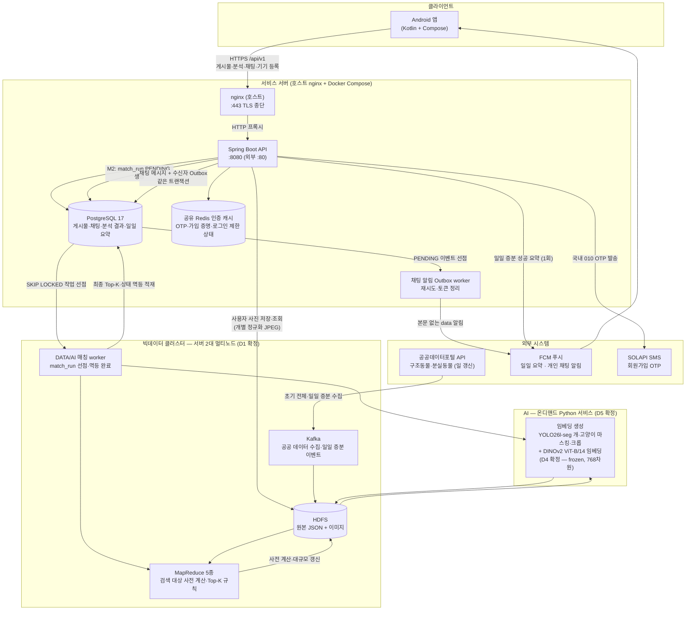

# 시스템 아키텍처

> 상태: **MVP 개발 기준 확정** — 수치 임계값처럼 명시된 DATA·AI 미결 항목은 담당 문서에서 별도로 관리한다.
> 데이터 파이프라인 관점의 요약은 [루트 README](../README.md)의 람다 아키텍처 절 참조.

## 시스템 구조도 — 컴포넌트와 연동

## 컴포넌트 책임

MVP에서는 사용자 `잃어버렸어요`를 기준으로 사용자·공공 `보호하고 있어요` 후보를 찾는 단방향
온디맨드 분석만 제공한다. 등록·수정, 보호센터 초기·일일 적재와 스케줄은 후보 분석을 자동
실행하지 않는다. 본인 활성 `잃어버렸어요` 게시물 상세의 버튼 요청에서만 `match_run`을 만들고
DATA/AI worker가 MapReduce 소유 규칙으로 최종 Top-K를 결정한다. 사용자 후보는 활성·매칭 가능
건만 노출하고, 공공 후보는 과거 입소분 소급 검색을 위해 검색 대상으로 유지된 경우 현재 상태와
함께 노출한다. FCM은 일일 신규 입소 요약과 개인 채팅의 본문 없는 새 메시지 알림에 사용한다.
신규 입소 감시 기반 개별 후보 알림과 `보호하고 있어요 → 잃어버렸어요` 역방향 매칭은 P1 범위다.

| 컴포넌트 | 책임 | 상태 |
|---|---|---|
| Android 앱 | MVP: 분실·보호 게시물과 후보 조회. 본인 활성 `잃어버렸어요` 상세의 버튼으로 분석을 요청하고 서버 권장 간격으로 상태를 조회한다. 채팅 목록 안 읽음 수, `afterMessageId` REST 증분 조회, 명시적 읽음 갱신과 개인 채팅 FCM data 알림을 처리하며 일일 요약도 수신·조회한다. | 스캐폴드 구축됨 |
| Spring Boot API | 게시물·채팅 REST API(`/api/v1`), 참여자별 읽음 위치·인증 세션 푸시 등록·채팅 알림 Outbox, 사용자 사진 검증·정규화와 HDFS 저장·조회, `match_run(PENDING)` 생성·상태·결과 조회와 일일 요약 조회·FCM 발송을 조정한다. 무거운 유사도 계산이나 Top-K 결정은 하지 않는다. | 공통 설정 구축됨, 도메인 기능 미구현 |
| PostgreSQL | 서비스 게시물·채팅 데이터와 참여자별 읽음 위치, `auth_session`의 개인 푸시 보호값·채팅 알림 Outbox, 내구성 있는 `match_run` 작업 큐, DATA/AI가 적재한 분석 결과와 일일 증분 요약·발송 이력. Flyway만 스키마를 변경하고 Hibernate는 `validate`만 수행한다. | 개발 환경·Flyway V1 13개 테이블 구축됨, 도메인 엔티티·API 미구현 |
| 공유 Redis 인증 캐시 | 전화번호 HMAC, 전용 키 OTP HMAC, 불투명 `pv1` 가입 증명의 selector·secret hash·상태와 로그인 실패 제한을 TTL로 유지한다. 인증·내부 네트워크·`noeviction`을 적용하고 장애 시 인증 기능은 fail-closed한다. 전화번호·로그인 ID·IP·OTP·증명 원문은 저장·기록하지 않는다. | MVP, 미구축 |
| Kafka | 공공 API 초기·일일 증분 수집 이벤트 스트림. 사용자별 후보 분석이나 개별 후보 알림을 자동으로 시작하지 않는다. | **구축됨** (2026-08-31, [bigdata-cluster.md](bigdata-cluster.md)) |
| HDFS | 공공 원본 JSON·TAR 이미지 누적 저장(2008~ 벌크 + 일 증분), 사용자 게시물의 개별 정규화 JPEG, 임베딩 행렬. 사용자 사진은 `/data/user/images/{postId}/{photoId}.jpg`에 복제 2로 저장한다. | **클러스터 구축됨** — 2노드·복제 2 검증, 사용자 사진 연동 미구현 |
| MapReduce 5종 | 매칭 본체. 버튼 요청의 검색 대상에 대해 최종 후보·Top-K를 결정하고, 사전 계산과 일일 증분 집계를 수행한다. | 클러스터 구축됨 — **알고리즘 구현 대기** (D3) |
| DATA/AI 매칭 worker | PostgreSQL PENDING 실행을 `FOR UPDATE SKIP LOCKED`로 선점하고 준비된 임베딩·색인과 MapReduce 소유 규칙으로 후보를 계산한다. `matchRunId` 단위로 결과를 멱등 적재하고 5분 초과 RUNNING을 실패로 회수한다. M2마다 새 YARN 잡을 기동하지 않는다. | MVP, 미구축 |
| 임베딩 서비스 (Python) | YOLO26l-seg로 개·고양이 개체 탐지·마스킹·크롭 후 DINOv2 ViT-B/14(frozen)로 768차원 임베딩 생성, 속성 태그 추출 및 사전 준비. 임베딩 준비만으로 최종 후보를 결정하거나 FCM을 발송하지 않는다. | 서비스 미구축 (YOLO26l-seg·DINOv2 ViT-B/14 가중치는 서버 2 적재 완료) |
| FCM | 일일 보호센터 증분 적재 요약은 `daily-intake-summary` 토픽으로 발송한다. 개인 채팅은 수신자의 활성 `auth_session.push_*` 등록에 `type`, `chatRoomId`, `messageId`, `postId`만 담은 data 메시지를 발송하며 전달 성공을 메시지 저장·읽음의 근거로 사용하지 않는다. | MVP, 미구축 (D7·D10) |
| SOLAPI SMS | 사전 등록 발신번호로 국내 `010` 회원가입 OTP를 발송한다. 로컬·테스트는 외부 발송 없는 Fake 공급자를 사용한다. | MVP, 미구축 |

**경계 원칙**: API 서버는 유사도 계산이나 Top-K 결정을 하지 않는다. API는 버튼 요청을
`match_run(PENDING)`으로 내구성 있게 기록하고 상태·결과만 제공한다. DATA/AI worker가 작업을
선점하고 임베딩 서비스와 MapReduce가 소유한 계산 규칙을 사용해 결과를 적재한다. 일일 증분
수집은 분석을 자동 실행하지 않으며, 성공 집계만 API를 통해 FCM·앱 내 요약으로 제공한다.
채팅의 권한·저장·읽음·조회는 Spring Boot API와 PostgreSQL이 담당한다. 메시지와 개인 알림
Outbox는 같은 트랜잭션에 저장하고 발송 worker가 나중에 FCM을 호출한다. 따라서 FCM 장애나
클라이언트 연결 단절은 메시지 commit을 되돌리지 않으며 C2·C3 DB 조회가 최종 복구 경로다.

## 비기능 요구사항 (NFR) 검토

> 아래 수치는 첫 구현의 SLO다. 실제 부하 시험 결과로 갱신하되 동기 응답 SLA로 오해하지 않는다.

### 성능

| 항목 | 목표(안) | 근거·측정 방법 |
|---|---|---|
| M2 접수 | p95 < 500ms | DB에 `match_run(PENDING)`을 기록하고 계산 완료를 기다리지 않고 202 반환 |
| 최종 Top-K | 1~3장 p95 ≤ 10초, 10장 p95 ≤ 30초, hard timeout 60초 | 현행 v2 실측과 비동기 worker 전제의 초기 SLO. M1 폴링으로 완료 확인 |
| 매칭 품질 | **Recall@20 ≥ 80%** (평가 조건 확정 필요) | 실제 반환 여부가 확인된 평가셋으로 측정·기록 |
| 데이터 적재 주기 | 최초 1회 전체 적재 후 매일 22:30 KST 증분 적재 | at-least-once·멱등 재실행, 다음날 증분 꼬리 흡수. BACKFILL 제외 후 최신 실행 RUNNING, 최신 종료 실패 FAILED, 성공 이력 없음 NEVER_SYNCED, 마지막 성공 36시간 초과 DELAYED, 그 외 SUCCEEDED |
| API 응답 | 분석 상태·완료 결과 조회 p95 < 500ms | 무거운 계산은 MapReduce가 수행하고 API는 상태·적재 결과를 조회 |
| 채팅 조회·갱신 | 목록·메시지·읽음 갱신 p95 < 500ms, 대화 화면에서 약 3초 간격 증분 조회 | `(chat_room_id, id)` 인덱스와 `afterMessageId`로 새 메시지만 조회한다. 읽음 위치는 `chat_room`에서 단조 증가하며 WebSocket·SSE는 MVP 제외 |
| 개인 채팅 푸시 | 메시지 commit 이후 비동기 at-least-once 발송, DB 조회로 누락 복구 | Outbox의 메시지당 유일 제약으로 이벤트 중복 생성을 막고 재시도한다. 앱은 `messageId`로 중복 수신을 흡수하며 푸시 실패는 메시지 commit에 영향 없음 |
| 일일 입소 요약 푸시 | 일일 증분 적재 성공 후 하루 1회 | 알림을 허용하고 `daily-intake-summary` 토픽을 구독한 기기에 발송하고, 앱 내 동일 요약으로 누락을 보완 |

### 보안·개인정보

| 항목 | 정책(안) |
|---|---|
| 회원 식별·연락 | 회원가입은 현재 `privacy-collection-v1` 고지 동의와 휴대전화 인증을 요구한다. 번호당 활성 계정은 하나이며 A5 탈퇴 즉시 모든 세션·공개를 차단하고 30일 개인정보 파기 커밋 뒤 번호 재가입을 허용한다. 번호는 AES-256-GCM 암호문·조회 HMAC으로 저장하고 회원 간에는 닉네임과 1:1 채팅만 제공한다. |
| 푸시 식별자 | 일일 요약은 FCM 토픽 `daily-intake-summary`로 분리한다. 개인 채팅은 설치 UUID별 기기 토큰을 현재 `auth_session`의 `push_*` 컬럼에 등록한다. 토큰은 AES-256-GCM 암호문과 전용 HMAC 조회값으로 저장하고 로그·오류·metric label·trace에 남기지 않는다. 계정 전환은 현재 세션으로 원자적으로 재귀속한다. worker는 활성 회원의 미폐기·미만료 세션 등록만 사용하며 로그아웃·탈퇴·영구 FCM 오류에서 제외·정리한다. |
| 채팅 접근 | 대화 참여자만 메시지를 조회·전송하고 자신의 읽음 위치만 갱신할 수 있다. 메시지 내용과 개인 푸시 식별자는 애플리케이션 로그에 남기지 않는다. 게시물이 종료·삭제되면 신규 전송만 막고 기존 대화 조회·읽음 갱신은 유지한다. |
| 오류 응답 | 내부 예외·스택 미노출 (구축됨 — GlobalExceptionHandler) |
| 비밀값 | `.env`/credential 주입, 저장소 커밋 금지 (구축됨) |
| 인증 | `잃어버렸어요`·`보호하고 있어요` 게시물 목록·상세와 출처 배지는 비로그인 허용 (2026-09-21 QA로 상세 공개 전환). 후보 조회, 등록·수정·종료, 채팅과 정확한 위치 확인은 로그인 필수. 유저 플로우는 [product/user-flow.md](product/user-flow.md) 참조 |
| 비밀번호 | A1·A2 body는 8,192바이트, loginId·password는 NFC 전 각각 256 코드 포인트로 먼저 제한한다. 비밀번호는 NFC 정규화 후 8~64자이며 공백·제어·형식 문자를 금지하고 문자 종류 조합은 강제하지 않는다. 고정 commit·checksum의 로컬 취약 목록을 검사하고 `{argon2id-v1}` Argon2id(64 MiB, 3회, 병렬도 4, salt 16바이트, hash 32바이트)로만 저장한다. A1 인코딩·A2 실제/dummy 비교·재인코딩은 같은 공용 실행권으로 최대 4개만 동시에 실행하고 계정·IP 실패 제한은 공유 Redis에서 원자 처리하며 영구 잠금하지 않는다. 상세 기준은 [비밀번호 정책](password-policy.md)을 따른다. |
| 인증 토큰 | access token은 15분 `RS256` JWT이고 모든 보호 API에서 `sid`의 `auth_session` 상태를 확인해 로그아웃·탈퇴를 즉시 반영한다. A4만 같은 세션의 멱등 로그아웃 재시도를 허용한다. refresh token은 로그인부터 30일 고정 유효한 회전형 불투명 토큰을 사용한다. refresh secret은 DB에 SHA-256만 저장하고 selector로 회전 관계를 유지해 이전 token 재사용 시 해당 세션을 폐기한다. Android 저장, JWT 검증과 Jenkins Secret file 기반 키 교체는 [인증 토큰 정책](auth-token-policy.md)을 따른다. |
| 사진 | P3·P5는 JPEG·PNG 1~10장을 장당 10 MiB·요청 전체 50 MiB로 제한하고 실제 형식·해상도를 서버에서 검증한다. 사용자 원본은 방향 보정·메타데이터 제거·sRGB JPEG로 정규화해 HDFS에 저장하며 내부 경로를 응답하지 않는다. 교체·종료·삭제와 접근 제어는 [사진 업로드·저장소 정책](photo-upload-policy.md)을 따른다. |
| 게시물 날짜·위치 | 사용자 `eventDate`는 서버의 `Asia/Seoul` 기준 오늘까지 허용한다. 정확한 위치는 위치별 기본 비공개이고 `exact-location-v1` 안내 확인 뒤 다른 회원에게는 활성 사용자 게시물의 로그인 상세에서만 공개할 수 있다. 작성자 관리용 상세는 자신의 저장 위치와 공개 상태를 복원하며 좌표는 항상 숨긴다. 상세 기준은 [게시물 날짜·정확한 위치 공개 정책](post-date-location-policy.md)을 따른다. |
| 암호화·운영 | 전화번호·정확한 위치·개인 FCM 토큰은 목적별 AES-256-GCM 키, 조회·OTP·제한·FCM 토큰 조회는 목적별 HMAC 키를 사용한다. Redis fail-closed, 최소 권한 DB 역할, 구조화 로그 redaction, readiness, 백업·복구와 정리 작업 경보는 [백엔드 보안·운영 정책](backend-security-operations-policy.md)을 따른다. |

### 확장성·가용성

| 항목 | 검토 |
|---|---|
| 데이터 증가 | 누적 수백만 건 전제 — K-Means 블로킹으로 n² 후보 공간 축소가 설계에 포함됨 |
| 계산 확장 | MapReduce 수평 확장 구조. 단, 실제 노드 수는 D1 결정에 종속 |
| 가용성 | 6주 학생 프로젝트 수준: 단일 서버 + 롤백 경로(이미지 태그)로 충분 — HA는 명시적 비목표 |
| 장애 격리 | 배치 실패가 서비스 조회를 막지 않음 (마지막 성공 결과 유지) |
