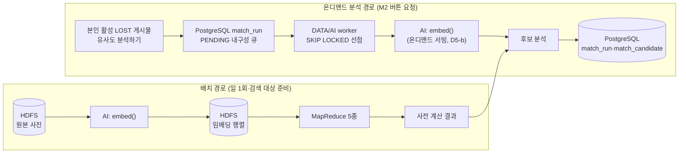

# DATA–AI 인터페이스 계약

> 상태: **초안** — DATA(파이프라인 소유)와 AI(모델 소유) 사이의 역할 경계·데이터 계약·토의 안건 정리.
> 근거: [ADR-002](adr/ADR-002-제품-스택-결정기록.md) D4·D5 ("경계는 모델 아티팩트 + 전처리 스펙 인터페이스"), [architecture.md](architecture.md).
> D4 모델 선택은 확정됐다(YOLO26l-seg + DINOv2 ViT-B/14, 2026-09-03). 나머지 TODO는 AI가 규격을 통보하면 확정값으로 갱신한다.

## 1. 전제: AI 파트는 학습이 아니라 추론을 한다

- **YOLO26l-seg(개·고양이 탐지·마스킹) + DINOv2 ViT-B/14(768차원 임베딩, frozen)** 를 사용한다 — 둘 다 **사전학습이 끝난 모델**을 그대로 사용하며, 파인튜닝은 비목표 (D4 확정, 2026-09-03).
- 탐지·마스킹(YOLO26l-seg)과 크롭 규격은 **전처리 스펙에 포함**된다 — 변경 시 `model_version`을 올리는 대상 (§4).
- AI 파트의 일: ① 1주차 스파이크에서 후보 모델을 실데이터로 **평가**·선정 (D4 — 완료), ② 운영에서 사진 → 벡터 **추론**.
- 따라서 "학습 데이터"는 없고, **평가 데이터**(스파이크용)와 **추론 입력**(운영)만 있다.

## 2. 파이프라인에서 AI의 위치

AI는 같은 모델을 두 지점에서 호출하는 **함수 `embed(이미지) → 벡터(+태그)`** 다.
그 앞(원본 적재)과 뒤(5종 계산·적재)는 전부 DATA 파이프라인이다.

## 3. 데이터 계약 — 입력과 출력

### DATA → AI (입력)

| 경로 | 데이터 | 출처 | 담당 작업 |
|---|---|---|---|
| 배치 | 원본 이미지 + 사진ID | HDFS (공공 API 수집분 + 사용자 게시물 사진) | 공공 TAR·사용자 개별 파일 경로와 ID 규칙은 아래 계약 사용 |
| 온디맨드 분석 | 본인 활성 `LOST` 게시물의 이미지 1~10장 + 게시물ID·version·matchRunId | 작성자의 `M2`가 만든 PENDING 실행을 worker가 선점 | DATA: 선점·서빙·멱등 완료 규격 소유 |
| 스파이크(평가) | 보호소 사진 ~1만 장 + '반환' 이력 정답쌍 | 공공데이터포털 API | **DATA가 수집해 전달 — AI 파트 첫 작업의 선행 조건** |

### AI → DATA (출력)

| 데이터 | 형태 | 목적지 |
|---|---|---|
| 임베딩 벡터 | `(사진ID, float[768])` — DINOv2 ViT-B/14 출력. 장당 탐지 정보(`detection: {fallback, confidence, box, detection_count}`)와 모델 메타데이터(임베딩 + `detector` 블록) 동봉 (`ai/app/pipeline.py`) | 배치: HDFS 임베딩 행렬 / 온디맨드: M2 후보 분석 경로 |
| 속성 태그 | **(제안 — 팀 합의 대기, 2026-09-09)** CLIP 사진 추론 보류에 따라 태그 원천을 **사용자 입력 + 공공 API 필드의 통제 어휘 정규화**(DATA 소유)로 변경하는 제안. 단위는 사진ID가 아니라 **게시 건 ID ↔ 태그 집합**(`<속성>:<코드>`, tags-v1: 축종 3·품종 195·색 15·크기 3). 어휘·매핑 규칙은 [data/tags/vocabulary.json](../data/tags/vocabulary.json), 입력 포맷은 [data/tags/jaccard-input.schema.json](../data/tags/jaccard-input.schema.json), 실데이터 근거는 [data/experiments/2026-09-09-tag-vocabulary](../data/experiments/2026-09-09-tag-vocabulary/README.md). `모름`·결측·매핑 불가는 태그 생략(집합 미포함). **합의되면 이 행은 AI 출력 계약에서 제외**되고 DATA 파이프라인 계약으로 이동한다 | HDFS — 자카드 셀프조인 입력 |

### 원본 이미지 HDFS·ID 계약

| 출처 | HDFS locator | 사진 ID |
| --- | --- | --- |
| 공공 일일 | `/data/shelter/images/dt=YYYY-MM-DD/images-<ms>.tar`의 `{desertionNo}_{1\|2}.{jpg\|png}` entry | `{desertionNo}_{1\|2}` 논리 키. PostgreSQL 사진 ID 매핑은 DATA 적재 단계 책임 |
| 공공 역사 | `/data/shelter/images-backfill/yyyymm=YYYYMM/images-YYYYMM-NNNN.tar`의 같은 entry 규칙 | 공공 일일과 같은 매핑 |
| 사용자 게시물 | `/data/user/images/{postId}/{photoId}.jpg` | 파일명의 `photoId` = PostgreSQL `animal_photo.id` |

사용자 사진은 [사진 업로드·저장소 정책](photo-upload-policy.md)에 따라 방향 보정, 메타데이터
제거, sRGB 변환과 긴 변 최대 4,096px 처리가 끝난 정규화 JPEG다. AI·DATA는 원래 업로드
파일이나 API 표시 URL이 아니라 이 HDFS 파일을 입력으로 사용한다. 사용자 사진은 HDFS
replication 2이며 게시물 최종 삭제 뒤 정리될 수 있으므로 작업 시작 시 DB에서 유효한
`animal_photo` ID인지 확인한다.

### 매칭 후보 출력 정책

0. **후보 집합을 먼저 좁힌다 (2026-09-10 확정)** — 벡터 검색 이전 단계다. `processState=보호중`, 실종 지역 근처(`orgNm`·`careAddr`), 같은 축종(`upKindCd`), 실종일 이후 발견(`happenDt`). 이건 유사도가 아니라 **답이 될 자격**의 문제다: 이미 입양돼 나간 개, 다른 지역, 다른 축종은 닮았더라도 답이 아니다. 실측(2026-09-09, 서울·개·8월 말 이후): 452,470장 → 보호중 32,531 → 서울 1,018 → 개 377 → 날짜 64. 온디맨드는 PostgreSQL 조건 조회, 배치는 쎄타조인이 담당한다.
0-0. **후보 출처는 둘이다 (2026-09-27 구현 — URS UR-OWN-004)** — 공공 입소 동물(`PUBLIC/SHELTERING/ACTIVE/is_matchable`)과 **사용자 `보호하고 있어요` 게시물**(`USER/SHELTERING/ACTIVE/is_matchable`, 삭제 안 됨). 같은 축종·시도·실종일 필터를 양쪽에 똑같이 적용한다. 작성자 상태는 엔진이 보지 않는다 — 엔진 DB 계정은 `member`·`user_post` 를 읽을 수 없고(보안 경계), 작성자 `ACTIVE` 검증은 표시 계층(M1, `MatchResultRepository`)이 한다. 공공 후보 벡터는 야간 배치 스냅샷에서 읽고, 사용자 게시물 사진은 스냅샷에 없으므로 **엔진이 매칭 시점에 질의 사진과 같은 경로(WebHDFS→v2 파이프라인)로 임베딩하고 `animal_photo.id` 로 프로세스 메모리에 캐시한다**(사진 교체 P5는 새 id 를 만들므로 무효화 불요). 사용자 후보 사진을 읽거나 임베딩하지 못하면 그 실행에서만 건너뛴다 — 실행 전체를 실패시키지 않는다. 점수 집계(0-2)·임계값(0-3)·정렬(2)은 출처와 무관하게 같다.
0-1. **경로에 따라 검색 방식이 다르다** — 온디맨드는 위 필터 뒤 후보가 수백 장이라 **전량 비교**로 밀리초에 끝나고 K-Means 색인이 필요 없다(실측 63장 0.1ms, 25,314장 22.8ms). 색인(nprobe=16)은 **조건 없이 전국을 훑는 배치**에서 값을 한다(후보 7%로 줄여도 recall@20 손실 0.001).
0-2. **질의 사진이 여러 장이면 동물 점수는 쌍 코사인의 최댓값 (2026-09-14 확정, 이슈 -143)** — 질의 사진 1~10장 × 후보 사진 1~2장의 코사인을 모두 재고 그중 가장 높은 값을 그 동물의 `image_score`로 쓴다. 같은 정답쌍 113,493건에서 다섯 규칙을 비교했다(`data/experiments/2026-09-14-score-aggregation/`): **최댓값만 무관 사진 혼입을 견딘다.** 무관 사진 한 장이 섞이면 상위 2개 평균은 recall@1 0.0, 질의 사진별 최고점의 평균은 0.67→0.48 로 무너지는데 최댓값은 0.81→0.76→0.73(후보 100마리, 1·2·3장)이다. 깨끗한 1장에서 상위 2개 평균이 1.5pt 앞서지만 그 이득으로 혼입 붕괴를 감수할 수 없다. **평균 벡터를 쓰지 않는다**: 각도가 다른 사진을 평균하면 어느 원본과도 덜 닮은 좌표가 된다(같은 개의 옆·정면 코사인 0.67 실측). 벡터는 장별로 보존한다. **폴백 사진은 빼지도 깎지도 않는다** — "탐지 성공 사진이 있으면 폴백 질의 사진을 뺀다" 는 이전 안은 실측에서 recall@1 을 5~6pt 떨어뜨렸다(진짜 사진이 폴백인 12% 에서 유일한 신호를 버린다). 갤러리 폴백 사진 ×0.8 가중도 −2pt 다. 최댓값의 알려진 약점(무관 사진 한 장당 recall@1 −3~5pt)은 규칙으로 못 막고, 사용자가 자기 동물 사진만 올리게 하는 UX 와 Top-20 목록(3장 혼입에도 recall@20 0.91)이 흡수한다. **후보를 좁히는 0 이 벡터 검색보다 먼저 품질을 정한다**: 같은 쌍에서 전국 25만 개체 recall@1 0.51, 400마리 0.75, 100마리 0.81.
0-3. **점수 임계값 τ = 0.60 (`dinov2_vitb14` v2, 2026-09-14 확정)** — 동물 점수가 τ 미만인 후보는 저장하지 않고, τ 이상이 하나도 없으면 "아직 유사 개체가 없어요" 다. 근거(같은 실험, 질의 1장): 정답 개체 점수 ≥ 0.60 인 비율 **0.83**(0.65 면 0.78, 0.70 이면 0.72), 후보 100마리에서 τ 이상 개체 평균 4.3마리(98% 가 20 이하), 실종 동물이 보호소에 없을 때 엉뚱한 후보가 보일 확률 0.60(후보 100마리 기준). 목록은 K=20 으로 잘리고 사용자가 사진을 보고 판단하므로 되돌릴 수 없는 오류는 진짜 짝을 안 보여주는 것이다 — 그래서 낮은 쪽을 택했다. 정답의 17% 는 0.60 아래에 있다(p10 0.484); "없어요" 가 잦다는 피드백이 오면 첫 조정은 0.55 다. **전국 갤러리에서는 정답(중앙값 0.808)과 최고 사칭자(0.806) 분포가 겹쳐 어떤 τ 도 의미가 없다** — 임계값은 0 의 사전 필터 뒤에서만 성립한다. 값은 모델 버전별 엔진 설정이며(-144), 모델이 바뀌면 `eval_aggregation.py` 를 새 벡터로 다시 돌려 곡선에서 다시 고른다.
1. 모델 버전별 서버 설정으로 관리하는 점수 임계값을 먼저 적용한다.
2. 통과한 후보를 `total_score DESC, target_case_id ASC`로 안정 정렬한다.
3. 본인 활성 `LOST` 게시물의 `M2` 요청으로 생성된 `match_run`에 대해서만 상위 20건을 `match_candidate`에 저장하고 `rank`를 1부터 부여한다. `match_run.candidate_count`는 저장된 행 수와 같은 0~20이다.
4. `total_score`, `image_score`, `distance_km`, `time_gap_days`는 내부 정렬·필터링·평가용이다. 공개 API와 Android 화면에는 원시 값·백분율·정확한 거리로 노출하지 않는다.

MVP의 K=20과 공개 표시 정책은 확정이다. 점수 임계값은 0-3 대로 모델 버전별 설정값이고(v2 = 0.60), 모델을 바꾸면 곡선을 다시 그려 정한다.

게시물 등록·수정과 공공데이터 초기·일일 적재는 검색 대상과 사전 계산 결과만 갱신하며, 사용자별 `match_run`이나 개별 후보 알림을 자동으로 만들지 않는다. M2는 PENDING 행만 만들고, worker는 `FOR UPDATE SKIP LOCKED`로 선점한 뒤 DB 잠금을 해제한다. `matchRunId` 단위의 결과 적재는 멱등하며 RUNNING 5분 초과는 `MATCH_TIMEOUT`으로 회수한다. M2마다 약 15초가 걸리는 새 YARN 잡을 기동하지 않는다.

### AI가 규격으로 확정해서 DATA에 통보해야 하는 것

- [x] 선택 모델 — **YOLO26l-seg(개·고양이 탐지·마스킹·크롭) + DINOv2 ViT-B/14(임베딩, frozen)** 확정 (D4, 2026-09-03). 세그멘테이션 모델과 마스크·크롭 규격은 전처리 스펙에 포함
- [x] **임베딩 차원** — DINOv2 ViT-B/14의 768차원
- [x] 전처리 스펙 — 탐지·마스킹·크롭(`ai/app/detect.py`) + 임베딩 변환(`ai/app/embed.py`), 규칙 값은 `ai/model.yaml`이 유일 원천:
  - **탐지·마스킹·크롭 (YOLO26l-seg, 2026-09-03 확정)**: 개·고양이(COCO 15·16)만 탐지, 신뢰도 임계값 0.5 → 다중 개체는 최고 신뢰도 1개 선택(`highest_confidence`) → 세그멘테이션 마스크 밖 배경을 0(검정)으로 채움 → bbox를 변 길이의 8%씩 사방 확장(경계 클램프) 후 크롭. 탐지 실패(개체 없음·저신뢰)나 크롭 최소 변 32px 미만이면 **원본 전체 사용 폴백 + `fallback: true` 플래그** 동봉
  - **임베딩 변환**: RGB 변환 → 224×224 bicubic 직접 리사이즈 → [0,1] 스케일 → ImageNet 정규화(mean 0.485/0.456/0.406, std 0.229/0.224/0.225)
  - 마스킹·크롭 전처리 추가로 **`model_version` v1→v2 상향** (§4 — v1 벡터와 섞지 않는다). 이후 임계값·패딩·배경 채움·다중 개체 정책 등 규칙 값 변경도 상향 대상
- [x] 모델 아티팩트 형식 — **PyTorch: torch.hub(`facebookresearch/dinov2`) 아키텍처 + 공식 사전학습 `.pth` 주입(strict). 버전 식별자는 `ai/model.yaml`의 `model_version`(현재 `v2`)** (2026-09-03 확정)
- [x] 출력 벡터의 **L2 정규화** — **AI 책임, `normalized: true`. 출력 시점에 L2 정규화된 float32 벡터를 전달하므로 행렬곱 = 코사인 유사도 성립** (2026-09-03 확정, 서버 실측 norm=1.0)
- [x] 유사도 점수 해석 기준 — **v2 임계값 0.60** (§3 후보 출력 정책 0-3, 2026-09-14). 앱의 "아직 유사 개체가 없어요" 판정 근거. 모델 교체 시 `data/eval/eval_aggregation.py` 로 다시 정한다
- [x] 추론 리소스 요구 — **GPU 불필요(CPU 추론). M2 1~10장의 임베딩은 배치 텐서 1회 forward, 탐지는 장당 수행. 실측(서버 2, 4 vCPU, 2026-09-03)**:
  - 임베딩(DINOv2)만: 모델 로딩 3.5초(프로세스당 1회), 1장 0.27초, 10장 배치 2.5초
  - 탐지(YOLO26l-seg): 장당 약 0.74초(500×375~810×1080 대표 이미지 5회 중앙값)
  - **end-to-end(탐지+마스킹+크롭+임베딩): 1장 1.1초 / 3장 3.2초 / 10장 14.2초** — 당시 NFR "M2 요청→결과 평균 5초" 대비 1~3장은 충족, **10장은 초과**였다. 현재는 비동기 SLO를 적용하며 탐지 배치화·해상도 축소가 개선 후보(별도 이슈)
  - **성능·부하 정밀 측정 (2026-09-04, #105 — 상세: [ai-load-test-report.md](ai-load-test-report.md))**: 보호소 실사진 30장, 장수 1~10 전 구간. 현행 v2 는 장당 약 1.05초 선형 증가로 **5장부터 NFR 초과**(10장 10.5초, 탐지가 70%). RAM 여유는 전 측정에서 10GB 이상으로 병목 아님. 동시 부하에서 현행 v2 는 동시 3명부터 3장 요청 6.2초로 붕괴 — **비동기 처리 + 완료 알림 UX 권고**. 사이즈 스윕 결과 YOLO26s-seg + vits14 조합이 10장 3.3초로 NFR 충족(탐지 성공 20→18/30, v3 전환은 재식별 정확도 검증 후 별도 이슈)

### DATA가 규격으로 확정해서 AI에 통보해야 하는 것

- [x] **임베딩 저장 포맷 (2026-09-07 확정, `data/embedding/`)** — §4의 버전 격리 포함:
  - HDFS 경로: `/embeddings/{model_id}/{model_version}/{source}/{partition}/` — `source` ∈ `shelter-backfill`(파티션 `yyyymm=YYYYMM`) · `shelter-daily`(`dt=YYYY-MM-DD`). 사용자 사진 벡터는 온디맨드 서빙이 즉시 계산하며 영구 저장 여부는 스코어 적재 설계와 함께 결정
  - 파일: `vectors-<tar stem>.tsv` = `사진ID<TAB>v1,...,v768`(소수 6자리, MapReduce 입력 형식과 동일) + `detections-<tar stem>.jsonl`(사진별 탐지 정보 또는 `error`)
  - 메타데이터: `/embeddings/{model_id}/{model_version}/_meta.json` — `ai/model.yaml`의 `metadata()` 그대로(`model_id·model_version·dim·normalized·detector`). 러너는 출력 디렉터리의 `_meta.json`과 다른 모델·버전이면 쓰기를 거부한다
  - ID 매핑: 사진 ID는 원본 이미지 계약의 `{desertionNo}_{1|2}` 논리 키. PostgreSQL 사진 ID 매핑은 스코어 적재 단계 책임(변경 없음)
  - 활성 모델 포인터: **`/embeddings/ACTIVE`** 텍스트 파일 한 줄 `{model_id}/{model_version}` — 배치(MapReduce 입력 경로)와 온디맨드 서빙이 모두 여기서 읽는다. 모델 교체 절차 = 새 버전 디렉터리에 재임베딩 완료 → `ACTIVE` 교체 → 배치 재실행
  - **K-Means 색인 (2026-09-09 추가, #109)**: `/embeddings/{model_id}/{model_version}/index/kmeans-k{K}/` — `centers.tsv`(최종 중심 `clusterId<TAB>v1,...,vD`, **소비자는 이 파일만 읽는다**), `work/assignments/part-*`(`사진ID<TAB>clusterId`, 갤러리 전체의 소속), `centers-init.tsv`·`work/centers-N/`(재현용 중간 산출). 색인은 모델 버전 디렉터리 **안**에 있으므로 다른 모델의 벡터와 만날 경로가 없다(원칙 2). 소비자(kNN 조인 `KnnJoinDriver`, 대안 B 상주 서비스)는 질의 벡터를 `centers.tsv` 로 최근접 클러스터 nprobe 개에 배정하고 그 클러스터의 사진만 비교한다. **권장 k=256, nprobe=16**: 후보 7%(약 32,000장)만 비교해도 정확 탐색과 recall 동일(@20 0.649→0.648), nprobe=8 은 후보 3.7%에 손실 0.008 — 실측 `data/experiments/2026-09-09-kmeans-real/`. 재구축 25분(GPU 불필요, YARN 2노드), 일일 증분은 기존 중심으로 배정만. 재임베딩(모델 교체) 시 색인도 새 버전 아래에 다시 만든다
  - **배정 파일 (2026-09-10 확정)**: `index/kmeans-k{K}/assignments/` — `base.tsv`(배치 전량, K-Means 잡 산출물 복사) + `shelter-daily-dt-YYYY-MM-DD.tsv`(일일 증분, `data/embedding/index_tools.py assign`). 소비자는 이 **디렉터리 전체**를 읽고 **같은 사진 ID가 두 번 나오면 마지막 것을 쓴다** (일일 수집이 백필 파티션과 겹칠 수 있다 — 실측 1,771건). `work/`는 재현용 중간 산출물이라 소비자가 볼 곳이 아니다. **일일 배정이 없으면 그날 들어온 사진은 색인 기반 검색에서 영원히 빠진다** (2026-09-10 발견: 3일치 4,175장이 색인 밖이었다)
  - **서빙 스냅샷 (2026-09-10 추가)**: `/embeddings/{model_id}/{model_version}/snapshot/` — `vectors-float32.npy`(N × dim 이진 행렬) + `ids.txt`(행 순서대로 사진 ID 한 줄씩) + `meta.json`(모델·dtype·count·sources·duplicates_dropped·built_at). 배치 TSV와 **같은 숫자의 이진 사본**이고 원본은 TSV다. 상주 worker가 시작할 때 한 번 읽는 용도 — 실측(454,890 × 768): TSV 파싱 65초 vs 메모리맵 0.06초·전량 로딩 0.4초, 파일 1,397MB. 매일 22:30 파이프라인이 전량 재작성해 멱등이다. **MapReduce는 이 파일을 읽지 않는다** — 하둡이 줄바꿈 없는 이진을 쪼갤 수 없기 때문이고, 배치에서 이진이 필요해지면 npy가 아니라 SequenceFile을 쓴다
- [ ] 성능 요구 역산치 — 배치 6h 내 완주와 M2 접수 p95 500ms, 결과 1~3장 p95 10초·10장 p95 30초, hard timeout 60초([architecture.md](architecture.md) NFR)에서 나오는 worker 처리량
  - 일부 확정(2026-09-07): 일일 증분 ~1,100장은 서버 2 CPU(e2e 1.1초/장)로 약 20분 → 22:30 수집 배치의 4번째 태스크로 수용 가능. 벌크 45만 장은 CPU 5.7일이라 **GPU 서버에서 1회 실행**(팀 결정 2026-09-07). 온디맨드 worker 처리량 역산은 미확정
- [ ] 실행 환경 제약 — 발급 서버 사양·GPU 유무 (D1 결정에 종속)

## 4. 모델 교체 가능 설계 (DATA 파이프라인 요구사항)

모델은 갈아끼울 수 있어야 한다(스파이크에서 복수 모델 비교 + 이후 교체 대비). 단 아래를 지켰을 때만 성립한다.

**원칙 3가지**

1. 차원을 하드코딩하지 않는다 — DINOv2도 모델 크기(ViT-S/B/L)에 따라 384~1024로 다르고, 이후 모델 교체 가능성에 대비한다
2. **서로 다른 모델의 벡터는 절대 섞이지 않는다** — 다른 공간의 좌표라서 섞인 유사도는 에러 없이 그럴듯한 쓰레기 값이 됨. 모델 교체 = 전체 재임베딩 + 배치 전체 재실행
3. 모델 = 가중치 + 전처리 한 덩어리 — 가중치만 바꾸고 전처리를 안 바꾸면 2와 같은 조용한 품질 붕괴

**구현 체크리스트 (1~4 필수)**

- [x] ① 임베딩 파일·디렉터리에 메타데이터 강제 (`_meta.json`, 러너 불일치 거부 — 2026-09-07): `model_id`, `model_version`(전처리 변경 시에도 올림), `dim`, `normalized`
- [x] ② HDFS 경로를 모델 버전으로 격리: `/embeddings/{model_id}/{model_version}/...` (2026-09-07 §3 확정) — 스파이크 때 복수 모델 공존 가능, 섞일 경로 자체가 없음
- [x] ③ MapReduce에서 차원을 메타데이터에서 읽어 파라미터화 (상수 금지 — 2026-09-09, `data/mapreduce` `common.Dimensions`): 벡터를 다루는 잡(K-Means·kNN·행렬곱)은 `-Dmungo.vector.meta=…/_meta.json`의 `dim`으로 중심·입력 벡터를 **매 줄 검증**하고, 길이가 다른 벡터 연산은 예외로 죽는다(예전엔 짧은 쪽 길이만 계산해 조용히 틀렸다). 쎄타조인·자카드는 벡터를 쓰지 않아 해당 없음
- [x] ④ "현재 활성 모델" 포인터(`/embeddings/ACTIVE`, 2026-09-07)를 **한 곳**에 두고 배치·온디맨드 서빙이 모두 거기서 읽음 — 두 경로가 각자 지정하면 버전 불일치 사고(D5 경고)
- [x] ⑤ 평가 하네스 (2026-09-07, `data/eval/`): 같은 개체 사진 1·2 정답쌍(중복 사진 제외) + recall@1/5/10/20·MRR, 폴백별·축종별·같은 축종 갤러리·보호소 편향 — 벡터 디렉터리만 바꿔 모델 비교. **표준 평가 데이터셋은 `data/eval/datasets/`(repr-v1, 2026-09-08)** — 임계값 비교·성능 검증·모델 교체 전후 비교는 이 세트를 기준으로 한다
- [ ] ⑥ (선택) `match_candidate`에 `model_version` 컬럼 — 결과 추적·교체 배치 중 신구 구분

이후 모델 교체 절차는 고정된다: **활성 모델 포인터 변경 → 재임베딩 배치 1회 → 전체 배치 재실행.**

## 5. 공동 토의 안건

| # | 안건 | 왜 공동 결정인가 | 시점 |
|---|---|---|---|
| 1 | D4 스파이크 설계 — 평가셋 구성·recall 측정법·합격선 | 데이터는 DATA, 모델 실행은 AI, 판정 기준은 둘 다 | **최우선 — 모든 것의 선행** |
| 2 | ~~사진 최대 10장 → 임베딩 단위 + 게시물 유사도 집계(max/mean)~~ → **장당 임베딩 + 최댓값 확정 (2026-09-14, §3 0-2)** | 모델 특성(AI) × 계산량 10배 차이(DATA) | **스파이크 전 합의 필요** (스파이크 설계에 영향) |
| 3 | D5 온디맨드 서빙(FastAPI) 배포 형태 — 배치와 모델 공유 방법 | 구조는 DATA 소유, 모델 로딩·메모리는 AI만 앎 | 스파이크 후 |
| 4 | 임베딩 버전 관리 — 재임베딩 트리거·비용 감당 절차 | 교체 판단(AI) × 재계산 비용(DATA) | 스파이크 후 |
| 5 | ~~점수 임계값의 실제 수치~~ → **v2 = 0.60 확정 (2026-09-14, §3 0-3)** | 임계값 곡선(recall vs 오경보 vs 표시 건수)을 후보 풀 100·400 에서 실측. 모델 교체 시 재측정 | 완료 |
| 6 | P1 증분 매칭의 K-Means 클러스터 배정 계산 위치 | K-Means는 DATA 구현, 임베딩 공간 거리 특성은 AI 소관 | MVP 이후(P1) 검토 시 |
| 7 | **속성 태그 원천 변경** — 사진 추론(AI) → 사용자 입력+공공 필드 정규화(DATA). 부속: ① 사용자 게시물 크기(체중) 선택 입력 필드 신설 여부(현재 size 태그는 공공 건만 생성 가능한 비대칭), ② zero-shot 사진 추론 보완은 오픈 후 사용자 `모름` 비율 실측 뒤 재검토 | 태그 생산 책임이 AI→DATA로 이동(둘 다 합의 필요), 크기 필드는 BE·Android 영향 | **다음 팀 회의** — 어휘·스키마·커버리지 실측은 준비 완료([data/tags](../data/tags/README.md)) |

## 결정 이력

| 날짜 | 변경 | 사유 |
|---|---|---|
| 2026-08-26 | 초안 작성 | DATA–AI 역할 경계·데이터 계약·모델 교체 설계 정리 |
| 2026-08-31 | MVP K=20·원시 점수 비노출 확정 | Recall@20 평가와 사용자 오인·위치 추정 방지 정책 정합화 |
| 2026-09-01 | 버튼 선택형 분석과 일일 입소 요약 정책 반영 | 등록·수정·적재의 자동 분석과 개별 후보 FCM 알림은 MVP에서 제외 |
| 2026-09-02 | D4 확정 반영: YOLO26(탐지) + DINOv2(임베딩, frozen), CLIP 기각. 탐지·크롭 규격을 전처리 스펙에 포함. 임베딩 차원·L2 정규화·아티팩트 형식은 TODO 유지 | 1주차 스파이크 — frozen DINOv2 재식별 Top-1 97.3% |
| 2026-09-03 | YOLO26 구체 모델을 YOLO26l-seg로 확정하고 개·고양이 개체 마스킹을 전처리 책임에 포함 | 배경을 제거한 개체 단위 DINOv2 입력 생성 필요 |
| 2026-09-03 | DINOv2 구체 모델을 ViT-B/14로 확정하고 임베딩 차원을 768로 명시 | HDFS 임베딩 행렬과 MapReduce 입력 계약 확정 필요 |
| 2026-09-03 | 임베딩 프로세스 구현(`ai/app/embed.py`)으로 전처리 스펙·아티팩트 형식·L2 정규화(AI 책임)·CPU 실측 확정. 출력 계약은 (사진ID, float32[768]) + `model.yaml` 메타데이터 동봉 | #46 — 서버 venv에서 가중치 로딩·재현성·정규화 검증 완료 |
| 2026-09-03 | 탐지·마스킹·크롭 전처리 구현(`ai/app/detect.py`)·end-to-end 파이프라인(`ai/app/pipeline.py`)으로 마스킹·크롭 규칙 확정, `model_version` v2 상향. 탐지 실패 폴백 플래그·탐지 정보를 출력 계약에 동봉. e2e 실측 1장 1.1초/10장 14.2초 | #56 — 서버 2에서 3경로(정상·다중 개체·폴백) pytest·재현성 검증. 마스킹 유무 코사인 유사도 0.90(개)·0.68(다중 고양이)로 배경 제거가 입력에 실효 반영됨 확인 |
| 2026-09-04 | 성능·부하 측정 결과 반영([ai-load-test-report.md](ai-load-test-report.md)): 현행 v2 는 5장부터 NFR 초과·동시 3명부터 붕괴, RAM 은 병목 아님. 비동기 처리+완료 알림 UX 권고, YOLO26s-seg+vits14 를 v3 후보로 권고 | #105 — 측정 도구는 `ai/tools/bench_*.py`, 보호소 실사진 30장·장수 1~10·동시 1/3/5/10 측정 |
| 2026-09-04 | 공공 TAR과 사용자 개별 JPEG의 HDFS 원본 경로·사진 ID 매핑 확정 | #80 — P3·P5 사진 저장 정책과 배치·온디맨드 입력 locator 일치 |
| 2026-09-07 | 임베딩 저장 계약 확정(경로·TSV 형식·`_meta.json`·`ACTIVE` 포인터), 벌크 임베딩 러너·래퍼 추가(`data/embedding/`). 벌크는 GPU 서버 1회, 일일 증분은 서버 2 CPU로 결정 | 팀 회의 2026-09-07 — v2(YOLO26l+ViT-B/14) 유지 |
| 2026-09-09 | 속성 태그 통제 어휘 tags-v1·정규화 매핑·자카드 입력 스키마 작성(`data/tags/`), 태그 원천을 사용자 입력+공공 필드 정규화로 바꾸는 **제안** 기재(§3·§5 안건 7 — 팀 합의 대기). 공공 수집분 실측: 결측 ~0%, 품종은 코드 테이블(변형 0건), 색 자유 텍스트 정규화 커버리지 97.6% | #117 — CLIP 사진 추론 태그 보류(팀 결정)에 따른 대체 원천 검토 |
| 2026-09-14 | §3 후보 출력 정책 0-2 의 '잠정' 제거 — 집계 규칙은 최댓값으로 확정, 폴백 질의 사진 제외·갤러리 폴백 가중은 실측으로 기각. 0-3 신설 — 점수 임계값 v2 = 0.60. §5 안건 2·5 완료 | #143 — `data/eval/eval_aggregation.py`, 정답쌍 113,493건·후보 풀 100/400 실측(`data/experiments/2026-09-14-score-aggregation/`) |
| 2026-09-15 | 매칭 엔진 상주 서비스 구축(`data/match_engine/`, 서버 1) — 계약 0·0-2·0-3·2·3 을 코드로 구현, `MATCH_ENGINE_URL` 연결, 첫 e2e SUCCEEDED | #144 — 배치 근거·운영은 deploy-guide "매칭 엔진" 절 |
| 2026-09-16 | repr-v1 사진 단위 순위 기준선 기록: recall@1 0.509 / @5 0.810 / @10 0.897, mRR 0.625 (n=116, 갤러리 469장). 무너지는 조건은 hard 밴드(R@1 0.054), 정답 top 각도(0.227), plain 배경(R@10 0.59~0.67)이고, no_animal 정답 4쌍은 순위 233~457로 검색 불가 — 품질 감지(-118)의 실측 근거. 계약 변경 없음(측정 기록) | #154 — [data/eval/results/repr-v1-rank-v2.md](../data/eval/results/repr-v1-rank-v2.md), 표준 데이터셋 repr-v1·결정적 실행 |
| 2026-09-17 | 게시물(개체) 단위 집계 규칙 순위 실측: 깨끗한 같은-개체 2장 묶음에서 현행 max 가 4개 규칙 중 최하(R@1 0.474 vs mean 0.612·rep1 0.517·mean_max 0.603, n=116). 단 mean 계열 우위는 정답 점수가 규칙 불변인 구성의 상한선이다. -143(0-2 확정)과 모순 아님 — -143 은 10장 실게시물에 무관 사진이 섞이는 혼입 축(max 만 견딤), -155 는 전 사진이 같은 동물인 청정 묶음 축을 쟀다. 권고안(MVP max 유지 + -118 입력 필터 전제, 배치 병목 시 rep1 압축→max 재채점 2단계)은 **팀 회의 상정 대기 — 계약 0-2·0-3 변경 없음**. 부속으로 τ=0.60 × Top-K 교차 분석: τ 미달 정답 29쌍 중 20쌍이 max Top-20 안 — 임계값 조정 논의는 노출 vs 오경보 축으로 수렴 | #155·-156 — [data/eval/results/repr-v1-post-agg.md](../data/eval/results/repr-v1-post-agg.md) §6 권고안, 교차 분석 [repr-v1-threshold-rank-cross.md](../data/eval/results/repr-v1-threshold-rank-cross.md) |
| 2026-09-27 | §3 정책 0-0 신설 — 엔진 후보에 **사용자 `보호하고 있어요` 게시물** 포함(URS UR-OWN-004 의 미구현 절반). 그동안 엔진 후보 SQL 이 `PUBLIC` 전용이라 사용자 보호 게시물은 닮아도 후보가 될 수 없었다(표시 계층은 이미 USER 후보를 지원). 사용자 사진 벡터는 야간 스냅샷 편입 대신 **매칭 시점 온디맨드 임베딩 + `animal_photo.id` 캐시** — 배치·백엔드 무변경, 등록 직후부터 후보가 된다. 필터·집계·임계값·정렬 계약은 출처와 무관하게 동일 유지 | `data/match_engine/engine.py` `USER_CANDIDATE_SQL`·`UserPhotoVectors`, 작성자·삭제 조건은 `MatchResultRepository` 와 정합 |
