# ERD

> 상태: **개발 기준 확정** — 수치 임계값처럼 명시된 미결 항목을 제외한 MVP·입양 탐색 P1 데이터 계약이다.
> 네이밍·마이그레이션 규칙은 [code-convention.md](code-convention.md)를 따른다.
> 제품 범위는 [product/mvp-user-requirements-spec.md](product/mvp-user-requirements-spec.md), 매칭 경계는 [adr/ADR-002-제품-스택-결정기록.md](adr/ADR-002-제품-스택-결정기록.md) D9를 따른다.
> 입양 탐색 범위는 [product/adoption-discovery-mvp.md](product/adoption-discovery-mvp.md)를 따른다.
> 공공 필드명은 [국가동물보호정보시스템 구조동물 조회 서비스](https://www.data.go.kr/data/15098931/openapi.do) v2 명세를 기준으로 한다.

## 1. 설계 결정

| 항목 | 결정 |
|---|---|
| 데이터베이스 | 사용자 게시물과 공공 보호동물 모두 동일한 PostgreSQL 17에 저장한다. |
| 모델링 | 목록·매칭 공통 필드는 `animal_case`, 출처별 필드는 `user_post`와 `shelter_animal` 1:1 상세 테이블로 분리한다. |
| 목록 구성 | `보호하고 있어요` 목록은 사용자 보호 게시물과 공공 보호동물을 함께 표시하고 `source_type`으로 출처를 구분한다. |
| 목록 출처 정보 | 비로그인 목록은 `source_type`을 출처 배지로 표시한다. 작성자 닉네임·보호소 이름·공식 전화번호는 상세(비로그인 열람 가능)에, 후보 확인에 필요한 출처별 정보는 로그인 후보 요약에 제공한다. |
| 목록 정렬 | 기본 `LATEST`는 `animal_case.listed_at DESC, id DESC`, 선택 `OLDEST`는 `listed_at ASC, id ASC`다. 사용자 건은 등록 시각을, 공공 건은 공고 시작일·원천 사건 시각·적재 시각 순으로 계산한다. |
| 페이지네이션 | 한 번에 10건을 반환하는 `(listed_at, id)` 기반 커서를 사용하고 P1 커서 범위에 정렬 값을 포함한다. |
| MVP 매칭 | 사용자 `잃어버렸어요`를 기준으로 `보호하고 있어요` 사용자 게시물과 공공 보호동물을 찾는 단방향 매칭만 제공한다. |
| 분석 실행 | 본인 활성 `LOST` 상세의 버튼 요청에서만 `match_run`을 생성한다. 등록·수정·수집·스케줄은 분석을 자동 실행하지 않으며, DATA/AI worker가 MapReduce 소유 규칙으로 최종 Top-K를 결정한다. |
| 분석 결과 조회 | 기준 `animal_case`가 `USER/LOST`, `ACTIVE`이고 `user_post.member_id`가 인증 회원과 같은 경우에만 실행 상태와 후보를 반환한다. 종료 후 이력 보존은 M1 조회 허용을 뜻하지 않는다. |
| 일일 요약 | 성공한 `DAILY_INCREMENTAL` 수집의 `inserted_count`·`shelter_count`를 앱·FCM 공통 요약으로 사용한다. `summary_published_at`으로 정상 발송 완료를 표시하며, 토픽 요약의 사용자·기기별 전송·읽음 이력은 저장하지 않는다. 개인 채팅 알림은 별도 기기·Outbox 계약을 사용한다. |
| 입양 탐색 | 공고 종료 후에도 원천 상태가 정확히 `보호중`인 공공 보호동물을 공고 종료일이 오래된 순으로 조회한다. 회원이 넘긴 건은 `adoption_swipe`에 방향 없이 남겨 다음 조회에서 제외하고, 명시적으로 누른 찜은 `adoption_favorite`에 따로 저장한다. 이용 가능 여부와 공고 종료 후 경과일은 조회 시 계산한다. |
| 입양 개인화 | 검증된 동물 특성 원천이 없으므로 가정 환경·성격 프로필과 개인화 점수를 저장하지 않는다. 도입 전 별도 개인정보 고지와 검증 가능한 추천 이유 계약을 먼저 확정한다. |
| 개인정보 | 회원 전화번호와 개인 FCM 토큰은 목적별 AES-256-GCM 암호문·조회 HMAC으로 분리 저장하고 응답·로그에 노출하지 않는다. OTP와 불투명 가입 증명은 Redis에 보호값만 둔다. 고지는 가입 정보와 게시물·사진·위치·선택 좌표·채팅·개인 푸시 식별자를 포함하고, 탈퇴 번호·기기 보호값과 사용자 생성 데이터는 30일 이내 파기·익명화한다. 정확한 위치 공개 여부·동의 버전·시각은 위치 역할별 `animal_case_location`에 저장한다. |
| 재시도 안전성 | 사용자 게시물 등록은 회원별 `client_request_id`, 채팅 전송은 발신자별 `client_message_id`를 유일하게 해 같은 성공 요청의 재전달이 중복 행을 만들지 않게 한다. |
| 스키마 변경 | Flyway가 유일한 스키마 변경 주체이며 모든 프로필에서 Hibernate `ddl-auto=validate`를 사용한다. 이 문서의 SQL은 설계 계약이고 실제 적용은 버전 migration으로 수행한다. |
| MVP 채팅 | 활성 사용자 게시물마다 작성자와 요청자 간 1:1 텍스트 채팅을 제공한다. 참여자별 마지막 읽음 메시지 ID는 기존 `chat_room` 컬럼으로, 개인 FCM 기기 보호값은 기존 `auth_session` 컬럼으로 저장한다. 개인 알림에는 `chat_notification_outbox`만 새로 추가하며 첨부파일·그룹 채팅은 제외한다. |
| 공공 원본 | PostgreSQL에는 서비스용 정규화 데이터를 저장하고, 원본 JSON·이미지 보존은 HDFS 정책을 따른다. |
| 사용자 사진 | 검증·정규화한 JPEG를 `/data/user/images/{postId}/{photoId}.jpg`에 HDFS replication 2로 저장하고 PostgreSQL에는 내부 경로와 무결성·크기 메타데이터만 저장한다. 상세 수명 주기는 [사진 업로드·저장소 정책](photo-upload-policy.md)을 따른다. |
| 날짜 정밀도 | 사용자 입력은 날짜와 선택 시각을 저장한다. 공공 API `happenDt`는 접수일 `YYYYMMDD`이므로 날짜만 저장한다. |

`animal_case`는 실제 동일 개체임을 확정하는 테이블이 아니다. 사용자 신고나 공공 API의 구조 건처럼 **한 번의 관찰·게시 건**을 나타낸다. 동일 개체 여부는 매칭 후보일 뿐이며 `animal_case` 행을 병합하지 않는다.

## 2. 핵심 불변식

1. `source_type=PUBLIC`인 건은 `case_type=SHELTERING`(보호소 공고) 또는 `case_type=LOST`(공공 분실 신고, 2026-09-15 추가)이다.
2. `case_type=LOST`인 건은 `source_type=USER`(사용자 게시물) 또는 `source_type=PUBLIC`(공공 분실 신고)이다. 매칭 기준(`match_run.query_case_id`)은 여전히 `USER/LOST`만이다.
3. `source_type=USER`인 건에는 `user_post`가 정확히 하나 있고 `shelter_animal`·`lost_report`는 없다.
4. `source_type=PUBLIC`인 건에는 출처 상세가 정확히 하나 있다 — `SHELTERING`이면 `shelter_animal`, `LOST`면 `lost_report`. `user_post`는 없다.
5. 사용자 `LOST`와 공공 `LOST`에는 `EVENT` 위치가 정확히 하나 있고 `CURRENT` 위치는 없다.
6. 사용자 `SHELTERING`과 공공 `SHELTERING`에는 `EVENT`, `CURRENT` 위치가 각각 정확히 하나 있다.
7. 공공 위치 행은 `exact_location_ciphertext IS NULL`, `exact_location_visible=false`다.
8. 활성 게시 건에는 사진이 1장 이상 10장 이하로 존재한다. 사용자 사진은 HDFS 정규화 JPEG이며 checksum·바이트 수·가로·세로 메타데이터가 필수다.
9. MVP의 `match_run.query_case_id`는 `USER/LOST` 건만 참조하고, 본인 활성 게시물의 버튼 요청에서만 생성한다.
10. `match_candidate.target_case_id`는 `SHELTERING`이면서 `is_matchable=true`인 건만 참조한다.
11. `status=ACTIVE`인 건만 공개 목록에 표시한다. `is_matchable`은 과거 공공 입소분의 소급 검색을 위해 목록 상태와 별도로 관리한다.
12. 종료·삭제된 사용자 게시물은 즉시 `is_matchable=false`로 바꾸어 새로운 후보군에서 제외한다.
13. 채팅방은 `USER` 출처 게시물에만 만들고, 작성자와 요청자는 서로 달라야 하며 `(animal_case_id, requester_member_id)`당 하나만 존재한다.
14. 채팅 메시지는 방의 작성자 또는 요청자만 보낼 수 있다. 종료·삭제된 게시물의 기존 방은 메시지
    조회와 읽음 위치 갱신만 허용한다.
15. `chat_room`의 작성자·요청자 마지막 읽음 메시지 ID는 `NULL`이거나 같은 방 메시지를 가리키고
    앞으로만 이동한다. 상대가 보낸 메시지 중 현재 위치보다 ID가 큰 건만 안 읽음으로 계산한다.
16. 새 `chat_message`와 수신자 한 명의 `chat_notification_outbox`는 같은 트랜잭션에서 정확히 한
    건씩 생성한다. FCM 성공 여부는 메시지 commit과 읽음 위치에 영향을 주지 않으며 앱은
    `message_id`로 중복 알림을 흡수한다.
17. `auth_session.push_installation_id`와 `push_token_lookup_hash`는 각각 유일하고 한 설치·토큰은
    한 시점에 한 인증 세션에만 속한다. 계정 전환 등록은 현재 세션으로 원자적으로 재귀속한다.
18. 동일 활성 회원의 전화번호 중복과 동일 게시물의 처리 중 분석 중복은 부분 유일 인덱스로 막는다. 일일 요약 토픽 발송은 `summary_published_at IS NULL`인 성공한 일일 증분 실행만 행 잠금으로 선점해 처리한다. 외부 FCM 호출과 DB 갱신 사이 장애로 인한 재시도·중복 가능성은 Android 알림 태그와 로컬 실행 ID 중복 제거로 흡수한다.
19. 출처별 상세 행의 상호 배타성, 출처·유형별 위치 행 수와 공공 위치 정책, 사진 최소 1장과 채팅 참여자 권한은 하나의 서비스 트랜잭션에서 검사한다. 나머지 형식·범위 규칙은 DB 제약조건으로도 방어한다.
20. `exact_location_visible=true`인 사용자 위치는 정확한 위치 암호문과 현재 공개 정책 버전·동의 시각을 모두 가져야 한다. 저장 버전이 현재 서버 버전과 다르면 API는 공개하지 않는다.
21. 같은 회원의 게시물 `client_request_id`, 같은 발신자의 채팅 `client_message_id`는 각각 하나의 canonical request hash만 가질 수 있다.
22. `adoption_favorite`는 `PUBLIC/SHELTERING` 게시 건만 참조한다. 추가 시 공고 종료 후 `보호중`,
    `ACTIVE`, 대표 사진 존재를 검사하고, 이후 자격을 잃어도 회원이 해제할 수 있도록 행은 유지한다.
    이용 가능 여부와 공고 종료 후 경과일은 저장하지 않는다.
23. `adoption_swipe`도 `PUBLIC/SHELTERING` 게시 건만 참조하되, `adoption_favorite`와 달리 **후보
    자격은 검사하지 않는다.** 카드를 보고 넘기는 사이에 원천 상태가 바뀔 수 있는데 그때 기록이
    거절되면 같은 동물이 다음 조회에 다시 올라온다. 넘긴 방향은 저장하지 않는다 — 찜 여부는
    `adoption_favorite` 하나가 정답이고, 두 곳에 두면 찜을 해제했을 때 어긋난다(2026-09-25).
24. 두 테이블은 서로를 바꾸지 않는다. 하트로 넘기면 두 행이 함께 생기고, 찜을 해제해도
    `adoption_swipe` 행은 남아 그 동물이 후보 목록으로 돌아오지 않는다.

## 3. 다이어그램

```mermaid
erDiagram
    member {
        bigint id PK
        varchar login_id UK
        varchar password_hash
        varchar nickname
        text phone_ciphertext
        char phone_lookup_hash
        timestamptz phone_verified_at
        boolean privacy_collection_agreed
        varchar privacy_collection_policy_version
        timestamptz privacy_collection_consented_at
        varchar status
        timestamptz created_at
        timestamptz updated_at
        timestamptz deleted_at
    }

    auth_session {
        bigint id PK
        bigint member_id FK
        char refresh_token_selector UK
        char refresh_token_hash UK
        uuid push_installation_id UK
        varchar push_platform
        text push_token_ciphertext
        char push_token_lookup_hash UK
        timestamptz push_last_seen_at
        timestamptz expires_at
        timestamptz revoked_at
        timestamptz created_at
        timestamptz last_used_at
    }

    animal_case {
        bigint id PK
        varchar case_type
        varchar source_type
        varchar status
        boolean is_matchable
        bigint version
        timestamptz listed_at
        varchar name
        varchar species
        varchar breed_name
        varchar sex
        varchar color
        date event_date
        time event_time
        text feature_text
        timestamptz closed_at
        timestamptz deleted_at
        timestamptz created_at
        timestamptz updated_at
    }

    animal_case_location {
        bigint animal_case_id PK, FK
        varchar location_type PK
        varchar public_location
        char region_code
        char emd_code
        text exact_location_ciphertext
        boolean exact_location_visible
        varchar disclosure_policy_version
        timestamptz disclosure_consented_at
        numeric latitude
        numeric longitude
    }

    user_post {
        bigint animal_case_id PK, FK
        bigint member_id FK
        uuid client_request_id UK
        char request_hash
        varchar close_reason
    }

    chat_room {
        bigint id PK
        bigint animal_case_id FK
        bigint owner_member_id FK
        bigint requester_member_id FK
        bigint owner_last_read_message_id
        bigint requester_last_read_message_id
        timestamptz last_message_at
        timestamptz created_at
        timestamptz updated_at
    }

    chat_message {
        bigint id PK
        bigint chat_room_id FK
        bigint sender_member_id FK
        uuid client_message_id UK
        char request_hash
        varchar content
        timestamptz created_at
    }

    chat_notification_outbox {
        bigint id PK
        bigint message_id FK, UK
        bigint recipient_member_id FK
        varchar status
        integer attempt_count
        timestamptz next_attempt_at
        timestamptz lease_until
        varchar last_error_code
        timestamptz created_at
        timestamptz completed_at
    }

    shelter {
        bigint id PK
        varchar care_reg_no UK
        varchar name
        varchar phone
        text address
        varchar jurisdiction
        timestamptz created_at
        timestamptz updated_at
    }

    shelter_animal {
        bigint animal_case_id PK, FK
        varchar desertion_no UK
        bigint shelter_id FK
        bigint ingestion_run_id FK
        varchar notice_no
        date notice_start_date
        date notice_end_date
        varchar process_state_raw
        varchar end_reason_raw
        varchar age_text
        varchar weight_text
        varchar neuter_status
        timestamptz source_updated_at
        timestamptz last_synced_at
    }

    animal_photo {
        bigint id PK
        bigint animal_case_id FK
        varchar storage_type
        text storage_uri
        varchar content_type
        bigint byte_size
        integer width_px
        integer height_px
        smallint sort_order
        char checksum_sha256
        timestamptz created_at
    }

    member_photo_erasure_task {
        bigint id PK
        text storage_uri UK
        timestamptz deadline_at
        integer attempt_count
        timestamptz next_attempt_at
        timestamptz lease_until
        varchar last_error_code
        timestamptz created_at
        timestamptz updated_at
    }

    match_run {
        bigint id PK
        bigint query_case_id FK
        bigint query_case_version
        varchar status
        varchar model_id
        varchar model_version
        integer candidate_count
        varchar error_code
        timestamptz started_at
        timestamptz completed_at
        timestamptz created_at
    }

    match_candidate {
        bigint id PK
        bigint match_run_id FK
        bigint target_case_id FK
        integer rank
        double total_score
        double image_score
        double distance_km
        integer time_gap_days
        timestamptz created_at
    }

    adoption_favorite {
        bigint member_id PK, FK
        bigint animal_case_id PK, FK
        timestamptz created_at
    }

    adoption_swipe {
        bigint member_id PK, FK
        bigint animal_case_id PK, FK
        timestamptz swiped_at
    }

    ingestion_run {
        bigint id PK
        varchar source_system
        varchar run_type
        varchar status
        date requested_from_date
        date requested_to_date
        integer fetched_count
        integer inserted_count
        integer updated_count
        integer shelter_count
        integer failed_count
        timestamptz last_source_updated_at
        text error_summary
        timestamptz started_at
        timestamptz completed_at
        timestamptz summary_published_at
    }

    member ||--o{ auth_session : authenticates
    member ||--o{ user_post : writes
    member ||--o{ chat_room : owns
    member ||--o{ chat_room : requests
    member ||--o{ chat_message : sends
    member ||--o{ chat_notification_outbox : receives
    member ||--o{ adoption_favorite : favorites
    member ||--o{ adoption_swipe : swipes
    animal_case ||--|{ animal_case_location : locates
    animal_case ||--o| user_post : "USER detail"
    animal_case ||--o{ chat_room : discusses
    chat_room ||--o{ chat_message : contains
    chat_message ||--o| chat_notification_outbox : notifies
    animal_case ||--o| shelter_animal : "PUBLIC detail"
    animal_case ||--o{ animal_photo : has
    shelter ||--o{ shelter_animal : protects
    ingestion_run ||--o{ shelter_animal : "last sync"
    animal_case ||--o{ match_run : "LOST query"
    match_run ||--o{ match_candidate : produces
    animal_case ||--o{ match_candidate : "SHELTERING target"
    animal_case ||--o{ adoption_favorite : "PUBLIC SHELTERING"
    animal_case ||--o{ adoption_swipe : "PUBLIC SHELTERING"
```



## 4. 테이블 정의

| 데이터 소유 영역 | 쓰기 주체 |
|---|---|
| `member`, `auth_session` | Spring Boot 인증 API |
| 사용자 `animal_case`, 위치, `user_post`, 사용자 사진 | Spring Boot 게시물 API. P3 재시도는 회원·클라이언트 요청 ID로 멱등 처리 |
| `member_photo_erasure_task` | Spring Boot 회원 파기 작업이 적재하고 HDFS 정리 작업이 성공 시 제거 |
| `chat_room`, `chat_message` | Spring Boot 채팅 API. C4 재시도는 발신자·클라이언트 메시지 ID로 멱등 처리하고 C5는 참여자별 읽음 위치를 앞으로만 이동 |
| `auth_session`, `chat_notification_outbox` | Spring Boot 개인 푸시 API와 Outbox worker. 세션에 귀속된 토큰 보호값과 메시지별 알림 발송 상태 관리 |
| 공공 `animal_case`, `shelter`, `shelter_animal`, 공공 사진 | DATA 수집 파이프라인 |
| `ingestion_run` | DATA 수집 파이프라인. Spring Boot 알림 API는 성공한 일일 증분 실행의 발송 시각만 갱신 |
| `match_run` | Spring Boot가 버튼 요청으로 생성하고 DATA/AI worker가 선점해 상태·결과를 갱신 |
| `match_candidate` | DATA/AI 매칭 경로만 적재, Spring Boot는 조회만 수행 |
| `adoption_favorite` | Spring Boot 입양 탐색 API. 회원의 명시적 찜만 저장하고 현재 이용 가능 여부는 조회 시 계산 |
| `adoption_swipe` | Spring Boot 입양 탐색 API. 회원이 넘긴 건을 방향 없이 저장하고 후보 조회에서 제외하는 데만 사용 |

여러 컴포넌트가 같은 PostgreSQL을 사용하더라도 각 테이블의 쓰기 책임을 위 표처럼 제한한다. 특히 Spring Boot API에서 유사도 점수를 계산하거나 후보를 임의로 생성하지 않는다.

### 4.1 `member`

인증 계정과 화면에 표시할 닉네임, 인증된 휴대전화 번호의 보호된 값을 저장한다.

| 컬럼 | 타입 | Null | 제약·설명 |
|---|---|:---:|---|
| `id` | `bigint` | N | PK, identity |
| `login_id` | `varchar(50)` | N | `NFC(NFC(value).toLowerCase(Locale.ROOT))` canonical 로그인 ID. UNIQUE |
| `password_hash` | `varchar(255)` | N | `{argon2id-v1}`과 Argon2id 알고리즘·비용·salt가 포함된 인코딩 문자열. 평문·정규화 값 저장 금지 |
| `nickname` | `varchar(30)` | N | 화면 표시명 |
| `phone_ciphertext` | `text` | Y | 활성 회원은 필수인 인증 전화번호 암호문. 탈퇴 30일 파기 시 `NULL`; 다른 회원·일반 로그·DTO에 노출 금지 |
| `phone_lookup_hash` | `char(64)` | Y | 활성 회원은 필수인 E.164 전화번호의 HMAC-SHA-256 소문자 16진수 조회 키. 탈퇴 30일 파기 시 `NULL` |
| `phone_verified_at` | `timestamptz` | Y | 활성 회원의 전화번호 소유 인증 완료 시각. 탈퇴 30일 파기 시 `NULL` |
| `privacy_collection_agreed` | `boolean` | Y | 활성 회원은 `true` 필수. 저장 중인 동의 기록이 있는 기존 계정은 V9에서 `true`로 이관하며, 탈퇴 30일 파기 시 `NULL` |
| `privacy_collection_policy_version` | `varchar(50)` | Y | 활성 회원이 동의한 개인정보 수집·이용 고지 버전. 현재 `privacy-collection-v1`; 탈퇴 30일 파기 시 `NULL` |
| `privacy_collection_consented_at` | `timestamptz` | Y | 활성 회원의 개인정보 수집·이용 동의 시각. 탈퇴 30일 파기 시 `NULL` |
| `status` | `varchar(20)` | N | `ACTIVE`, `WITHDRAWN` |
| `created_at` | `timestamptz` | N | 생성 시각 |
| `updated_at` | `timestamptz` | N | 수정 시각 |
| `deleted_at` | `timestamptz` | Y | 탈퇴 후 삭제 예약·완료 추적 |
| `personal_data_erased_at` | `timestamptz` | Y | 전화번호·동의·계정 자격 증명 파기 트랜잭션 완료 시각 |
| `relational_data_erased_at` | `timestamptz` | Y | 게시물·위치·매칭·채팅 관계형 데이터 파기 완료 시각 |

`password_hash`는 비밀번호마다 새 16바이트 salt를 사용하는 Argon2id(memory 64 MiB,
iterations 3, parallelism 4, hash 32바이트)로 생성하고 `{argon2id-v1}` 식별자를 붙인다.
평문·NFC 정규화 값·hash는 응답이나 로그에 포함하지 않는다. 생성·검증·로그인 제한의 상세
기준은 [비밀번호 정책](password-policy.md)을 따른다.

`phone_lookup_hash`에는 활성 회원만 대상으로 하는 부분 유일 인덱스를 적용한다. 가입 서비스는 이 인덱스와 별도로 상태나 탈퇴 후 경과 시간과 무관하게 같은 해시가 남은 모든 회원 행을 검사해 번호 재사용을 거부한다. 활성 회원은 동의 여부가 `true`이고 버전·시각이 있어야 하며, 파기 완료 회원은 동의 여부·버전·시각이 모두 `NULL`이어야 한다. 탈퇴 30일 뒤 회원 개인정보 파기 트랜잭션은 전화번호 암호문·조회 해시·인증 시각·동의 여부·버전·시각을 `NULL`로 만들고, 로그인 ID를 `withdrawn:<member_id>` 형태의 유일한 탈퇴 식별값으로, 닉네임을 일반 탈퇴 표시명으로, 비밀번호 해시를 인증 불가능한 값으로 치환한다. 이 트랜잭션이 커밋되면 `personal_data_erased_at`을 기록하고 같은 번호를 다시 사용할 수 있으며, 실패 시 기존 해시가 남아 차단을 유지한다. 뒤이은 관계형 파기가 커밋되면 `relational_data_erased_at`을 기록한다. 두 완료 시각은 재실행 대상을 구분하고 앞의 100건이 반복 선택되는 기아를 막으며, 관계형 완료 시각은 개인정보 파기 완료 시각보다 빠를 수 없다. 개인정보 수집·이용 고지는 현재 `privacy-collection-v1`이고 동의 여부·버전·시각을 함께 기록한다. 마케팅 동의와 제3자 제공 동의는 MVP에 포함하지 않는다. 닉네임 중복은 허용하고 휴면 상태는 구분하지 않는다.

조회 키의 정규 입력은 공백 없이 UTF-8로 인코딩한 E.164 번호이며, `PHONE_LOOKUP_HMAC_KEY_V1` 전용 Secret을 사용하는 HMAC-SHA-256 결과를 소문자 16진수 64자로 저장한다. MVP 운영 중에는 모든 행과 가입 요청이 같은 키 버전을 사용한다. 긴급 키 교체 시에는 신규 가입을 일시 중단하고, 보관 중인 전화번호 암호문을 새 전용 키로 재계산해 모든 조회 키를 일괄 갱신하고 활성 번호 중복과 부분 유일 인덱스를 검증한 뒤에만 가입을 재개한다. 서로 다른 키 버전을 동시에 사용한 채 가입을 허용하지 않는다.

`phone_ciphertext`는 전화번호 전용 키의 AES-256-GCM과 `enc:v1:{kid}:{nonce}:{ciphertextAndTag}`
envelope를 사용한다. OTP HMAC·가입 증명·목적별 키 분리와 교체 절차는
[백엔드 보안·운영 정책](backend-security-operations-policy.md)을 따른다.

### 4.2 `auth_session`

로그아웃과 탈취된 갱신 토큰의 재사용 차단을 위한 인증 세션이다. access token은 15분
`RS256` JWT로 유지하고 `sid` claim으로 이 행을 참조한다. 모든 보호 API는 세션의 회원
일치·고정 만료·폐기 여부를 확인해 로그아웃·탈퇴를 즉시 반영한다. refresh token secret
원문은 저장하지 않는다. 토큰 계약과 키 운영은 [인증 토큰 정책](auth-token-policy.md)을
따른다.

| 컬럼 | 타입 | Null | 제약·설명 |
|---|---|:---:|---|
| `id` | `bigint` | N | PK, identity |
| `member_id` | `bigint` | N | FK → `member.id` |
| `refresh_token_selector` | `char(22)` | N | 16바이트 난수의 Base64 URL 값, UNIQUE. 세션 조회와 회전 관계 유지용이며 로그에 기록하지 않음 |
| `refresh_token_hash` | `char(64)` | N | 32바이트 refresh secret의 SHA-256 소문자 16진수, UNIQUE. 원문 저장 금지 |
| `push_installation_id` | `uuid` | Y | N1 앱 설치 UUID, UNIQUE. 계정 전환 시 현재 세션으로 재귀속 |
| `push_platform` | `varchar(20)` | Y | 등록 세션은 `ANDROID`, 미등록 세션은 `NULL` |
| `push_token_ciphertext` | `text` | Y | FCM 등록 토큰 AES-256-GCM 암호문. 응답·로그 노출 금지 |
| `push_token_lookup_hash` | `char(64)` | Y | 전용 키 HMAC-SHA-256 소문자 16진수 조회값, UNIQUE |
| `push_last_seen_at` | `timestamptz` | Y | 성공한 N1 등록·갱신 시각 |
| `expires_at` | `timestamptz` | N | 로그인 시각 + 30일. 회전 시 연장하지 않는 고정 만료 시각 |
| `revoked_at` | `timestamptz` | Y | 로그아웃·강제 만료 시각 |
| `created_at` | `timestamptz` | N | 세션 생성 시각 |
| `last_used_at` | `timestamptz` | Y | 마지막 정상 갱신 시각 |

refresh token은 `v1.{selector}.{secret}` 형식이다. 갱신 시 selector로 행을 잠금 조회하고
secret 해시가 현재 값과 일치할 때만 새 secret 해시로 원자 교체한다. selector가 같지만
해시가 다르면 회전된 토큰의 재사용 또는 탈취로 보고 해당 세션의 `revoked_at`을 기록한다.
동일 토큰의 동시 갱신은 하나만 성공해야 한다. 로그아웃은 현재 세션의 `revoked_at`을
기록하고, 회원 탈퇴는 해당 회원의 모든 활성 세션을 같은 트랜잭션에서 폐기한다. 재사용
탐지의 폐기 기록은 401 응답을 반환하더라도 rollback하지 않고 commit한다. N1은 현재 세션의
`push_*` 컬럼을 갱신하며 같은 설치 UUID 또는 토큰 조회값이 다른 세션에 있으면 그 세션의
`push_*` 컬럼을 먼저 비워 현재 세션으로 재귀속한다. worker는 `ACTIVE` 회원의 미폐기·미만료
세션 중 `push_*` 등록이 완전한 행만 발송 대상으로 사용한다.

### 4.3 `animal_case`

사용자 게시물과 공공 보호동물의 목록·매칭 공통 속성을 저장한다.

| 컬럼 | 타입 | Null | 제약·설명 |
|---|---|:---:|---|
| `id` | `bigint` | N | PK, identity |
| `case_type` | `varchar(20)` | N | `LOST`, `SHELTERING` |
| `source_type` | `varchar(20)` | N | `USER`, `PUBLIC` |
| `status` | `varchar(20)` | N | `ACTIVE`, `CLOSED`, `DELETED` |
| `is_matchable` | `boolean` | N | 현재·과거 매칭 후보 포함 여부, 기본값 `true` |
| `version` | `bigint` | N | 게시물 수정 충돌 방지용 낙관적 잠금 버전, 기본값 `0` |
| `listed_at` | `timestamptz` | N | 목록 등록순·커서 기준 시각. 사용자=등록 시각, 공공=공고 시작일→원천 사건 시각→적재 시각 |
| `name` | `varchar(50)` | Y | 동물 이름 |
| `species` | `varchar(20)` | N | `DOG`, `CAT`, `OTHER` |
| `breed_name` | `varchar(100)` | Y | 사용자 입력 또는 공공데이터 정규화 품종명 |
| `sex` | `varchar(20)` | N | `MALE`, `FEMALE`, `UNKNOWN` |
| `color` | `varchar(100)` | Y | 색상 설명 |
| `event_date` | `date` | N | 실종일 또는 발견·접수일. 사용자 입력은 `Asia/Seoul` 기준 오늘 이하 |
| `event_time` | `time` | Y | 사용자 입력 시각. 공공데이터는 `NULL` |
| `feature_text` | `text` | Y | 특징·특이사항 |
| `closed_at` | `timestamptz` | Y | 종료 시각 |
| `deleted_at` | `timestamptz` | Y | 논리 삭제 시각 |
| `created_at` | `timestamptz` | N | 생성 시각 |
| `updated_at` | `timestamptz` | N | 수정 시각 |

`status=CLOSED`이면 `closed_at`, `status=DELETED`이면 `deleted_at`이 필요하다. `PUBLIC/LOST` 조합은 허용하지 않는다. 사용자 P3·P4는 서비스의 명시적 `Asia/Seoul` `Clock`으로 `event_date`가 오늘 이하인지 검증한다. 현재 날짜에 따라 결과가 바뀌는 조건은 DB `CHECK`로 두지 않으며 공공데이터 적재에는 이 사용자 입력 상한을 적용하지 않는다.

### 4.4 `animal_case_location`

게시 건의 위치를 사건 장소 `EVENT`와 현재 보호 장소 `CURRENT` 역할별 행으로 저장한다. 별도 테이블로 두어 공개 목록 쿼리가 정확한 위치를 우연히 읽지 않게 한다.

| 컬럼 | 타입 | Null | 제약·설명 |
|---|---|:---:|---|
| `animal_case_id` | `bigint` | N | 복합 PK, FK → `animal_case.id` |
| `location_type` | `varchar(20)` | N | 복합 PK, `EVENT`, `CURRENT` |
| `region_code` | `char(5)` | N | 행정안전부 기준 시·군·구 코드. 목록 지역 필터는 `EVENT` 행의 이 값과 정확히 일치 |
| `emd_code` | `char(10)` | Y | 선택 읍·면·동 코드. 있으면 `region_code` 하위 코드 |
| `public_location` | `varchar(255)` | N | 코드 기준으로 만든 시·군·구 및 선택 읍·면·동 표시값. 검색 조건으로 사용하지 않음 |
| `exact_location_ciphertext` | `text` | Y | 사용자 입력 정확한 위치의 AES-256-GCM envelope |
| `exact_location_visible` | `boolean` | N | 해당 위치의 정확한 위치 공개 선택, 기본값 `false` |
| `disclosure_policy_version` | `varchar(20)` | Y | 해당 위치를 마지막으로 공개 동의한 안내 버전 |
| `disclosure_consented_at` | `timestamptz` | Y | 해당 역할의 공개 안내를 확인한 서버 처리 시각 |
| `latitude` | `numeric(9,6)` | Y | 내부 시공간 매칭용, `-90..90` |
| `longitude` | `numeric(9,6)` | Y | 내부 시공간 매칭용, `-180..180` |

`EVENT`는 `LOST`의 실종 장소 또는 `SHELTERING`의 발견 장소이고, `CURRENT`는 `SHELTERING` 동물의 현재 보호 장소다. 복합 PK `(animal_case_id, location_type)`이 한 게시 건 안의 역할 중복을 막는다.

| 게시 건 | `EVENT` | `CURRENT` |
|---|:---:|:---:|
| 사용자 `LOST` | 필수 | 금지 |
| 사용자 `SHELTERING` | 필수 | 필수 |
| 공공 `SHELTERING` | 필수 | 필수 |

위도와 경도는 둘 다 있거나 둘 다 없어야 한다. `exact_location_visible=true`이면 같은 행에 정확한 위치 암호문, 현재 공개 정책 버전과 동의 시각이 모두 필요하다. 다른 회원 응답은 저장 버전이 서버의 현재 버전과 같은 위치만 공개한다. 정확한 위치를 바꾸면서 공개를 유지하는 요청도 현재 버전 재확인이 필요하다. 작성자는 관리용 상세에서 비공개·`CLOSED` 상태를 포함한 자신의 저장 위치와 공개 상태를 확인할 수 있다. 목록·검색·후보·공공 게시물에는 정확한 위치를 적용하지 않고 좌표는 작성자에게도 응답하지 않는다. 좌표는 내부 계산을 위해 숫자로 저장하지만 민감정보로 분류한다. 암호화 envelope와 좌표 접근 통제는 [백엔드 보안·운영 정책](backend-security-operations-policy.md)을 따른다.

### 4.5 `user_post`

사용자 게시물의 소유권, 등록 재시도 식별자와 종료 사유를 저장한다. `LOST`와 사용자 `SHELTERING` 모두 사용한다.

| 컬럼 | 타입 | Null | 제약·설명 |
|---|---|:---:|---|
| `animal_case_id` | `bigint` | N | PK/FK → `animal_case.id` |
| `member_id` | `bigint` | N | FK → `member.id` |
| `client_request_id` | `uuid` | N | P3이 받은 클라이언트 멱등성 키. `(member_id, client_request_id)` UNIQUE |
| `request_hash` | `char(64)` | N | canonical metadata와 정규화 사진 checksum 목록의 SHA-256 |
| `close_reason` | `varchar(30)` | Y | `RETURNED`, `TRANSFERRED`, `OTHER` |

같은 회원·`client_request_id`·`request_hash`의 P3 재요청은 이 행이 가리키는 기존 게시물을 반환한다. 같은 키에 다른 hash가 오면 충돌로 거부한다. 위치별 공개 여부와 동의 증빙은 `animal_case_location`에 저장한다. 상세 계약은 [게시물 날짜·정확한 위치 공개 정책](post-date-location-policy.md)을 따른다.

### 4.6 `chat_room`

사용자 게시물을 주제로 작성자와 요청자 두 명이 참여하는 최소 단위의 1:1 대화방이다.

| 컬럼 | 타입 | Null | 제약·설명 |
|---|---|:---:|---|
| `id` | `bigint` | N | PK, identity |
| `animal_case_id` | `bigint` | N | FK → 사용자 `animal_case.id` |
| `owner_member_id` | `bigint` | N | 게시물 작성 회원 FK → `member.id` |
| `requester_member_id` | `bigint` | N | 대화를 시작한 회원 FK → `member.id` |
| `owner_last_read_message_id` | `bigint` | Y | 작성자가 화면에 표시한 마지막 메시지 ID. 같은 방 메시지만 허용하고 단조 증가. 순환 FK는 두지 않고 C5 서비스에서 검증 |
| `requester_last_read_message_id` | `bigint` | Y | 요청자가 화면에 표시한 마지막 메시지 ID. 같은 방 메시지만 허용하고 단조 증가. 순환 FK는 두지 않고 C5 서비스에서 검증 |
| `last_message_at` | `timestamptz` | Y | 마지막 메시지 시각. 메시지가 없으면 `NULL` |
| `created_at` | `timestamptz` | N | 생성 시각 |
| `updated_at` | `timestamptz` | N | 수정 시각 |

`(animal_case_id, requester_member_id)`를 유일하게 해 같은 사용자의 중복 방 생성을 막는다. 게시물
작성자와 요청자는 달라야 한다. 게시물이 `ACTIVE`이고 `source_type=USER`이며
`owner_member_id=user_post.member_id`인지는 방 생성 서비스에서 검사한다. 읽음 컬럼은 새 방에서
`NULL`로 시작하고, C5가 대상 메시지의 `chat_room_id`와 현재 값보다 큰지 검사한 뒤 참여자 본인의
컬럼만 갱신한다. 메시지 조회 GET과 FCM 수신은 읽음 위치를 바꾸지 않는다.

### 4.7 `chat_message`

채팅방에서 주고받은 텍스트 한 건을 저장한다.

| 컬럼 | 타입 | Null | 제약·설명 |
|---|---|:---:|---|
| `id` | `bigint` | N | PK, identity |
| `chat_room_id` | `bigint` | N | FK → `chat_room.id` |
| `sender_member_id` | `bigint` | N | 발신 회원 FK → `member.id` |
| `client_message_id` | `uuid` | N | C4가 받은 클라이언트 멱등성 키. `(sender_member_id, client_message_id)` UNIQUE |
| `request_hash` | `char(64)` | N | 정규화된 메시지 내용의 SHA-256 |
| `content` | `varchar(1000)` | N | 공백 제외 1자 이상 1000자 이하 텍스트 |
| `created_at` | `timestamptz` | N | 생성 시각, 메시지 커서 첫 키 |

발신자가 해당 방의 작성자 또는 요청자인지는 전송 서비스에서 검사한다. 같은 발신자·
`client_message_id`·`request_hash` 재요청은 기존 메시지를 반환하고 다른 hash는 충돌로 거부한다.
메시지 수정·삭제와 첨부파일은 MVP에서 저장하지 않는다. 읽음 위치는 메시지별 행을 만들지 않고
`chat_room`의 두 컬럼에 저장한다.

### 4.7a `chat_notification_outbox`

새 채팅 메시지 commit과 개인 FCM 발송 사이를 분리하는 내구성 이벤트다. payload 본문은 저장하지
않고 메시지·방·게시물 참조에서 `type`, `chatRoomId`, `messageId`, `postId`만 만든다.

| 컬럼 | 타입 | Null | 제약·설명 |
|---|---|:---:|---|
| `id` | `bigint` | N | PK, identity |
| `message_id` | `bigint` | N | FK → `chat_message.id`, UNIQUE. 메시지당 이벤트 한 건 |
| `recipient_member_id` | `bigint` | N | 수신 회원 FK → `member.id` |
| `status` | `varchar(20)` | N | `PENDING`, `PROCESSING`, `SENT`, `SKIPPED` |
| `attempt_count` | `integer` | N | 선점·발송 시도 횟수, 기본 0 |
| `next_attempt_at` | `timestamptz` | N | 다음 재시도 가능 시각 |
| `lease_until` | `timestamptz` | Y | worker 장애 복구용 선점 만료 시각 |
| `last_error_code` | `varchar(50)` | Y | 비민감 분류 코드만 저장. 공급자 원문·토큰 금지 |
| `created_at` | `timestamptz` | N | 이벤트 생성 시각 |
| `completed_at` | `timestamptz` | Y | `SENT`·`SKIPPED` 종료 시각 |

worker는 `PENDING` 또는 lease가 만료된 `PROCESSING` 행을 `FOR UPDATE SKIP LOCKED`로 선점한다.
적격 기기가 없으면 `SKIPPED`다. 영구 오류 토큰은 제거하고, transient 오류가 하나라도 있으면
성공한 기기가 있어도 최대 1시간 지수 백오프로 `PENDING` 재시도한다. transient 오류 없이 한
기기 이상 성공하면 `SENT`, 모든 대상이 영구 오류면 `SKIPPED`다. 10회 또는 생성 후 24시간을
넘긴 일시 실패도 `last_error_code=RETRY_EXHAUSTED`와 함께 `SKIPPED`로 종료한다. 기기별 부분 성공
뒤 재시도로 중복 FCM이 올 수 있으므로 Android는 `messageId`를 알림 태그·로컬 중복 제거 키로
사용한다. `SENT`·`SKIPPED` 행은 `completed_at`부터 30일 보관한 뒤 정리한다.

### 4.8 `shelter`

공공 API 보호소 정보를 보호동물 행과 분리해 중복 저장을 피한다.

| 컬럼 | 타입 | Null | 제약·설명 |
|---|---|:---:|---|
| `id` | `bigint` | N | PK, identity |
| `care_reg_no` | `varchar(50)` | N | 공공 API 보호소번호, UNIQUE |
| `name` | `varchar(150)` | N | 보호소 이름 |
| `phone` | `varchar(50)` | Y | 공공 연락처 |
| `address` | `text` | Y | 보호소 주소 |
| `jurisdiction` | `varchar(150)` | Y | 관할기관 |
| `created_at` | `timestamptz` | N | 생성 시각 |
| `updated_at` | `timestamptz` | N | 수정 시각 |

### 4.9 `shelter_animal`

공공 API 구조 건의 원본 식별자와 공고·동기화 정보를 저장한다.

| 컬럼 | 타입 | Null | 제약·설명 |
|---|---|:---:|---|
| `animal_case_id` | `bigint` | N | PK/FK → `animal_case.id` |
| `desertion_no` | `varchar(50)` | N | 공공 API 구조번호, UNIQUE·멱등 upsert 키 |
| `shelter_id` | `bigint` | N | FK → `shelter.id` |
| `ingestion_run_id` | `bigint` | Y | FK → 마지막 `ingestion_run.id`, 이력 삭제 시 `NULL` |
| `notice_no` | `varchar(100)` | Y | 공고번호 |
| `notice_start_date` | `date` | Y | 공고 시작일 |
| `notice_end_date` | `date` | Y | 공고 종료일 |
| `process_state_raw` | `varchar(100)` | Y | 원본 상태 문자열 |
| `end_reason_raw` | `varchar(255)` | Y | 원본 처분 사유 |
| `age_text` | `varchar(100)` | Y | 공공 API 나이 원문 |
| `weight_text` | `varchar(100)` | Y | 단위가 포함될 수 있는 공공 API 체중 원문 |
| `neuter_status` | `varchar(20)` | N | `YES`, `NO`, `UNKNOWN` |
| `source_updated_at` | `timestamptz` | Y | 공공 API `updTm` 정규화 값 |
| `last_synced_at` | `timestamptz` | N | 마지막 정상 동기화 시각 |

공공 API `happenDt`는 `animal_case.event_date`, `happenPlace`는 위치 정보로 정규화한다. 전체 원본 필드는 HDFS 원본에서 추적한다.

### 4.9a `lost_report`

공공 분실동물 API(`lossInfoService`) 신고 건의 출처 상세. 원천에 고유 ID·상태·갱신 시각이 없어 열이 `shelter_animal`과 다르다.
**신고자 이름·전화번호와 도로명 상세 주소는 저장하지 않는다** (2026-09-15 결정 — 비회원 제3자의 개인정보). 상세 화면은
`org_name`과 "동물보호관리시스템에서 확인" 안내만 보여 준다.

| 컬럼 | 타입 | Null | 제약·설명 |
|---|---|:---:|---|
| `animal_case_id` | `bigint` | N | PK/FK → `animal_case.id` (`PUBLIC / LOST`, `is_matchable=false`) |
| `lost_key` | `char(64)` | N | UNIQUE. `sha256(happenDt + 원문 happenAddr + popfile)` — 적재기와 HDFS 스냅샷(`/data/lost/raw`)이 같은 규칙으로 만드는 멱등 키 |
| `rfid_code` | `varchar(50)` | Y | 마이크로칩 번호(원천 `rfidCd`, 29%만 있음) |
| `org_name` | `varchar(150)` | Y | 관할 기관명(원천 `orgNm`) |
| `happen_place` | `varchar(500)` | Y | 자유 지명(원천 `happenPlace`). 도로명 상세·건물명은 저장하지 않는다 |
| `ingestion_run_id` | `bigint` | Y | FK → 마지막 `ingestion_run.id` |
| `first_seen_date` | `date` | N | 일일 전량 스냅샷에서 처음 본 날짜 |
| `last_seen_date` | `date` | N | 마지막으로 본 날짜(`>= first_seen_date`). 스냅샷에서 사라지면 `animal_case.status=CLOSED` |
| `last_synced_at` | `timestamptz` | N | 마지막 정상 동기화 시각 |

원천 `happenDt`(초 단위)는 `animal_case.event_date`·`event_time`으로, 시·군·구 주소는 `EVENT` 위치로 정규화한다. 사진은 1장(`PUBLIC_URL`).
축종은 원천에 코드가 없어 품종 이름 사전(`infra/reference/breed-species.csv`)으로 유도하고, 개·고양이가 아니면 적재하지 않는다.

### 4.10 `animal_photo`

| 컬럼 | 타입 | Null | 제약·설명 |
|---|---|:---:|---|
| `id` | `bigint` | N | PK, identity |
| `animal_case_id` | `bigint` | N | FK → `animal_case.id` |
| `storage_type` | `varchar(20)` | N | `USER_UPLOAD`, `PUBLIC_URL` |
| `storage_uri` | `text` | N | 사용자 HDFS 절대 경로 또는 공공 이미지 출처 URL. 사용자 HDFS 경로는 API 응답에 노출하지 않음 |
| `content_type` | `varchar(50)` | Y | 사용자 사진은 `image/jpeg` 필수. 공공 URL은 원천에서 확인할 수 없으면 `NULL` |
| `byte_size` | `bigint` | Y | 사용자 정규화 결과의 바이트 수, 양수 필수. 공공 URL은 `NULL` 가능 |
| `width_px` | `integer` | Y | 사용자 정규화 결과의 가로 크기, `1..4096`. 공공 URL은 `NULL` 가능 |
| `height_px` | `integer` | Y | 사용자 정규화 결과의 세로 크기, `1..4096`. 공공 URL은 `NULL` 가능 |
| `sort_order` | `smallint` | N | `0..9`, 0번이 대표 사진 |
| `checksum_sha256` | `char(64)` | Y | 사용자 정규화 결과 바이트의 소문자 16진수 SHA-256은 필수. 공공 URL은 `NULL` 가능 |
| `created_at` | `timestamptz` | N | 생성 시각 |

`(animal_case_id, sort_order)`을 유일하게 하고 `sort_order BETWEEN 0 AND 9`를 검사하면 건당 최대
10장을 DB에서도 보장한다. `USER_UPLOAD`은 서버가 할당한 `animal_case_id`·`id`를 사용하는
`/data/user/images/{animal_case_id}/{id}.jpg` 경로와 정규화 메타데이터를 모두 가져야 한다.
원래 파일명, EXIF와 HDFS 외부 접속 주소는 저장하지 않는다.

### 4.11 `member_photo_erasure_task`

회원 탈퇴 관계형 파기와 외부 HDFS 삭제 사이의 장애를 견디는 내구성 outbox다. 사용자 사진
메타데이터를 삭제하는 같은 트랜잭션에서 `USER_UPLOAD` 경로를 먼저 적재한다.

| 컬럼 | 타입 | Null | 제약·설명 |
|---|---|:---:|---|
| `id` | `bigint` | N | PK, identity |
| `storage_uri` | `text` | N | `/data/user/images/{postId}/{photoId}.jpg`만 허용, UNIQUE. 로그·응답 노출 금지 |
| `deadline_at` | `timestamptz` | N | 회원 탈퇴 시각 + 30일. 이 시각 뒤 실패는 운영 경보 대상 |
| `attempt_count` | `integer` | N | 선점 횟수, 0 이상 |
| `next_attempt_at` | `timestamptz` | N | 다음 재시도 가능 시각 |
| `lease_until` | `timestamptz` | Y | 다중 인스턴스 중복 처리를 막는 30분 lease 만료 시각 |
| `last_error_code` | `varchar(30)` | Y | 실패 시 `PHOTO-006`만 저장. 경로 외 오류 원문·스택 저장 금지 |
| `created_at` | `timestamptz` | N | outbox 적재 시각 |
| `updated_at` | `timestamptz` | N | 마지막 선점·실패 갱신 시각 |

작업자는 `FOR UPDATE SKIP LOCKED`와 조건부 갱신으로 실행당 100건을 선점한다. HDFS 삭제 성공과
이미 없는 파일(404)은 같은 성공으로 취급해 행을 제거한다. 실패는 1분부터 최대 24시간까지 지수
백오프로 재시도한다. HDFS 삭제 뒤 행 제거 전에 종료되면 lease 만료 후 같은 경로를 다시 삭제한다.
완료 행을 장기 보관하지 않아 탈퇴한 게시물의 내부 경로도 성공 즉시 제거한다.

### 4.12 `match_run`

후보 없음과 처리 실패를 분리하고, 새 계산이 실패해도 마지막 성공 결과를 유지하기 위한 실행 단위다.

| 컬럼 | 타입 | Null | 제약·설명 |
|---|---|:---:|---|
| `id` | `bigint` | N | PK, identity |
| `query_case_id` | `bigint` | N | FK → 기준 `animal_case.id` |
| `query_case_version` | `bigint` | N | 요청 시점 기준 게시물의 `animal_case.version` |
| `status` | `varchar(20)` | N | `PENDING`, `RUNNING`, `SUCCEEDED`, `FAILED` |
| `model_id` | `varchar(100)` | N | 임베딩 모델 식별자 |
| `model_version` | `varchar(50)` | N | 전처리를 포함한 모델 버전 |
| `candidate_count` | `integer` | N | 임계값 통과 후 저장된 성공 결과 수 0~20, 기본값 0 |
| `error_code` | `varchar(100)` | Y | 실패 분류. 민감정보·스택 저장 금지 |
| `started_at` | `timestamptz` | Y | 시작 시각 |
| `completed_at` | `timestamptz` | Y | 성공·실패 종료 시각 |
| `created_at` | `timestamptz` | N | 생성 시각 |

`SUCCEEDED`인데 `candidate_count=0`이면 정상적인 후보 없음이다. `FAILED`는 오류이며 후보 없음으로 표시하지 않는다. 기준 게시물이 수정되어 현재 `animal_case.version`이 `query_case_version`보다 크면 실행 행은 변경하지 않고 API가 결과를 `STALE`로 표시한다.

### 4.13 `match_candidate`

| 컬럼 | 타입 | Null | 제약·설명 |
|---|---|:---:|---|
| `id` | `bigint` | N | PK, identity |
| `match_run_id` | `bigint` | N | FK → `match_run.id` |
| `target_case_id` | `bigint` | N | FK → 후보 `animal_case.id` |
| `rank` | `integer` | N | 실행 내 1~20 순위 |
| `total_score` | `double precision` | N | 내부 정렬·임계값 판정용 `0..1` 정규화 최종 점수 |
| `image_score` | `double precision` | Y | 내부 평가용 `0..1` 정규화 이미지 유사도 |
| `distance_km` | `double precision` | Y | 내부 필터링·평가용 거리, 0 이상 |
| `time_gap_days` | `integer` | Y | 내부 필터링·평가용 실종일~발견일 차이, 0 이상 |
| `created_at` | `timestamptz` | N | 적재 시각 |

`(match_run_id, target_case_id)`와 `(match_run_id, rank)`은 각각 유일하다. 점수는 `0..1`, `rank`는 `1..20`, 거리·일수는 0 이상이어야 한다. 모델 버전별 임계값을 적용한 뒤 `total_score DESC, target_case_id ASC`로 정렬한 상위 20건만 저장한다. 원시 점수·백분율·정확한 거리 값은 공개 API에 반환하지 않는다.

### 4.14 `ingestion_run`

공공데이터의 마지막 정상 갱신 시각과 장애 상태를 제공하는 실행 이력이다.

| 컬럼 | 타입 | Null | 제약·설명 |
|---|---|:---:|---|
| `id` | `bigint` | N | PK, identity |
| `source_system` | `varchar(50)` | N | 공공데이터 제공 시스템 식별자 |
| `run_type` | `varchar(30)` | N | `INITIAL_FULL`, `DAILY_INCREMENTAL`, `BACKFILL` |
| `status` | `varchar(20)` | N | `RUNNING`, `SUCCEEDED`, `FAILED` |
| `requested_from_date` | `date` | Y | 요청 범위 시작일 |
| `requested_to_date` | `date` | Y | 요청 범위 종료일 |
| `fetched_count` | `integer` | N | 수신 건수, 기본값 0 |
| `inserted_count` | `integer` | N | 신규 건수, 기본값 0 |
| `updated_count` | `integer` | N | 갱신 건수, 기본값 0 |
| `shelter_count` | `integer` | N | 이번 실행에서 신규 등록된 동물이 속한 보호소 수, 기본값 0 |
| `failed_count` | `integer` | N | 실패 건수, 기본값 0 |
| `last_source_updated_at` | `timestamptz` | Y | 이번 실행에서 확인한 최신 원본 수정 시각 |
| `error_summary` | `text` | Y | 비민감 오류 요약 |
| `started_at` | `timestamptz` | N | 실행 시작 시각 |
| `completed_at` | `timestamptz` | Y | 실행 종료 시각 |
| `summary_published_at` | `timestamptz` | Y | 성공한 `DAILY_INCREMENTAL` 요약을 FCM 토픽에 발송한 시각 |

성공한 `INITIAL_FULL` 실행은 최초 전체 적재 완료의 근거가 된다. `DAILY_INCREMENTAL` 성공 실행만 일일 요약 대상이며 `BACKFILL`과 실패 실행은 대상이 아니다. 알림 API는 `summary_published_at IS NULL`인 실행을 행 잠금으로 선점해 FCM 토픽 `daily-intake-summary`에 발송한 뒤 그 시각을 기록한다. 외부 FCM 호출은 DB 트랜잭션과 원자적일 수 없으므로 장애 뒤 재시도 시 중복 발송될 수 있다. Android는 알림 태그와 DataStore의 마지막 확인 실행 ID로 같은 실행을 한 번만 표시한다.

### 4.15 `dashboard_stat`

홈 인사이트(D3) 중 요청 시점에 SQL로 계산하기엔 무거운 통계를 DATA 배치가 미리 넣어 두는 표다. 백엔드는 읽기만 한다.

| 컬럼 | 타입 | Null | 제약·설명 |
|---|---|:---:|---|
| `stat_key` | `varchar(50)` | N | PK 일부. 통계 이름 (`shelter_outcomes` 등) |
| `region_code` | `char(5)` | N | PK 일부. 시·군·구 코드, 전국은 `'00000'`. `ck_dashboard_stat_region_code` (`^[0-9]{5}$`) |
| `payload` | `jsonb` | N | 통계 내용. 필드는 배치와 백엔드 DTO(`InsightsResponse`)가 함께 정한다 |
| `computed_at` | `timestamptz` | N | 배치가 계산한 시각 — 카드의 "기준" 표기 |

내용을 jsonb로 두는 이유: 카드가 늘거나 필드가 바뀔 때마다 마이그레이션을 만들지 않기 위해서다. 행의 정체는 키·지역이고,
백엔드는 필드가 없거나 형식이 다르면 그 카드만 비운다. `shelter_loader` 역할에 `SELECT, INSERT, UPDATE`를 준다(V4).

### 4.16 `adoption_favorite`

회원이 입양 탐색 카드에서 명시적으로 선택한 찜을 저장한다. 스와이프·건너뛰기 이력, 추천 점수와
현재 이용 가능 여부는 저장하지 않는다.

| 컬럼 | 타입 | Null | 제약·설명 |
|---|---|:---:|---|
| `member_id` | `bigint` | N | PK 일부, FK → `member.id` |
| `animal_case_id` | `bigint` | N | PK 일부, FK → `animal_case.id`. 추가 시 `PUBLIC/SHELTERING` 입양 후보 자격 검사 |
| `created_at` | `timestamptz` | N | 최초 찜 시각. 같은 찜 PUT 재요청에서는 바꾸지 않음 |

PK `(member_id, animal_case_id)`가 중복 찜을 막는다. 추가 시점에는 현재 입양 후보 자격을 모두
검사한다. 이후 원천 상태·공고·게시 건 상태가 바뀌어도 행을 지우지 않고 조회 시
`availability=UNAVAILABLE`로 계산해 사용자가 해제할 수 있게 한다. 회원 관계형 데이터 파기 작업은
해당 회원의 찜을 명시적으로 제거한다. 회원이나 참조 공공 게시 건이 물리 삭제될 때는 FK `CASCADE`도
정리 안전망으로 동작한다.

### 4.17 `adoption_swipe`

회원이 입양 탐색 카드에서 넘긴 동물을 저장한다. 같은 동물을 두 번 묻지 않기 위한 기록이며,
어느 쪽으로 넘겼는지·추천 점수·현재 이용 가능 여부는 저장하지 않는다.

| 컬럼 | 타입 | Null | 제약·설명 |
|---|---|:---:|---|
| `member_id` | `bigint` | N | PK 일부, FK → `member.id` |
| `animal_case_id` | `bigint` | N | PK 일부, FK → `animal_case.id`. `PUBLIC/SHELTERING` 여부만 검사하고 후보 자격은 검사하지 않음 |
| `swiped_at` | `timestamptz` | N | 최초로 넘긴 시각. 같은 넘김 PUT 재요청에서는 바꾸지 않음 |

PK `(member_id, animal_case_id)`가 중복 기록을 막는다. AD1은 요청 회원의 이 행이 있는 건을 후보에서
제외하므로, 행이 하나 생기면 그 동물은 다시 카드로 올라오지 않는다. 찜 해제는 이 행을 지우지 않는다.

`adoption_favorite`와 달리 추가 시 후보 자격을 검사하지 않는 이유는 §2 규칙 23에 있다. 회원 관계형
데이터 파기 작업은 해당 회원의 넘김 기록을 명시적으로 제거하며, 회원이나 참조 공공 게시 건이 물리
삭제될 때는 FK `CASCADE`도 정리 안전망으로 동작한다.

## 5. 키·참조 동작

| FK 이름 | 참조 | 삭제 동작 | 이유 |
|---|---|---|---|
| `fk_auth_session_member` | `auth_session.member_id → member.id` | `CASCADE` | 계정 최종 파기 시 인증 세션 제거 |
| `fk_user_post_member` | `user_post.member_id → member.id` | `RESTRICT` | 소유 게시 건을 먼저 정리하지 않은 회원 삭제 차단 |
| `fk_animal_case_location_animal_case` | `animal_case_location.animal_case_id → animal_case.id` | `CASCADE` | 게시 건 최종 파기 시 위치 제거 |
| `fk_user_post_animal_case` | `user_post.animal_case_id → animal_case.id` | `CASCADE` | 사용자 게시 건 상세 제거 |
| `fk_chat_room_animal_case` | `chat_room.animal_case_id → animal_case.id` | `CASCADE` | 게시 건 최종 파기 시 대화방·메시지 제거 |
| `fk_chat_room_owner_member` | `chat_room.owner_member_id → member.id` | `CASCADE` | 작성 회원 최종 파기 시 대화방 제거 |
| `fk_chat_room_requester_member` | `chat_room.requester_member_id → member.id` | `CASCADE` | 요청 회원 최종 파기 시 대화방 제거 |
| `fk_chat_message_chat_room` | `chat_message.chat_room_id → chat_room.id` | `CASCADE` | 대화방 파기 시 메시지 제거 |
| `fk_chat_message_sender_member` | `chat_message.sender_member_id → member.id` | `CASCADE` | 발신 회원 최종 파기 시 메시지 제거 |
| `fk_chat_notification_outbox_message` | `chat_notification_outbox.message_id → chat_message.id` | `CASCADE` | 메시지 파기 시 발송 이벤트 제거 |
| `fk_chat_notification_outbox_recipient` | `chat_notification_outbox.recipient_member_id → member.id` | `CASCADE` | 수신 회원 최종 파기 시 발송 이벤트 제거 |
| `fk_shelter_animal_animal_case` | `shelter_animal.animal_case_id → animal_case.id` | `CASCADE` | 공공 보호동물 상세 제거 |
| `fk_animal_photo_animal_case` | `animal_photo.animal_case_id → animal_case.id` | `CASCADE` | 게시 건 최종 파기 시 사진 메타데이터 제거 |
| `fk_shelter_animal_shelter` | `shelter_animal.shelter_id → shelter.id` | `RESTRICT` | 참조 중인 보호소 삭제 차단 |
| `fk_shelter_animal_ingestion_run` | `shelter_animal.ingestion_run_id → ingestion_run.id` | `SET NULL` | 90일 이력 정리 후에도 현재 보호동물 유지 |
| `fk_match_run_animal_case` | `match_run.query_case_id → animal_case.id` | `CASCADE` | 기준 게시 건 파기 시 실행·후보 제거 |
| `fk_match_candidate_match_run` | `match_candidate.match_run_id → match_run.id` | `CASCADE` | 실행 이력 파기 시 후보 제거 |
| `fk_match_candidate_animal_case` | `match_candidate.target_case_id → animal_case.id` | `CASCADE` | 후보 게시 건 최종 파기 시 참조 제거 |
| `fk_adoption_favorite_member` | `adoption_favorite.member_id → member.id` | `CASCADE` | 회원 물리 삭제 시 남은 찜 제거 |
| `fk_adoption_favorite_animal_case` | `adoption_favorite.animal_case_id → animal_case.id` | `CASCADE` | 공공 게시 건 최종 파기 시 찜 제거 |
| `fk_adoption_swipe_member` | `adoption_swipe.member_id → member.id` | `CASCADE` | 회원 물리 삭제 시 남은 넘김 기록 제거 |
| `fk_adoption_swipe_animal_case` | `adoption_swipe.animal_case_id → animal_case.id` | `CASCADE` | 공공 게시 건 최종 파기 시 넘김 기록 제거 |

## 6. 인덱스와 조회 규칙

### 6.1 공개 목록

```sql
CREATE INDEX idx_animal_case_list
    ON animal_case (case_type, listed_at DESC, id DESC)
    WHERE status = 'ACTIVE';

CREATE INDEX idx_animal_case_list_filter
    ON animal_case (case_type, species, sex, listed_at DESC, id DESC)
    WHERE status = 'ACTIVE';

CREATE INDEX idx_animal_case_location_public
    ON animal_case_location (location_type, region_code, animal_case_id);
```

P1 첫 요청은 선택한 등록순으로 11건을 읽고 10건만 반환한다. 기본 `LATEST`는 아래처럼 마지막
tuple보다 작은 값을 내림차순으로 조회하고, `OLDEST`는 비교 연산자를 `>`로 바꿔 마지막
tuple보다 큰 값을 `listed_at ASC, id ASC`로 조회한다. 후속 요청의 불투명 커서는 마지막
`(listed_at, id)`와 정렬 값을 같은 scope에 묶는다. PostgreSQL은 기존 DESC 인덱스를 역방향으로
스캔할 수 있으므로 실행 계획에서 필요성이 확인되기 전에는 ASC 인덱스를 추가하지 않는다.

```sql
SELECT ac.*, acl.public_location
FROM animal_case ac
JOIN animal_case_location acl
  ON acl.animal_case_id = ac.id
 AND acl.location_type = 'EVENT'
WHERE ac.case_type = :case_type
  AND ac.status = 'ACTIVE'
  AND (
      ac.listed_at < :cursor_listed_at
      OR (ac.listed_at = :cursor_listed_at AND ac.id < :cursor_id)
  )
ORDER BY ac.listed_at DESC, ac.id DESC
LIMIT 11;
```

목록과 지역 검색은 항상 `animal_case_location.location_type='EVENT'`를 고정한다. 지역 필터는 5자리 `region_code`의 정확 일치로 적용하고 `public_location`은 카드의 시·군·구 및 선택 읍·면·동 표시값으로만 사용한다. `SHELTERING` 조회 결과는 `source_type`에 따라 `user_post` 또는 `shelter_animal`을 조인하고, API 응답에 `USER_POST` 또는 `SHELTER` 출처 배지를 포함한다. 비로그인 목록은 출처별 닉네임·보호소 이름·공식 전화번호를 조인·반환하지 않는다. 회원 개인 연락처, 보호소 주소, 정확한 주소·건물명·좌표는 목록에 포함하지 않는다.
정렬 enum은 허용 목록으로 파싱하고 사용자 입력을 `ORDER BY`에 직접 보간하지 않는다.

### 6.2 보조 인덱스

```sql
CREATE UNIQUE INDEX idx_member_login_id_canonical
    ON member (login_id);

CREATE UNIQUE INDEX idx_member_active_phone_lookup_hash
    ON member (phone_lookup_hash)
    WHERE status = 'ACTIVE';

CREATE INDEX idx_auth_session_member_active
    ON auth_session (member_id, expires_at)
    WHERE revoked_at IS NULL;

CREATE INDEX idx_user_post_member
    ON user_post (member_id, animal_case_id);

CREATE UNIQUE INDEX uk_user_post_member_client_request
    ON user_post (member_id, client_request_id);

CREATE INDEX idx_chat_room_owner_latest
    ON chat_room (owner_member_id, updated_at DESC, id DESC);

CREATE INDEX idx_chat_room_requester_latest
    ON chat_room (requester_member_id, updated_at DESC, id DESC);

CREATE INDEX idx_chat_message_room_cursor
    ON chat_message (chat_room_id, created_at DESC, id DESC);

CREATE INDEX idx_chat_message_room_after
    ON chat_message (chat_room_id, id ASC);

CREATE INDEX idx_chat_message_room_sender_unread
    ON chat_message (chat_room_id, sender_member_id, id ASC);

CREATE UNIQUE INDEX uk_chat_message_sender_client_message
    ON chat_message (sender_member_id, client_message_id);

CREATE INDEX idx_auth_session_push_recipient
    ON auth_session (member_id, expires_at, id)
    WHERE revoked_at IS NULL AND push_installation_id IS NOT NULL;

CREATE INDEX idx_chat_notification_outbox_due
    ON chat_notification_outbox (next_attempt_at, lease_until, id)
    WHERE status IN ('PENDING', 'PROCESSING');

CREATE INDEX idx_animal_case_matchable
    ON animal_case (case_type, listed_at DESC, id DESC)
    WHERE is_matchable = true;

CREATE INDEX idx_shelter_animal_shelter
    ON shelter_animal (shelter_id, animal_case_id);

CREATE INDEX idx_shelter_animal_adoption
    ON shelter_animal (notice_end_date ASC, animal_case_id ASC)
    WHERE process_state_raw = '보호중' AND notice_end_date IS NOT NULL;

CREATE INDEX idx_adoption_favorite_member_latest
    ON adoption_favorite (member_id, created_at DESC, animal_case_id DESC);

CREATE INDEX idx_adoption_favorite_animal_case
    ON adoption_favorite (animal_case_id);

-- AD6 히스토리 목록. favoritedAt 대신 swiped_at 으로 같은 모양의 커서를 쓴다.
CREATE INDEX idx_adoption_swipe_member_latest
    ON adoption_swipe (member_id, swiped_at DESC, animal_case_id DESC);

CREATE INDEX idx_match_run_latest_success
    ON match_run (query_case_id, completed_at DESC, id DESC)
    WHERE status = 'SUCCEEDED';

-- 모든 상태의 최신 요청 조회(M1); Flyway V2에서 추가한다.
CREATE INDEX idx_match_run_latest_request
    ON match_run (query_case_id, created_at DESC, id DESC);

CREATE UNIQUE INDEX idx_match_run_active_query
    ON match_run (query_case_id)
    WHERE status IN ('PENDING', 'RUNNING');

CREATE INDEX idx_match_candidate_run_rank
    ON match_candidate (match_run_id, rank);

CREATE INDEX idx_match_candidate_target
    ON match_candidate (target_case_id);

CREATE INDEX idx_ingestion_run_latest_success
    ON ingestion_run (source_system, completed_at DESC)
    WHERE status = 'SUCCEEDED';

CREATE INDEX idx_member_photo_erasure_task_due
    ON member_photo_erasure_task (next_attempt_at, lease_until, id);

```

후보 API는 기준 건의 최신 `SUCCEEDED` 실행 하나를 고른 뒤 `rank` 순으로 최대 20건을 읽는다. 실행이 없으면 `NOT_REQUESTED`를 반환한다. 최신 성공 실행의 `query_case_version`이 현재 게시물 `version`보다 작으면 이전 후보는 보존하되 `STALE`로 표시하며 자동 재실행하지 않는다. 공개 응답에는 `rank`와 후보 요약만 포함하고 내부 점수·거리·시간차는 포함하지 않는다. 최신 실행이 실패해도 이전 성공 실행을 유지한다. USER_POST 후보는 `ACTIVE`이면서 `is_matchable=true`인 건만 반환한다. SHELTER 후보는 과거 입소분 소급 검색을 위해 `CLOSED`여도 `is_matchable=true`이면 반환하며 현재 상태를 함께 표시한다. 출처와 관계없이 `DELETED` 또는 `is_matchable=false`인 대상은 제외한다.

입양 후보 조회는 `shelter_animal`의 공고 종료일과 원천 상태를 먼저 좁힌 뒤 `animal_case`의
`PUBLIC/SHELTERING/ACTIVE`, `EVENT.region_code`, 대표 사진 존재를 검사한다. 서버 KST 조회일보다
이전인 `notice_end_date`만 `notice_end_date ASC, animal_case.id ASC`로 반환한다. 커서는 조회일과
필터를 함께 서명해 다른 날짜·필터에 재사용하지 못하게 한다. 찜 목록은
`created_at DESC, animal_case_id DESC` 순서이며 자격은 현재 값으로 다시 계산한다.

### 6.3 기본값과 명명된 제약조건

| 유일 제약 이름 | 컬럼 |
|---|---|
| `idx_member_login_id_canonical` | `member.login_id` — NFC·`Locale.ROOT` 소문자 canonical 값 유일 인덱스 |
| `idx_member_active_phone_lookup_hash` | `member(phone_lookup_hash) WHERE status='ACTIVE'` — 활성 계정 번호 중복 제한 |
| `uk_auth_session_refresh_token_selector` | `auth_session(refresh_token_selector)` — 회전 전후 세션 조회 식별자 |
| `uk_auth_session_refresh_token_hash` | `auth_session(refresh_token_hash)` |
| `uk_chat_room_case_requester` | `chat_room(animal_case_id, requester_member_id)` |
| `uk_user_post_member_client_request` | `user_post(member_id, client_request_id)` |
| `uk_chat_message_sender_client_message` | `chat_message(sender_member_id, client_message_id)` |
| `uk_auth_session_push_installation` | `auth_session(push_installation_id)` |
| `uk_auth_session_push_token_lookup_hash` | `auth_session(push_token_lookup_hash)` |
| `uk_chat_notification_outbox_message` | `chat_notification_outbox(message_id)` |
| `uk_shelter_care_reg_no` | `shelter(care_reg_no)` |
| `uk_shelter_animal_desertion_no` | `shelter_animal(desertion_no)` |
| `uk_animal_photo_case_sort_order` | `animal_photo(animal_case_id, sort_order)` |
| `uk_member_photo_erasure_task_storage_uri` | `member_photo_erasure_task(storage_uri)` |
| `uk_match_candidate_run_target` | `match_candidate(match_run_id, target_case_id)` |
| `uk_match_candidate_run_rank` | `match_candidate(match_run_id, rank)` |

비유일 부분 인덱스 `idx_member_data_erasure_due`는 `WITHDRAWN`이면서 개인정보 또는 관계형
파기가 끝나지 않은 회원을 `(deleted_at, id)` 순서로 조회한다. 파기가 모두 끝난 회원은 인덱스에서
제외되어 실행당 100건 제한에서도 뒤쪽 대상이 굶지 않는다.

`idx_member_photo_erasure_task_due(next_attempt_at, lease_until, id)`는 재시도 가능 시각과 lease를
기준으로 탈퇴 사진 삭제 작업을 선점하는 조회를 지원한다.

| 테이블·컬럼 | 기본값 |
|---|---|
| `member.status` | `ACTIVE` |
| `animal_case.status` | `ACTIVE` |
| `animal_case.is_matchable` | `true` |
| `animal_case.version` | `0` |
| `animal_case_location.exact_location_visible` | `false` |
| `match_run.status` | `PENDING` |
| `match_run.candidate_count` | `0` |
| `chat_notification_outbox.status` | `PENDING` |
| `chat_notification_outbox.attempt_count` | `0` |
| `chat_notification_outbox.next_attempt_at` | 이벤트 생성 시각 |
| `ingestion_run.status` | `RUNNING` |
| 수집 건수 5개 컬럼 | `0` |
| 모든 `created_at`, `updated_at` | 애플리케이션의 UTC `Instant` |

마이그레이션에는 아래 의미의 이름 있는 `CHECK`를 둔다. PostgreSQL enum 타입은 사용하지 않는다.

```sql
ALTER TABLE member
    ADD CONSTRAINT ck_member_status
        CHECK (status IN ('ACTIVE', 'WITHDRAWN')),
    ADD CONSTRAINT ck_member_active_phone_policy
        CHECK (
            status <> 'ACTIVE'
            OR (
                phone_ciphertext IS NOT NULL
                AND phone_lookup_hash IS NOT NULL
                AND phone_verified_at IS NOT NULL
                AND privacy_collection_policy_version IS NOT NULL
                AND privacy_collection_consented_at IS NOT NULL
                AND deleted_at IS NULL
            )
        ),
    ADD CONSTRAINT ck_member_active_privacy_collection_agreed
        CHECK (status <> 'ACTIVE' OR privacy_collection_agreed IS TRUE),
    ADD CONSTRAINT ck_member_erased_privacy_collection
        CHECK (
            personal_data_erased_at IS NULL
            OR (
                privacy_collection_agreed IS NULL
                AND privacy_collection_policy_version IS NULL
                AND privacy_collection_consented_at IS NULL
            )
        ),
    ADD CONSTRAINT ck_member_erasure_progress
        CHECK (
            (
                personal_data_erased_at IS NULL
                OR (
                    status = 'WITHDRAWN'
                    AND deleted_at IS NOT NULL
                    AND personal_data_erased_at >= deleted_at
                )
            )
            AND (
                relational_data_erased_at IS NULL
                OR (
                    personal_data_erased_at IS NOT NULL
                    AND relational_data_erased_at >= personal_data_erased_at
                )
            )
        );

ALTER TABLE auth_session
    ADD CONSTRAINT ck_auth_session_expiry
        CHECK (expires_at > created_at),
    ADD CONSTRAINT ck_auth_session_revoked_at
        CHECK (revoked_at IS NULL OR revoked_at >= created_at);

ALTER TABLE animal_case
    ADD CONSTRAINT ck_animal_case_type
        CHECK (case_type IN ('LOST', 'SHELTERING')),
    ADD CONSTRAINT ck_animal_case_source
        CHECK (source_type IN ('USER', 'PUBLIC')),
    ADD CONSTRAINT ck_animal_case_source_type_pair
        CHECK (
            (source_type = 'USER')
            OR (source_type = 'PUBLIC' AND case_type IN ('SHELTERING', 'LOST'))  -- V3: 공공 분실 신고 허용
        ),
    ADD CONSTRAINT ck_animal_case_status
        CHECK (status IN ('ACTIVE', 'CLOSED', 'DELETED')),
    ADD CONSTRAINT ck_animal_case_status_dates
        CHECK (
            (status = 'ACTIVE' AND closed_at IS NULL AND deleted_at IS NULL)
            OR (status = 'CLOSED' AND closed_at IS NOT NULL AND deleted_at IS NULL)
            OR (status = 'DELETED' AND deleted_at IS NOT NULL)
        ),
    ADD CONSTRAINT ck_animal_case_species
        CHECK (species IN ('DOG', 'CAT', 'OTHER')),
    ADD CONSTRAINT ck_animal_case_sex
        CHECK (sex IN ('MALE', 'FEMALE', 'UNKNOWN')),
    ADD CONSTRAINT ck_animal_case_version
        CHECK (version >= 0);

ALTER TABLE animal_case_location
    ADD CONSTRAINT ck_animal_case_location_type
        CHECK (location_type IN ('EVENT', 'CURRENT')),
    ADD CONSTRAINT ck_animal_case_location_pair
        CHECK ((latitude IS NULL) = (longitude IS NULL)),
    ADD CONSTRAINT ck_animal_case_location_region_code
        CHECK (region_code ~ '^[0-9]{5}$'),
    ADD CONSTRAINT ck_animal_case_location_emd_code
        CHECK (emd_code IS NULL OR emd_code ~ '^[0-9]{10}$'),
    ADD CONSTRAINT ck_animal_case_latitude
        CHECK (latitude IS NULL OR latitude BETWEEN -90 AND 90),
    ADD CONSTRAINT ck_animal_case_longitude
        CHECK (longitude IS NULL OR longitude BETWEEN -180 AND 180),
    ADD CONSTRAINT ck_animal_case_location_disclosure
        CHECK (
            NOT exact_location_visible
            OR (
                exact_location_ciphertext IS NOT NULL
                AND disclosure_policy_version IS NOT NULL
                AND disclosure_consented_at IS NOT NULL
            )
        );

ALTER TABLE user_post
    ADD CONSTRAINT ck_user_post_request_hash
        CHECK (request_hash ~ '^[0-9a-f]{64}$'),
    ADD CONSTRAINT ck_user_post_close_reason
        CHECK (close_reason IS NULL OR close_reason IN ('RETURNED', 'TRANSFERRED', 'OTHER'));

ALTER TABLE chat_room
    ADD CONSTRAINT ck_chat_room_participants
        CHECK (owner_member_id <> requester_member_id),
    ADD CONSTRAINT ck_chat_room_owner_read_position
        CHECK (owner_last_read_message_id IS NULL OR owner_last_read_message_id > 0),
    ADD CONSTRAINT ck_chat_room_requester_read_position
        CHECK (requester_last_read_message_id IS NULL OR requester_last_read_message_id > 0);

ALTER TABLE chat_message
    ADD CONSTRAINT ck_chat_message_content
        CHECK (char_length(btrim(content)) BETWEEN 1 AND 1000),
    ADD CONSTRAINT ck_chat_message_request_hash
        CHECK (request_hash ~ '^[0-9a-f]{64}$');

ALTER TABLE auth_session
    ADD CONSTRAINT ck_auth_session_push_registration
        CHECK (
            (push_installation_id IS NULL AND push_platform IS NULL
                AND push_token_ciphertext IS NULL AND push_token_lookup_hash IS NULL
                AND push_last_seen_at IS NULL)
            OR
            (push_installation_id IS NOT NULL AND push_platform = 'ANDROID'
                AND push_token_ciphertext IS NOT NULL
                AND push_token_lookup_hash ~ '^[0-9a-f]{64}$'
                AND push_last_seen_at IS NOT NULL)
        );

ALTER TABLE chat_notification_outbox
    ADD CONSTRAINT ck_chat_notification_outbox_status
        CHECK (status IN ('PENDING', 'PROCESSING', 'SENT', 'SKIPPED')),
    ADD CONSTRAINT ck_chat_notification_outbox_attempt_count
        CHECK (attempt_count >= 0),
    ADD CONSTRAINT ck_chat_notification_outbox_completed_at
        CHECK ((status IN ('SENT', 'SKIPPED')) = (completed_at IS NOT NULL));

ALTER TABLE shelter_animal
    ADD CONSTRAINT ck_shelter_animal_notice_dates
        CHECK (
            notice_start_date IS NULL
            OR notice_end_date IS NULL
            OR notice_start_date <= notice_end_date
        ),
    ADD CONSTRAINT ck_shelter_animal_neuter_status
        CHECK (neuter_status IN ('YES', 'NO', 'UNKNOWN'));

ALTER TABLE animal_photo
    ADD CONSTRAINT ck_animal_photo_storage_type
        CHECK (storage_type IN ('USER_UPLOAD', 'PUBLIC_URL')),
    ADD CONSTRAINT ck_animal_photo_sort_order
        CHECK (sort_order BETWEEN 0 AND 9),
    ADD CONSTRAINT ck_animal_photo_user_metadata
        CHECK (
            storage_type <> 'USER_UPLOAD'
            OR (
                storage_uri ~ '^/data/user/images/[1-9][0-9]*/[1-9][0-9]*[.]jpg$'
                AND content_type IS NOT NULL AND content_type = 'image/jpeg'
                AND byte_size IS NOT NULL AND byte_size > 0
                AND width_px IS NOT NULL AND width_px BETWEEN 1 AND 4096
                AND height_px IS NOT NULL AND height_px BETWEEN 1 AND 4096
                AND checksum_sha256 IS NOT NULL AND checksum_sha256 ~ '^[0-9a-f]{64}$'
            )
        );

ALTER TABLE member_photo_erasure_task
    ADD CONSTRAINT ck_member_photo_erasure_task_path
        CHECK (storage_uri ~ '^/data/user/images/[1-9][0-9]{0,18}/[1-9][0-9]{0,18}\.jpg$'),
    ADD CONSTRAINT ck_member_photo_erasure_task_attempt_count
        CHECK (attempt_count >= 0),
    ADD CONSTRAINT ck_member_photo_erasure_task_error
        CHECK (last_error_code IS NULL OR last_error_code = 'PHOTO-006'),
    ADD CONSTRAINT ck_member_photo_erasure_task_timestamps
        CHECK (
            next_attempt_at >= created_at
            AND updated_at >= created_at
            AND (lease_until IS NULL OR lease_until >= updated_at)
        );

ALTER TABLE match_run
    ADD CONSTRAINT ck_match_run_status
        CHECK (status IN ('PENDING', 'RUNNING', 'SUCCEEDED', 'FAILED')),
    ADD CONSTRAINT ck_match_run_candidate_count
        CHECK (candidate_count BETWEEN 0 AND 20),
    ADD CONSTRAINT ck_match_run_timestamps
        CHECK (
            (status = 'PENDING' AND completed_at IS NULL)
            OR (status = 'RUNNING' AND started_at IS NOT NULL AND completed_at IS NULL)
            OR (status IN ('SUCCEEDED', 'FAILED') AND started_at IS NOT NULL AND completed_at IS NOT NULL)
        ),
    ADD CONSTRAINT ck_match_run_error
        CHECK (
            (status = 'FAILED' AND error_code IS NOT NULL)
            OR (status <> 'FAILED' AND error_code IS NULL)
        );

ALTER TABLE match_candidate
    ADD CONSTRAINT ck_match_candidate_rank
        CHECK (rank BETWEEN 1 AND 20),
    ADD CONSTRAINT ck_match_candidate_total_score
        CHECK (total_score BETWEEN 0 AND 1),
    ADD CONSTRAINT ck_match_candidate_image_score
        CHECK (image_score IS NULL OR image_score BETWEEN 0 AND 1),
    ADD CONSTRAINT ck_match_candidate_distance
        CHECK (distance_km IS NULL OR distance_km >= 0),
    ADD CONSTRAINT ck_match_candidate_time_gap
        CHECK (time_gap_days IS NULL OR time_gap_days >= 0);

ALTER TABLE ingestion_run
    ADD CONSTRAINT ck_ingestion_run_status
        CHECK (status IN ('RUNNING', 'SUCCEEDED', 'FAILED')),
    ADD CONSTRAINT ck_ingestion_run_type
        CHECK (run_type IN ('INITIAL_FULL', 'DAILY_INCREMENTAL', 'BACKFILL')),
    ADD CONSTRAINT ck_ingestion_run_counts
        CHECK (
            fetched_count >= 0 AND inserted_count >= 0
            AND updated_count >= 0 AND shelter_count >= 0 AND failed_count >= 0
        ),
    ADD CONSTRAINT ck_ingestion_run_request_dates
        CHECK (
            requested_from_date IS NULL
            OR requested_to_date IS NULL
            OR requested_from_date <= requested_to_date
        ),
    ADD CONSTRAINT ck_ingestion_run_completed_at
        CHECK (
            (status = 'RUNNING' AND completed_at IS NULL)
            OR (status IN ('SUCCEEDED', 'FAILED') AND completed_at IS NOT NULL)
        );

```

`USER/PUBLIC`에 맞는 출처 상세 행, 출처·유형별 `EVENT`·`CURRENT` 행 수, 공공 위치의 암호문 미사용·`exact_location_visible=false`, `emd_code`의 `region_code` 소속, 활성 건의 사진 최소 1장, 채팅방 작성자와 `user_post.member_id` 일치, 메시지 발신자의 참여자 여부는 단일 행 `CHECK`로 검증할 수 없다. MVP에서는 서비스 트랜잭션과 통합 테스트로 강제하고, 상호 참조 트리거는 사용하지 않는다.

### 6.4 목록 검색 필드

Figma의 “품종, 지역, 색상으로 검색”은 `breed_name`, `location_type='EVENT'`인 행의 `region_code`, `color`를 대상으로 한다. 지역은 코드 정확 일치이며 `public_location` 문자열 검색을 하지 않는다. `CURRENT` 위치는 목록·검색 위치로 대체하거나 추가하지 않는다. `species`와 `sex`는 정규화 값으로 필터링하고, 결과 정렬과 커서는 일반 목록과 동일하다. 품종·색상 부분 문자열 검색이 실제 데이터에서 병목일 때만 `pg_trgm` GIN 인덱스를 추가한다.

## 7. 쓰기 흐름과 트랜잭션 경계

### 7.1 사용자 `잃어버렸어요`

1. 인증 회원을 확인한다.
2. [사진 업로드·저장소 정책](photo-upload-policy.md)에 따라 사진 전체를 검증·정규화하고 새
   ID의 HDFS staging·최종 경로에 저장한다.
3. 하나의 DB 트랜잭션에서 `animal_case(USER, LOST)`, `EVENT` 위치 한 행, 회원·`client_request_id`·`request_hash`를 가진 `user_post`, 사진 메타데이터 1~10건을 저장하고 `CURRENT` 행이 없음을 검증한다. 같은 멱등성 키·hash 재요청은 기존 행을 반환하고 다른 hash는 거부한다.
4. `listed_at=created_at`으로 설정한다. 임베딩 준비는 후속 작업으로 요청할 수 있지만 `match_run`을 만들거나 후보를 생성하지 않는다.

HDFS 저장이나 DB commit이 실패하면 게시물을 생성하지 않고 해당 요청이 만든 파일을 정리한다.
DB와 HDFS 사이에 남은 비참조 파일은 24시간 유예 뒤 정리 작업이 재시도한다.

Android는 등록 완료 후 게시물 상세 또는 목록으로 이동한다. 분석 요청 전 후보 상태는 `NOT_REQUESTED`다.

### 7.2 `잃어버렸어요` 온디맨드 분석

1. API는 인증 회원이 본인 `ACTIVE` `USER/LOST` 게시물의 `유사도 분석하기`를 선택했는지 확인한다.
2. 같은 `query_case_id`의 `PENDING`·`RUNNING` 실행이 있으면 중복 실행을 만들지 않고 해당 실행을 반환한다.
3. 없으면 현재 `animal_case.version`을 `query_case_version`으로 복사한 `match_run(PENDING)`을 생성한다. 이 행 자체가 내구성 있는 작업 큐다.
4. DATA/AI worker는 `FOR UPDATE SKIP LOCKED`로 PENDING을 짧게 선점해 `RUNNING`으로 바꾼 뒤 DB 잠금을 해제한다. 준비된 임베딩·색인과 MapReduce가 소유한 Top-K 규칙으로 후보를 계산하고, `matchRunId` 단위의 한 트랜잭션에서 후보와 `SUCCEEDED`를 기록한다.
5. RUNNING 5분 초과는 watchdog가 `FAILED(MATCH_TIMEOUT)`으로 전환한다. 늦게 도착한 결과는 조건부 상태 갱신에 실패하므로 저장하지 않는다.

기준 게시물이 수정되면 기존 실행과 후보는 보존한다. 다만 실행의 `query_case_version`이 현재 `animal_case.version`보다 작으면 API는 `STALE`로 표시하며 자동 재분석하지 않는다.

### 7.3 사용자 `보호하고 있어요`

1. 사진 전체를 검증·정규화해 새 ID의 HDFS 경로에 저장한다.
2. 하나의 DB 트랜잭션에서 `animal_case(USER, SHELTERING)`, `EVENT`·`CURRENT` 위치를 각각 한 행, `user_post`, 사진 메타데이터를 저장한다.
3. 즉시 공개 목록과 `잃어버렸어요`의 후보군에 포함한다.
4. MVP에서는 이 게시물을 기준으로 역방향 `match_run`을 만들거나 알림을 보내지 않는다.

Android는 등록 완료를 안내하되 후보 화면으로 이동하지 않는다.

### 7.4 공공데이터 수집과 일일 요약

1. `ingestion_run(RUNNING, INITIAL_FULL | DAILY_INCREMENTAL | BACKFILL)`을 생성한다.
2. `care_reg_no`로 보호소를, `desertion_no`로 보호동물을 멱등 upsert한다.
3. `happenPlace`와 `careAddr`를 행정구역 기준 데이터로 정규화해 `EVENT`·`CURRENT`의 `region_code`, 선택 `emd_code`, 표시용 `public_location`을 저장한다. 두 공공 위치 행은 암호문·동의 증빙 없이 `exact_location_visible=false`로 저장하고 전체 `careAddr`는 `shelter.address`에 유지한다. 코드 매핑에 실패한 레코드는 임의 코드로 저장하지 않고 실패 건수와 비민감 오류를 기록해 보정 대상으로 둔다.
4. 공공 API의 공고·보호 중 상태는 `ACTIVE`, 종료 상태와 알 수 없는 상태는 보수적으로 `CLOSED`로 정규화한다. 정상 사진이 있는 과거 입소 건은 소급 검색을 위해 `is_matchable=true`를 유지하고 원본 상태도 보존한다.
5. 전체 수집이 성공한 후 실행을 `SUCCEEDED`로 바꾸고 마지막 정상 갱신 시각을 제공한다. 공공 `animal_case.listed_at`은 `notice_start_date`를 우선하고, 없으면 `event_date`, 모두 없으면 적재 시각을 사용한다.
6. 실행 실패 시 기존 서비스 데이터와 마지막 성공 실행은 유지하고 현재 실행만 `FAILED`로 기록한다.
7. 성공한 `DAILY_INCREMENTAL` 실행의 `inserted_count`와 `shelter_count`만 일일 요약으로 사용한다. `INITIAL_FULL`, `BACKFILL`, 실패 실행은 제외한다.
8. Spring Boot는 `summary_published_at IS NULL`인 요약 대상 실행을 행 잠금으로 선점해 FCM 토픽 `daily-intake-summary`에 발송하고 시각을 기록한다. 앱은 푸시 수신 여부와 무관하게 최신 성공 실행을 조회하며, FCM 재시도로 중복될 수 있는 알림은 실행 ID 기반 알림 태그와 기기 로컬 DataStore의 마지막 확인 실행 ID로 1회 표시한다.

### 7.5 회원가입·로그인·로그아웃

A1의 정확한 순서는 `저비용 입력·불투명 가입 증명의 형식·secret hash·번호 binding 검증 → 공용 Argon2 실행권
획득 → ISSUED→CLAIMED 원자 선점 → Argon2id 인코딩 → 회원 생성 트랜잭션`이다. 실행권을
얻지 못하면 증명을 선점하지 않으며, 선점·인코딩의 성공·실패·예외 모든 분기에서 실행권을
정확히 한 번 반환한다. 인코딩 예외처럼 DB 트랜잭션 전 명확한 실패는 같은 요청 ID의
`CLAIMED`만 `ISSUED`로 복구하고, Redis 복구 실패 시에는 만료까지 `CLAIMED`로 유지한다.

1. 운영은 SOLAPI와 사전 등록 발신번호로 국내 `010` 번호에 6자리 OTP를 보내고, 로컬·테스트는 외부 발송 없는 Fake 공급자를 사용한다. OTP는 3분, 가입용 증명은 10분·1회 유효하다. 재전송 60초, 번호당 최근 1시간 5회·최근 24시간 10회, IP당 최근 1시간 20회, 코드당 확인 실패 5회를 적용한다.
2. 인증 도전과 가입 증명 상태는 공유 Redis 인증 캐시에 전화번호 HMAC, OTP·가입 증명 해시, 실패 횟수, 발급·만료·소비 상태만 TTL과 함께 저장한다. 발급·재전송·실패 횟수·발송 제한·가입 증명 선점은 Lua 스크립트 또는 동등한 원자 연산으로 처리한다. OTP·가입 증명·전화번호 평문과 영구 인증 이력용 관계형 테이블은 만들지 않고 애플리케이션 로그에도 남기지 않는다. 인증에 성공하면 코드를 폐기하고 E.164 번호에 바인딩된 가입 증명을 발급한다.
3. 회원가입은 `privacyCollectionAgreed=true`와 다른 입력을 먼저 검증한다. 로그인 ID는 NFC·`Locale.ROOT` 소문자 canonical 값으로 변환해 저장·응답·중복 검사에 사용한다. 비밀번호는 NFC 정규화 후 8~64자이고 모든 공백·제어·형식 문자를 거부하며 고정 commit·checksum의 로컬 취약 목록과 전체 비교한다. Android의 `passwordConfirm`은 요청에 포함하지 않는다. 입력 검증 후 Redis에서 유효한 미사용 증명을 요청 ID로 `ISSUED → CLAIMED` 원자 선점하고, 선점한 요청만 비밀번호를 `{argon2id-v1}` Argon2id로 인코딩해 `member` 생성 트랜잭션을 실행한다. 커밋 후 증명을 `CONSUMED`로 바꾸고, 명확한 롤백이면 같은 요청 ID에 한해 `ISSUED`로 되돌리며, 커밋 여부가 불명확하면 `CLAIMED`를 만료까지 유지한다. Redis 후속 갱신 실패와 재시도에도 활성 번호 부분 유일 인덱스가 중복 계정 생성을 최종 차단한다. 개인정보 고지는 가입 정보와 기능 사용 시 처리하는 게시물·사진·위치·선택 좌표·채팅, 목적과 보유 기간을 포함한다. 같은 `phone_lookup_hash`가 남은 회원이 있으면 기존 계정 정보를 노출하지 않고 문의 방법만 안내한다.
4. A1·A2 body는 8,192바이트, login ID·비밀번호는 NFC 전 각각 256 코드 포인트로 먼저 제한한다. 로그인은 A1과 같은 login ID canonical 값과 NFC 비밀번호를 사용한다. hash 비교 전과 공용 실행권 획득 직후 공유 Redis의 계정·IP 제한을 확인하고, 계정의 15분 내 연속 5번째 실패 또는 IP의 10분 내 20번째 실패부터 15분 동안 `AUTH-004`로 제한한다. A1 인코딩·A2 실제/dummy 비교·재인코딩은 대기열 없는 같은 Argon2 공용 실행권으로 최대 4개만 동시에 실행하며 포화는 `AUTH-006`으로 구분한다. 존재하지 않는 아이디와 비밀번호 형식 오류도 현재 `{argon2id-v1}` 프로필의 dummy hash를 한 번 비교하고 결과를 버린 뒤 실패 제한을 적용한다. 인증 성공은 회원 존재·비밀번호 형식 유효·실제 hash 일치가 모두 참일 때만 성립한다. 제한이 활성화될 때 이미 두 번째 검사를 통과한 최대 4개만 완료될 수 있다. 제한 전 로그인 성공은 계정 실패 횟수만 제거하며 영구 잠금은 하지 않는다.
5. 로그인 성공 시 `auth_session`을 먼저 만들고 그 ID를 `sid`로 갖는 15분 `RS256` JWT와
   `v1.{selector}.{secret}` refresh token을 발급한다. selector와 secret 해시만 세션에
   저장하고 만료는 로그인 시각 + 30일로 고정한다.
6. 갱신 시 selector로 세션을 잠금 조회해 secret 해시·만료·폐기·회원 상태를 확인하고
   secret을 원자적으로 회전한다. 만료 시각은 연장하지 않으며 이전 secret 재사용을
   탐지하면 해당 세션을 폐기한다.
7. 로그아웃은 현재 `auth_session.revoked_at`을 기록한다.
8. A5 회원 탈퇴는 현재 비밀번호를 재인증한 뒤 같은 트랜잭션에서 `WITHDRAWN`, 모든 세션 폐기, 소유 게시물 `DELETED`·매칭 불가를 적용한다. 휴면 상태와 번호 변경은 제공하지 않으며, 탈퇴 번호는 30일 뒤 전화번호 보호값의 최종 파기가 끝난 후 재사용한다.

모든 보호 API는 JWT 서명과 claim을 검증한 뒤 `sid`의 세션이 `sub` 회원 소유이고 만료·
폐기되지 않았는지 확인한다. 따라서 로그아웃·탈퇴 직후 기존 JWT도 사용할 수 없다. A4만
같은 `sub`·`sid`·refresh token의 로그아웃 재시도를 폐기 여부와 무관하게 204로 처리한다.

아이디·비밀번호 찾기는 현재 URS의 MVP 범위에 없으므로 별도 인증 코드·복구 토큰 테이블을 두지 않는다.

### 7.6 게시물 수정·종료

1. `user_post.member_id`로 소유권과 `animal_case.status=ACTIVE`를 확인한다.
2. 클라이언트가 읽은 `version`과 현재 버전이 다르면 충돌로 거부하고 최신 내용을 다시 조회하게 한다.
3. `LOST`는 수정 후에도 `EVENT` 한 행만 유지하고, 사용자 `SHELTERING`은 `EVENT`·`CURRENT`를 각각 한 행 유지한다. 위치별 공개 동의는 해당 역할 행에서 갱신한다.
4. `LOST`의 사진·날짜·`EVENT` 위치·동물 특징처럼 매칭 입력이 바뀌면 `animal_case.version`을 올린다. 기존 후보를 덮거나 새 `match_run`을 만들지 않고 API가 이전 결과를 `STALE`로 표시한다.
5. 사용자 `SHELTERING` 수정은 향후 `LOST` 매칭 후보 입력에 반영하지만 역방향 실행은 만들지 않는다.
6. 종료는 `status=CLOSED`, `is_matchable=false`, `closed_at`, `close_reason`을 한 트랜잭션에서 기록한다.

### 7.7 1:1 내부 채팅

1. 방 생성 시 인증 회원이 게시물 작성자가 아닌지, 게시물이 `USER` 출처이고 `ACTIVE`인지 확인한다.
2. `(animal_case_id, requester_member_id)`로 기존 방을 조회하고 없을 때만 생성해 재요청에도 같은 방을 반환한다.
3. 메시지 조회·전송 전에 인증 회원이 `owner_member_id` 또는 `requester_member_id`인지 확인한다.
4. C3은 둘 다 없는 최신 조회, `cursor` 과거 조회, `afterMessageId` 이후 증분 조회를 구분한다.
   `cursor`와 `afterMessageId`는 함께 받지 않고, 증분 기준 메시지가 같은 방인지 확인한다. GET은
   읽음 위치를 변경하지 않는다.
5. C5는 요청 메시지가 같은 방인지 확인한 뒤 인증 회원 역할에 맞는
   `owner_last_read_message_id` 또는 `requester_last_read_message_id`를 현재 값보다 큰 경우에만
   갱신한다. 같거나 작은 재요청은 현재 값을 반환한다.
6. 메시지는 `(sender_member_id, client_message_id)`로 먼저 확인한다. 같은 request hash면 기존 행을
   반환하고 다르면 충돌로 거부한다. 새 메시지, 상대 회원의 `chat_notification_outbox`,
   `chat_room.last_message_at`·`updated_at`은 한 트랜잭션에 저장한다. 정상 멱등 재요청은 이벤트를
   다시 만들지 않는다.
7. Outbox worker는 커밋된 이벤트를 선점하고 수신자의 현재 활성 `auth_session.push_*` 등록을 조회해
   본문 없는 FCM data 메시지를 보낸다. 활성 기기가 없으면 `SKIPPED`, 일시 실패면 백오프 재시도,
   영구 토큰 오류면 해당 세션의 `push_*` 등록을 비운다. FCM 호출은 채팅 쓰기 트랜잭션 밖이며 결과가 메시지를 롤백하거나
   읽음 처리하지 않는다.
8. 게시물이 종료·삭제되면 기존 메시지 조회와 C5 읽음 갱신만 허용하고 새 메시지는 거부한다.
   별도 방 상태 컬럼은 두지 않는다.

멱등성 조회 전 참여 권한을 검사하며 같은 키의 방 ID도 별도로 비교한다. 다른 방에 같은 키를
재사용하면 충돌이다. 같은 방·내용의 정상 재요청은 게시물 종료/삭제 후에도 기존 메시지만 반환한다.
쓰기 잠금은 두 참여 회원 ID 오름차순 → 게시물 → 방 순서다. C5는 방을 잠근 뒤 대상 메시지와
현재 위치를 검증한다. 상대가 탈퇴하면 보존 중인 대화는 읽기 전용이며 닉네임은 `탈퇴한 회원`으로
표시한다. 탈퇴 즉시 개인 기기를 삭제하고 실제 회원/게시물 파기 시 FK CASCADE를 따른다.

### 7.8 입양 탐색과 찜·넘김

1. 후보 목록은 인증 회원만 조회한다. `PUBLIC/SHELTERING/ACTIVE`, 원천 상태 `보호중`, KST 조회일
   이전 공고 종료일, 대표 사진과 `EVENT.region_code`·성별 필터를 모두 확인한다.
2. 후보 목록에서 요청 회원의 `adoption_swipe` 행이 있는 건을 제외한 뒤, 공고 종료일 오름차순·게시
   건 ID 오름차순으로 11건을 읽어 10건을 반환한다.
3. 넘김 기록은 `PUBLIC/SHELTERING` 여부만 확인하고 `(member_id, animal_case_id)`가 없을 때만 최초
   시각으로 저장한다. 이미 있으면 `swiped_at`을 바꾸지 않고 성공한다. 현재 후보 자격은 검사하지
   않는다 — 거절하면 그 동물이 다음 조회에 다시 올라온다.
4. 찜 추가는 인증 회원과 현재 후보 자격을 같은 트랜잭션에서 확인하고
   `(member_id, animal_case_id)`가 없을 때만 최초 시각으로 저장한다. 이미 있으면 변경 없이 성공한다.
5. 찜 해제는 현재 후보 자격과 관계없이 본인 복합 키를 삭제하며 행이 없어도 성공한다. 같은 동물의
   `adoption_swipe` 행은 지우지 않는다.
6. 찜 목록과 넘김 목록은 현재 자격을 매번 계산한다. 자격을 잃은 행은 `UNAVAILABLE`로 반환하고
   자동 삭제하지 않는다. 넘김 목록은 현재 찜 여부도 함께 계산한다.
7. 회원 탈퇴 즉시 인증을 차단하고 관계형 데이터 파기 작업에서 회원의 찜과 넘김 기록을 명시적으로
   제거한다. 회원을 물리 삭제하는 경우에는 FK `CASCADE`가 남은 행을 제거한다.

가정 환경·성격 프로필, 넘긴 방향, 추천 점수·이유는 이 흐름에서 수집·저장하지 않는다.

## 8. 공공 API 필드 매핑

| 공공 API 필드 | PostgreSQL 목적지 | 처리 |
|---|---|---|
| `desertionNo` | `shelter_animal.desertion_no` | 문자열 보존, 멱등 upsert 키 |
| `happenDt` | `animal_case.event_date` | `YYYYMMDD`를 `date`로 변환 |
| `happenPlace` | `animal_case_location(EVENT)` | 행정구역 기준 데이터로 `region_code`·선택 `emd_code`·표시용 `public_location`을 생성 |
| `careAddr` | `animal_case_location(CURRENT)`, `shelter.address` | 위치 코드를 정규화하고 전체 주소는 보호소 상세에만 저장 |
| `upKindCd`, `upKindNm` | `animal_case.species` | `DOG`, `CAT`, `OTHER`로 정규화 |
| `kindFullNm`, `kindNm` | `animal_case.breed_name` | 전체 품종명을 우선 사용 |
| `colorCd` | `animal_case.color` | 원문 정리 후 저장 |
| `sexCd` | `animal_case.sex` | `M/F/Q` → `MALE/FEMALE/UNKNOWN` |
| `specialMark` | `animal_case.feature_text` | 특징 원문 저장 |
| `age` | `shelter_animal.age_text` | 단위·추정 표현이 있어 문자열 보존 |
| `weight` | `shelter_animal.weight_text` | 단위가 포함될 수 있어 문자열 보존 |
| `neuterYn` | `shelter_animal.neuter_status` | `Y/N/U` → `YES/NO/UNKNOWN` |
| `careRegNo` | `shelter.care_reg_no` | 보호소 upsert 키 |
| `careNm`, `careTel`, `careAddr`, `orgNm` | `shelter` 상세 컬럼 | 이름·전화·전체 주소·관할기관으로 정규화. 전체 주소는 `shelter.address`에만 유지 |
| `noticeNo`, `noticeSdt`, `noticeEdt` | `shelter_animal` 공고 컬럼 | 번호와 `date`로 저장 |
| `processState`, `endReason` | `shelter_animal` 원본 상태 컬럼 | 원문 보존 후 서비스 상태 별도 정규화 |
| `popfile1..8` | `animal_photo` | 빈 URL 제외, 순서대로 `0..7` 저장 |
| `updTm` | `shelter_animal.source_updated_at` | 원본 수정 시각으로 변환 |

RFID, 입양 절차, 예방접종·건강 체크, 행사·봉사 안내처럼 MVP 화면·매칭에 사용하지 않는 필드는 PostgreSQL 정규화 대상에서 제외하고 HDFS 원본에서만 보존한다.

## 9. 상태 전이

| 대상 | 허용 전이 | 효과 |
|---|---|---|
| `member` | `ACTIVE → WITHDRAWN` | 로그인 차단, 모든 인증 세션 폐기, 소유 게시물 삭제 예약 |
| 사용자 `animal_case` | `ACTIVE → CLOSED` | 목록 제외, `is_matchable=false`, 90일 보존 시작 |
| 사용자 `animal_case` | `ACTIVE/CLOSED → DELETED` | 모든 공개 차단, 최종 삭제 예약 |
| 공공 `animal_case` | `ACTIVE ↔ CLOSED` | 원본 상태 갱신에 따라 목록 노출만 변경, 소급 매칭 여부는 별도 유지 |
| `match_run` | `PENDING → RUNNING → SUCCEEDED` | 후보 0건도 정상 성공 가능 |
| `match_run` | `PENDING/RUNNING → FAILED` | 오류 코드 기록, 이전 성공 결과 유지. RUNNING 5분 초과는 `MATCH_TIMEOUT` |
| `ingestion_run` | `RUNNING → SUCCEEDED/FAILED` | 성공 실행만 마지막 정상 갱신 기준으로 사용 |
| `auth_session` | 활성 → 폐기 | `revoked_at` 기록 후 재사용 거부 |
| `chat_room` | 별도 상태 없음 | 연결 게시물이 `ACTIVE`면 송수신 가능, `CLOSED/DELETED`면 읽기 전용 |

`member_data_erasure_job`은 매일 03:30 KST에 advisory lock으로 단일 실행하며 탈퇴 후 30일이
지난 회원을 100건씩 처리한다. 계정 보호값 파기 커밋에 `personal_data_erased_at`, 관계형 데이터
파기 커밋에 `relational_data_erased_at`을 각각 기록한다. 관계형 파기 트랜잭션은 HDFS 경로를
`member_photo_erasure_task`에 먼저 적재한다. 별도 작업이 HDFS 사진을 멱등 삭제하며 외부 저장소
실패는 번호 재사용을 막지 않고 최대 24시간 백오프로 재시도한다. 30일 목표 초과는 경보한다.

종료·삭제 상태를 다시 `ACTIVE`로 되돌리는 복구 API는 MVP에서 제공하지 않는다. 공공데이터만 이후 원본 갱신에 따라 `CLOSED → ACTIVE`가 가능하다.

## 10. 접근·개인정보 정책

| 데이터 | 저장 | 비로그인 목록 | 로그인 후보 요약 | 상세(비로그인 열람 가능) |
|---|---|---|---|---|
| 목록용 위치 | `EVENT.public_location` | 표시 가능 | 표시 가능 | `eventLocation.publicLocation`으로 표시 |
| 현재 보호 공개 지역 | `CURRENT.public_location` | 미표시 | 미표시 | `SHELTERING`의 `currentLocation.publicLocation`으로 표시 |
| 사용자 정확한 위치 문자열 | 위치 역할별 AES-256-GCM 저장 | 미표시 | 미표시 | 비로그인 상세는 미표시. 다른 로그인 회원은 `ACTIVE`, 공개 true, 저장 동의 버전=현재 버전일 때만 표시. 작성자는 자신의 저장값과 공개 상태를 관리용으로 확인 |
| 좌표 | 민감정보로 내부 DB 저장 | 미표시 | 미표시 | 직접 응답하지 않고 최소 권한 역할의 매칭 계산에만 사용 |
| 회원 전화번호 | `member.phone_ciphertext`, `phone_lookup_hash` | 미표시 | 미표시 | 미표시. 사용자 간 소통은 내부 채팅 사용 |
| 사용자 작성자 | `member.nickname` | 출처 배지만 표시 | 닉네임 표시 | 닉네임 표시, 활성 타인 게시물에서 채팅 가능 |
| 사용자 사진 | HDFS 정규화 JPEG + 내부 URI·checksum·크기 메타데이터 | ACTIVE 대표 사진만 P8로 표시 가능 | ACTIVE 대표 사진만 P8로 표시 가능 | ACTIVE 게시 사진, CLOSED는 작성자에게만 P8로 표시 |
| 공공 보호소 이름·전화 | `shelter.name`, `shelter.phone` | 출처 배지만 표시 | 표시 가능 | 표시 가능 |
| 공공 보호소 주소 | `shelter.address` | 미표시 | 미표시 | 인증 상세에서만 표시 |
| 채팅 내용 | `chat_message.content` | 미표시 | 미표시 | 게시물 상세에는 미표시, 별도 채팅 API에서 해당 대화방 참여자에게만 표시 |
| 개인 FCM 토큰 | `auth_session.push_token_ciphertext`, `push_token_lookup_hash` | 미표시 | 미표시 | 모든 사용자 응답에서 미표시. N1·N2는 현재 세션의 설치 식별자와 보호값만 처리 |
| 입양 찜 | `adoption_favorite` | 미표시 | 본인의 찜 여부만 표시 | 본인의 찜 목록·추가·해제 API에서만 접근 |

- API DTO는 목록·후보 요약용과 상세용을 분리한다.
- 비밀번호 평문·NFC 정규화 값·hash, 전화번호 평문·조회 해시, 정확한 위치, 좌표, 인증 토큰,
  FCM 토큰의 원문·암호문·조회값과 채팅 내용은 애플리케이션 로그 및 `error_summary`에 남기지 않는다.
- MVP에는 운영자 전화번호 조회 화면·API가 없다. 장애 대응이나 적법한 요청으로 암호문·조회 해시에 예외 접근할 때는 서비스 책임자와 개인정보·보안 책임자의 사전 승인 및 인프라 접근 로그를 요구한다. 이후 조회 기능을 도입하면 목적별 권한과 애플리케이션 감사 로그를 별도 설계한다.
- 위치별 공개 여부와 동의 문구 버전·시각은 `animal_case_location`의 `EVENT`·`CURRENT` 각 행에 기록한다.
- 게시물 소유권은 `user_post.member_id`로 검사하며 다른 회원의 수정·종료 요청을 거부한다.
- 채팅방과 메시지는 작성자·요청자만 조회·전송하고 각 참여자는 자신의 읽음 위치만 갱신할 수
  있다. 회원은 닉네임으로만 표시한다.
- refresh token secret 원문은 저장하지 않고 조회용 selector와
  `auth_session.refresh_token_hash`만 저장한다. selector·해시도 로그에는 남기지 않는다.

## 11. 종료·삭제·보존 정책

| 데이터 | 정책 |
|---|---|
| 사용자 게시물 종료 | 즉시 `CLOSED`, `is_matchable=false`로 바꾸어 목록·새 후보군과 비로그인 사진 조회에서 제외한다. 종료 후 90일 동안 작성자 이력으로 사진을 보관한 뒤 정확한 위치와 함께 최종 삭제한다. |
| 채팅방·메시지 | 게시물 종료 후 읽기 전용으로 유지하고, 게시물 또는 참여 회원 최종 삭제 시 FK `CASCADE`로 함께 삭제한다. |
| 개인 푸시 등록 | 기존 `auth_session`의 `push_*` 컬럼에만 둔다. N2와 영구 FCM 토큰 오류는 현재 세션의 보호값을 비우고, A4 로그아웃·A5 탈퇴·세션 만료는 행을 남겨도 worker 대상에서 즉시 제외한다. 세션 최종 정리 시 보호값도 함께 제거된다. |
| 채팅 알림 Outbox | 메시지 또는 수신 회원 최종 삭제 시 FK `CASCADE`로 제거한다. `SENT`·`SKIPPED` 완료 행은 30일 보관 뒤 운영 정리한다. |
| 회원 탈퇴 | A5에서 현재 비밀번호를 재인증하고 즉시 `WITHDRAWN`으로 로그인 차단하며 소유 게시물을 `DELETED`·매칭 불가·공개 불가로 바꾼다. 탈퇴 30일 뒤 회원 개인정보 파기 트랜잭션으로 로그인 ID·닉네임·비밀번호 자격 증명을 복구 불가능한 탈퇴 값으로 치환하고 전화번호 보호값·인증 시각·동의 버전·시각을 `NULL`로 만든다. 이 커밋 뒤 같은 번호를 재사용할 수 있다. 일반 게시물 90일 보관보다 탈퇴 30일 파기가 우선하며 종속 DB 행과 사진 저장소 정리는 완료될 때까지 별도로 재시도한다. |
| 인증 세션 | 로그아웃·탈퇴 시 즉시 폐기한다. 만료·폐기된 세션 행은 최대 30일 뒤 삭제한다. |
| 매칭 실행·후보 | 90일 보관한다. 활성 게시물의 최근 성공 결과는 90일이 지나도 새 성공 결과로 교체되거나 게시물이 종료될 때까지 유지한다. |
| 공공 보호동물 | 활성 건만 공개 목록에 표시한다. 과거 입소 소급 검색에 필요한 정규화 이력은 유지하며 원본 보존 주기는 HDFS 정책을 따른다. |
| 입양 찜 | 후보 자격 상실 뒤에도 `UNAVAILABLE` 표시와 해제를 위해 유지한다. 회원 탈퇴 즉시 접근을 차단하고 관계형 데이터 파기에서 제거해 탈퇴 후 30일 이내 파기한다. 참조 공공 게시 건 최종 삭제 시에도 제거한다. |
| 수집 실행 이력 | 장애 추적을 위해 90일 보관한 뒤 삭제한다. `shelter_animal.ingestion_run_id`는 `NULL`로 전환된다. |

회원 개인정보 파기는 사진 저장소 정리와 분리한다. 탈퇴 30일 시점의 DB 트랜잭션은 회원
식별·인증 필드와 정확한 위치 등 관계형 개인정보를 먼저 파기하며 HDFS 장애가 이를 지연시키지
못한다. 사진은 DB 참조와 공개를 먼저 차단하고 `/data/user/images/{postId}/{photoId}.jpg`를
독립 삭제 작업으로 제거한다. 실패하면 회원 식별정보를 복원하지 않은 채 완료까지 재시도하고
30일 목표 초과를 경보한다. staging은 1시간, DB 비참조 최종 파일은 24시간 유예 뒤 최소 하루
한 번 정리한다. 실제 보존 의무가 확인되면 대상·근거·기간·접근권한을 정책과 고지문에 먼저
추가한다.

## 12. 검증 항목

| 구분 | 검증 내용 |
|---|---|
| 스키마 | 허용하지 않는 enum·위치 역할 값, 불완전하거나 범위를 벗어난 좌표, 공개 동의에 필요한 암호문 누락, 범위를 벗어난 점수, 음수 거리·일수, 사진 11번째 순서를 DB가 거부한다. |
| 출처 무결성 | `USER`는 `user_post`만, `PUBLIC`은 `shelter_animal`만 갖도록 서비스 통합 테스트에서 검증한다. |
| 위치 무결성 | 사용자 `LOST`는 `EVENT`만, 사용자·공공 `SHELTERING`은 `EVENT`·`CURRENT`를 갖는다. 코드 형식·상하위 소속을 검증하고 공공 위치는 암호문·동의 증빙 없이 비공개인지 서비스 통합 테스트에서 확인한다. |
| 수집 멱등성 | 같은 `desertion_no`를 반복 수집해도 `animal_case`가 중복 생성되지 않는다. |
| 혼합 목록 | 사용자 보호 게시물과 공공 보호동물이 선택한 `LATEST` 또는 `OLDEST`의 `listed_at, id` 순으로 섞이고, 공공 건은 공고 시작일→원천 사건 시각→적재 시각 우선순위를 지킨다. 위치 표시는 `EVENT.public_location`, 지역 검색은 `EVENT.region_code`만 사용한다. |
| 커서 | 같은 `listed_at`의 항목이 많아도 두 정렬 모두 순서가 결정적이고 후속 페이지에 중복·누락이 없으며, 다른 정렬의 커서는 거부한다. |
| 비로그인 목록 접근 통제 | 사용자·보호소 출처 배지와 시·군·구 및 읍·면·동 수준의 `EVENT.public_location`만 표시한다. 작성자 닉네임·보호소 이름·공식 전화번호, 보호소 주소·`CURRENT`·정확한 주소·건물명·좌표를 제외한다. 회원 전화번호는 모든 응답에서 제외한다. |
| 후보 요약 접근 통제 | 인증을 요구하고 `EVENT.public_location`만 위치로 반환한다. `CURRENT`, 정확한 위치, 좌표와 보호소 주소는 공개 동의 여부와 관계없이 후보 요약에서 제외한다. |
| 상세 접근 통제 | 인증을 요구하고 `eventLocation`, `SHELTERING`이면 `currentLocation`을 반환한다. 다른 회원에게는 `ACTIVE` 사용자 게시물에서 해당 역할 행의 `exact_location_visible=true`이고 저장 동의 버전이 현재 버전일 때만 정확한 위치를 포함한다. 작성자 관리용 상세는 자신의 저장 위치와 공개 상태를 반환할 수 있지만 좌표는 제외한다. 종료·삭제·공공 게시물에는 다른 회원용 정확한 위치를 포함하지 않으며 보호소 주소는 공공 보호동물 상세에서만 반환한다. |
| 사용자 사건 날짜·공개 안내 | P3·P4는 고정 `Clock` 경계에서 `Asia/Seoul` 기준 미래 날짜를 거부한다. 위치별 `false -> true`와 공개 유지 중 정확한 위치 변경은 해당 행에 `exact-location-v1`을 저장·갱신하고 누락·불일치를 `POST-007`로 거부한다. `true -> false`는 마지막 증빙을 보존하고 정책 상향 뒤 이전 버전은 공개하지 않는다. |
| 사용자 사진 | `USER_UPLOAD`의 HDFS 경로·JPEG MIME·양수 바이트 수·1~4096px 저장 크기·SHA-256이 함께 저장되고 외부 응답에 HDFS 경로가 없는지 검증한다. P3·P5 실패 시 부분 반영 없이 기존 상태를 유지하며 ACTIVE 비로그인·CLOSED 작성자·DELETED 접근 경계를 검사한다. |
| 채팅 | 활성 사용자 게시물만 방을 생성하고, 본인·공공 게시물 생성 차단, 중복 방 방지, 참여자 전용 조회·전송, 종료 게시물 읽기 전용과 발신자별 `client_message_id` 멱등성을 검증한다. `afterMessageId` 연속 페이지의 누락·중복 방지, 두 읽음 위치의 같은 방 검증·단조 증가, 상대 메시지만 집계한 목록 안 읽음 수와 세션 귀속 FCM 등록의 재귀속을 함께 검증한다. |
| 인증 세션 | 로그아웃·만료·탈퇴 후 refresh token을 거부하고, 회전된 token 재사용을 selector로 탐지해 해당 세션을 폐기한다. 동일 token 동시 갱신은 한 건만 성공하며 만료는 최초 로그인 + 30일로 유지한다. |
| 비밀번호 | A1·A2 body는 8,192바이트, login ID·비밀번호는 NFC 전 각각 256 코드 포인트로 먼저 제한한다. login ID의 NFC·대소문자 변형은 하나의 canonical 값으로 저장·조회·제한한다. 비밀번호는 A1·A2 모두 NFC를 적용하고 8~64자, 공백·제어·형식 문자 금지, 조합 규칙 미강제, 고정 차단 목록을 검증한다. 비밀번호마다 다른 salt와 `{argon2id-v1}`·64 MiB·3회·병렬도 4·32바이트 hash 매개변수를 저장한다. 아이디 미존재·불일치·형식 오류는 같은 `AUTH-001`과 현재 프로필 dummy hash 1회 경로를 사용하되 비교 결과를 버린다. 모든 요청 경로의 Argon2 작업은 같은 공용 실행권으로 동시 실행을 4개로 제한하고 포화는 `AUTH-006`, 계정 5번째·IP 20번째 실패부터 15분 제한은 `AUTH-004`로 구분하며, 영구 잠금과 민감정보 로그를 금지한다. |
| 전화번호·푸시 | 현재 개인정보 고지 버전 동의와 인증된 번호가 아니면 가입을 거부하고, 활성 회원 번호 중복 안내가 기존 계정 식별 정보를 노출하지 않는다. 전화번호·개인 FCM 토큰은 목적별 암호화·조회 키를 사용하고 로그에 보호값을 남기지 않는다. N1 재시도와 계정 전환은 한 설치·토큰을 현재 `auth_session`에만 귀속하고 N2·A4·탈퇴·영구 오류가 이를 비우거나 발송에서 제외한다. 메시지와 Outbox 원자 저장, 메시지당 이벤트 유일성, worker lease·재시도·기기 없음 SKIPPED와 Android `messageId` 중복 제거를 검증한다. 일일 요약은 별도 토픽 계약으로 `summary_published_at`을 한 번 기록한다. |
| 매칭 상태 | `NOT_REQUESTED`, 성공 0건, 성공 N건, 실패와 이전 성공 결과 유지, 수정 뒤 `STALE` 상태가 서로 구분된다. |
| 쓰기 멱등성 | 같은 회원·`client_request_id` P3과 같은 발신자·`client_message_id` C4의 성공 재시도가 행을 중복 생성하지 않고, 같은 키의 다른 request hash는 거부된다. |
| 후보 노출 | 종료된 USER_POST는 제외하고 `CLOSED && is_matchable=true`인 SHELTER 소급 후보는 상태와 함께 반환한다. |
| 입양 후보 | 공고 종료 전·당일, 비보호·알 수 없는 원천 상태, 비활성·사진 없는 건을 제외하고 지역·축종 필터와 오래된 공고 종료일 순서, KST 자정 경계와 커서 중복 방지를 검증한다. |
| 입양 찜 | 본인만 추가·조회·해제하고 PUT·DELETE 재요청은 멱등이다. 자격 상실 뒤 `UNAVAILABLE`로 조회·해제할 수 있으며 탈퇴 파기와 공공 게시 건 삭제에서 FK 정리를 검증한다. |
| 종료·삭제 | 사용자 게시물은 종료 즉시 목록·후보군에서 제외되고 30일·90일 정리 정책이 종속 행과 사진에 적용된다. |

## 13. 문서 정합성과 구현 후속 조치

- [product/user-flow.md](product/user-flow.md)에 MVP 단방향 매칭과 공공·사용자 보호 동물의 혼합 목록을 반영했다.
- [api-spec.md](api-spec.md)에 `listed_at` 커서, 전화번호 인증, 온디맨드 분석 상태, `ingestion_run` 기반 일일 요약 API를 후속 반영한다.
- [architecture.md](architecture.md)의 FCM 일일 요약·개인 채팅 Outbox와 버튼 기반 MapReduce 분석 경계에 맞춘다.
- `adoption_favorite`의 실제 Flyway migration과 API 구현은 #162에서 추가한다.
  `erdcloud-import.sql`은 시각화용이며 migration으로 실행하지 않는다.
