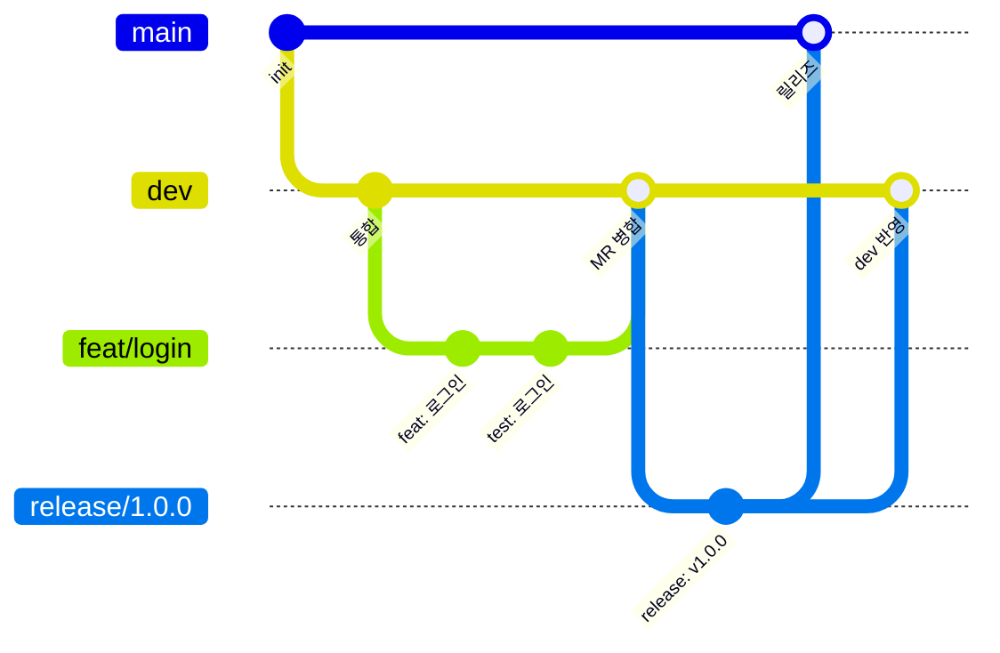

# 팀 온보딩 가이드

> 프로젝트 소개는 [루트 README](../README.md)에 있습니다. 이 문서는 **팀원용 실무 가이드**로,
> 클론 → 실행 → 첫 MR까지 이 문서 하나로 갈 수 있게 쓰였습니다.

```text
meong-go-spot/
├── android/    Kotlin + Jetpack Compose 앱            → Android Studio로 실행
├── backend/    Spring Boot 4.1 + Java 21 + Gradle    → http://localhost:8080/api/v1/ping
├── docs/       팀 규칙·가이드 문서 (아래 "문서 지도")
├── scripts/    루트 명령이 쓰는 보조 스크립트
├── .gitlab/    MR 템플릿  ·  .gitlab-ci.yml  MR 게이트
└── .ai/ .claude/ .agents/   AI 에이전트 하네스 (스킬)
```

| 역할 | 도구 |
|---|---|
| 코드 저장소 · 리뷰 | **GitLab (MR)** — 병합은 전부 MR로 |
| 이슈 · 일정 | **Jira 단일** — GitLab Issues는 사용하지 않음 |
| MR 게이트 | GitLab CI (`lint + typecheck + test` + AI 리뷰) |
| 배포 | Jenkins + Docker Compose — 서버 1 운영 중 (`<server1-host>`) |

모든 인프라 결정의 근거는 [ADR-001](handoff/ADR-001-인프라-결정기록.md)에 있습니다. 여기와 어긋나는 걸 만들기 전에 먼저 ADR을 바꾸세요.

## 기술 스택

| 영역 | 스택 | 검증 도구 |
|---|---|---|
| **Android** | Kotlin 2.0 · Jetpack Compose · AGP 8.7 · minSdk 26 | ktlint · JUnit |
| **Backend** | Java 21 (LTS) · Spring Boot 4.1 · Gradle 9.5 | Spotless(google-java-format) · Checkstyle · JUnit |
| **DB** | PostgreSQL 17 — 개발 서버는 `compose.dev.yml`, 테스트는 Testcontainers | — |
| **CI/CD** | GitLab CI (MR 게이트) · Jenkins (배포, 서버 1 운영 중) · Docker Compose | — |
| **훅·커밋** | lefthook · commitlint (Conventional Commits 13종) | — |
| **AI 리뷰** | Gemini (gemini-3.6-flash, non-blocking) | — |

> 로컬 JDK 버전은 상관없습니다(17+) — 백엔드는 Gradle Toolchain이 Java 21을 자동 프로비저닝합니다. Node 24+는 루트 하네스 도구(훅·커밋 검사)용입니다. Android 앱 개발자는 Android Studio(SDK 35)가 추가로 필요합니다.

---

## 1. 처음 받은 뒤 (5분)

**요구 사항**: Node.js 24+ (LTS) · JDK 17+ · Git · Docker(백엔드 DB용). Android 앱을 만질 사람은 **Android Studio**도 설치하세요 (SDK 경로는 `android/local.properties`에 각자 생성 — 커밋 금지).

```bash
git clone https://github.com/Kim-jin-gwang/meong-go-spot.git
cd meong-go-spot
npm run setup
```

`npm run setup` 하나가 의존성 설치와 **Git 훅(lefthook) 등록**까지 끝냅니다. 훅 등록을 건너뛰면 커밋 검사가 로컬에서 안 돌고 CI에서야 터지므로 반드시 setup으로 시작하세요.

동작 확인:

```bash
docker compose -f compose.dev.yml up -d postgres   # 개발 서버용 로컬 DB (최초 1회 후 재사용)
```

```bash
npm run dev:be   # → http://localhost:8080/api/v1/ping 이 {"code":"SUCCESS",...} 를 주면 OK
```

> 백엔드 첫 실행은 Gradle + JDK 21 다운로드 때문에 몇 분 걸립니다. 두 번째부터는 수 초.

## 2. 매일 쓰는 명령

| 명령 | 동작 |
|---|---|
| `npm run dev:be` | 백엔드 개발 서버 (앱은 Android Studio에서 실행) |
| `npm run check` | **커밋 전 필수.** Android(ktlint·unit test) + BE(spotless·checkstyle·test) 전체 검사 |
| `npm run fix` | 포맷·린트 자동 수정 — check가 빨간데 이유를 모르겠으면 일단 이것 |
| `npm run build:android` | 디버그 APK 빌드 (`android/app/build/outputs/apk/debug/`) |

`npm run check`와 MR 게이트(CI)는 **같은 검사**입니다. 로컬에서 초록이면 CI도 초록입니다.

## 3. 작업 흐름 (브랜치 → 커밋 → MR)

```bash
git switch dev && git pull
git switch -c feat/login               # <type>/<설명>
# ... 작업 ...
npm run check
git add <파일> && git commit           # 훅이 형식을 검사함
git push -u origin feat/login
```

- **브랜치**: `dev`에서 분기, 타입은 `feat|bugfix|refactor|docs|release|hotfix`. **브랜치명에 Jira 이슈 번호를 넣지 않습니다** (2026-08-31 팀 결정 — 이슈는 월요일 회의에서 별도 관리, CI가 형식을 정규식으로 검사)
- **커밋**: Conventional Commits 13종 (`feat` `fix` `docs` `chore` `ci` `test` `refactor` `style` `perf` `build` `revert` `release` `init`). Gitmoji 금지. 훅이 거부하면 메시지 형식부터 확인
- **dev 동기화는 `git merge dev` 하나로 통일. rebase·force push 금지** — 예외 없음
- **MR**: 생성 화면에서 브랜치 타입에 맞는 템플릿을 드롭다운으로 선택(자동 아님). 파이프라인 통과 없이는 병합 불가. 커밋마다 Gemini AI 리뷰 코멘트가 갱신되는데 **참고용**이며 병합을 막지 않음

### 브랜치 전략 한눈에



| 브랜치 | 어디서 분기 | MR 대상 | 용도 |
|---|---|---|---|
| `main` | — | — | 항상 배포 가능한 안정 상태 (직접 push 불가) |
| `dev` | `main` | — | 개발 통합 (MR로만 변경 — 규약) |
| `feat/*` `bugfix/*` `refactor/*` `docs/*` | `dev` | `dev` | 일상 작업 — 여기서만 커밋합니다 |
| `release/*` | `dev` | `main` **+ dev 반영** | 릴리즈 검증 |
| `hotfix/*` | `main` | `main` **+ dev 반영** | 운영 긴급 수정 |

- dev 동기화는 `git merge dev` 하나 — **rebase·force push 금지**
- 상세 규칙: [branch-strategy.md](branch-strategy.md)
- 참고: 이 전략은 [Git-Flow](https://nvie.com/posts/a-successful-git-branching-model/)의 축약형입니다 (rebase 미사용, 브랜치 이름은 main/dev/feat 계열로 단순화)

### 커밋이 거부될 때

| 증상 | 원인·해결 |
|---|---|
| pre-commit에서 파일이 바뀜 | 포매터가 자동 수정 후 재스테이징한 것 — 정상, 그대로 진행 |
| commit-msg에서 거부 | 메시지가 `<type>: <제목>` 형식인지, type이 13종에 있는지 확인 |
| `android-check`/`be-check` CI 실패 | 로컬에서 `npm run check`로 재현 → `npm run fix` → 남은 건 직접 수정 |
| 파이프라인이 pending에서 안 움직임 | 러너 문제 — [protected-branches-setup.md §0.5](protected-branches-setup.md) |

## 4. 규칙을 어기면 어떻게 되나 — 3개의 벽

어느 지점에서 걸리느냐에 따라 보이는 화면이 다릅니다. 전부 실제로 검증된 동작입니다.

**1차 벽 — 커밋하는 순간 (터미널)**

커밋 메시지 형식이 틀리면 커밋이 만들어지지 않고 터미널에 이유가 뜹니다:

```text
✖   type must be one of [init, feat, fix, build, chore, ci, docs,
    style, refactor, test, perf, revert, release] [type-enum]
✗ commitlint
```

포맷이 안 맞는 코드는 혼나는 게 아니라 **조용히 자동 수정 후 재스테이징**되고 커밋은 성공합니다.

**2차 벽 — MR 올린 뒤 (GitLab 화면)**

훅을 우회했거나 훅이 못 잡는 위반(타입 오류, 테스트 실패, 브랜치명 위반)은 MR 페이지에서 걸립니다:

- 파이프라인에 빨간 ✗ + 실패한 잡 이름 — 클릭하면 로그에 정확한 원인 (예: `error TS2322: Type 'string' is not assignable to type 'number'`)
- **Merge 버튼 비활성화** + "Merge blocked: pipeline must succeed" — 리뷰어가 봐줄 필요도 없이 병합 자체가 안 됨
- Gemini AI 리뷰 코멘트는 함께 달리지만 참고용 — 빨간불의 원인이 아님

**3차 벽 — push 자체 거부 (서버)**

`main`에 직접 push하면 서버가 거부합니다 (`dev`는 팀 결정으로 보호하지 않지만, 직접 push하면 push 파이프라인이 깨짐을 사후에 알려줍니다):

```text
remote: GitLab: You are not allowed to push code to protected branches
! [remote rejected] dev -> dev (pre-receive hook declined)
```

> 단 하나, **secret(API 키·비밀번호) 커밋은 자동으로 잡는 벽이 없습니다.** 커밋 전에 스스로 확인하거나 `scan-secrets-and-config` 스킬을 사용하세요. 한 번 커밋된 비밀값은 히스토리에 남아 키 폐기 말고는 답이 없습니다.

## 5. 문서 지도 — 뭘 언제 읽나

폴더는 평평하지만 문서는 용도별로 6묶음입니다. "지금 하려는 일"이 있는 줄을 찾으세요.

**📦 기획 — 무엇을 만드는가** (`product/`)

| 상황 | 문서 |
|---|---|
| 기능 범위·인수 조건 확인 | [product/mvp-user-requirements-spec.md](product/mvp-user-requirements-spec.md) |
| 화면 흐름·접근 정책 확인 | [product/user-flow.md](product/user-flow.md) |
| 화면 구성·와이어프레임 확인 | [product/wireframes/README.md](product/wireframes/README.md) |

**📐 설계 계약 — 어떻게 생겼는가**

| 상황 | 문서 |
|---|---|
| 시스템 전체 그림·NFR | [architecture.md](architecture.md) |
| API 요청·응답 계약 | [api-spec.md](api-spec.md) |
| DB 스키마·불변식 | [erd.md](erd.md) (+ ERDCloud 표기: [erd-table-guide.md](erd-table-guide.md), 임포트: `erdcloud-import.sql`) |
| DATA↔AI 역할 경계·임베딩 계약 | [data-ai-interface.md](data-ai-interface.md) |

**⚖️ 결정 기록 — 왜 이렇게 정했는가**

| 상황 | 문서 |
|---|---|
| 제품 스택 결정 (D1~D8) | [ADR-002](adr/ADR-002-제품-스택-결정기록.md) |
| 인프라·협업 도구 결정 | [ADR-001](handoff/ADR-001-인프라-결정기록.md) |

**📏 규칙·워크플로우 — 어떻게 작업하는가**

| 상황 | 문서 |
|---|---|
| 코드 스타일·구조 | [code-convention.md](code-convention.md) |
| 브랜치를 만들 때 | [branch-strategy.md](branch-strategy.md) |
| 커밋 메시지를 쓸 때 | [commit-strategy.md](commit-strategy.md) |
| MR을 올릴 때 (작성자 귀속 규칙 포함) | [mr-guide.md](mr-guide.md) |
| Jira 이슈를 쓸 때 | [jira-issue-guide.md](jira-issue-guide.md) |
| Secret·설정 파일 다룰 때 | [gitignore-guide.md](gitignore-guide.md) · [editor-config.md](editor-config.md) · [git-attributes.md](git-attributes.md) |
| AI 에이전트 스킬 사용법 | [skill-guide.md](skill-guide.md) |

**🔧 백엔드 가이드**

| 상황 | 문서 |
|---|---|
| 공통 응답·오류·설정 | [backend-common-settings.md](../backend/docs/backend-common-settings.md) |
| 인증 토큰·Android 저장·서명 키 운영 | [auth-token-policy.md](auth-token-policy.md) |
| 전화 인증·개인정보·멱등성·DB migration·비동기 작업·운영 기준 | [backend-security-operations-policy.md](backend-security-operations-policy.md) |
| API 구현 절차 | [backend-api-development-guide.md](../backend/docs/backend-api-development-guide.md) |
| Codex로 Jira 백엔드 이슈 시작 | [backend-codex-start-guide.md](../backend/docs/backend-codex-start-guide.md) |
| ping 예제로 구조 익히기 | [backend-ping-guide.md](../backend/docs/backend-ping-guide.md) |

**🖥️ 인프라 운영**

| 상황 | 문서 |
|---|---|
| 배포·롤백 | [deploy-guide.md](deploy-guide.md) |
| 빅데이터 클러스터 (Hadoop·Kafka) 운영·접속 | [bigdata-cluster.md](bigdata-cluster.md) |
| GitLab 저장소 초기 설정 (관리자) | [protected-branches-setup.md](protected-branches-setup.md) |
| AI 리뷰가 뭔지 궁금할 때 | [ai-review-gemini.md](ai-review-gemini.md) |

> `handoff/`의 나머지(KICKOFF, harness_study, 인프라 체크리스트)는 초기 인수인계 아카이브 — 일상 작업에서 읽을 일 없음.

규칙 문서와 실제 설정이 다르면 임의로 판단하지 말고 팀에 공유하세요 — 설정 파일이 원본입니다.

## 6. AI 에이전트를 쓴다면

Claude Code · Codex · Antigravity 모두 지원합니다. 공통 진입점은 [AGENTS.md](../AGENTS.md)이고, Codex로 백엔드 Jira 이슈를 시작할 때는 [Backend Codex 개발 시작 가이드](../backend/docs/backend-codex-start-guide.md)를 따릅니다. 검사·초안 작성용 스킬 7종의 사용법은 [skill-guide.md](skill-guide.md)에 있습니다.

## 7. 로컬 DB · 배포

- 로컬 PostgreSQL — 백엔드 개발 서버 실행 시 `docker compose -f compose.dev.yml up -d postgres`를 사용합니다. 테스트는 `SPRING_DATASOURCE_URL`이 없으면 Testcontainers가 PostgreSQL 17을 자동 실행하므로 Docker만 켜져 있으면 됩니다.
- 배포 대상은 **backend뿐**입니다 (앱은 스토어/APK 배포). Jenkins + `compose.prod.yml` —
  **서버 1에서 운영 중**이며 현재 HTTP 주소는 인증 기능이 없는 초기 스캐폴드입니다.
  A2~A4 운영 전 TLS·Secret mount가 필수입니다 ([deploy-guide.md](deploy-guide.md) 참조).

## 8. 절대 하지 말 것

- `main`·`dev` 브랜치에 **직접** push (`git push origin dev` 같은 것). push는 항상 본인 작업 브랜치로 하고, `dev`는 MR 병합 버튼으로 바꿉니다 (main은 서버가 막고, dev는 규약 — 막히지 않는다고 해도 되는 게 아닙니다)
- `.env` 등 secret 커밋 — `.env.example`만 커밋 대상. 이미 커밋했다면 `.gitignore` 추가로 끝나지 않으니 즉시 팀 공유 후 키 폐기
- rebase · force push
- GitLab Issues에 이슈 생성 (Jira로)
- `--no-verify`로 훅 우회
