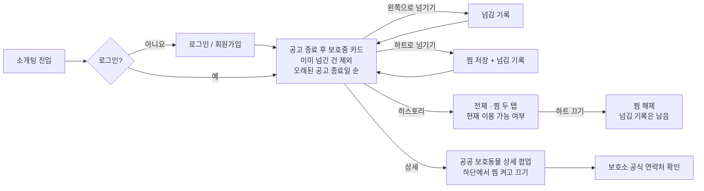
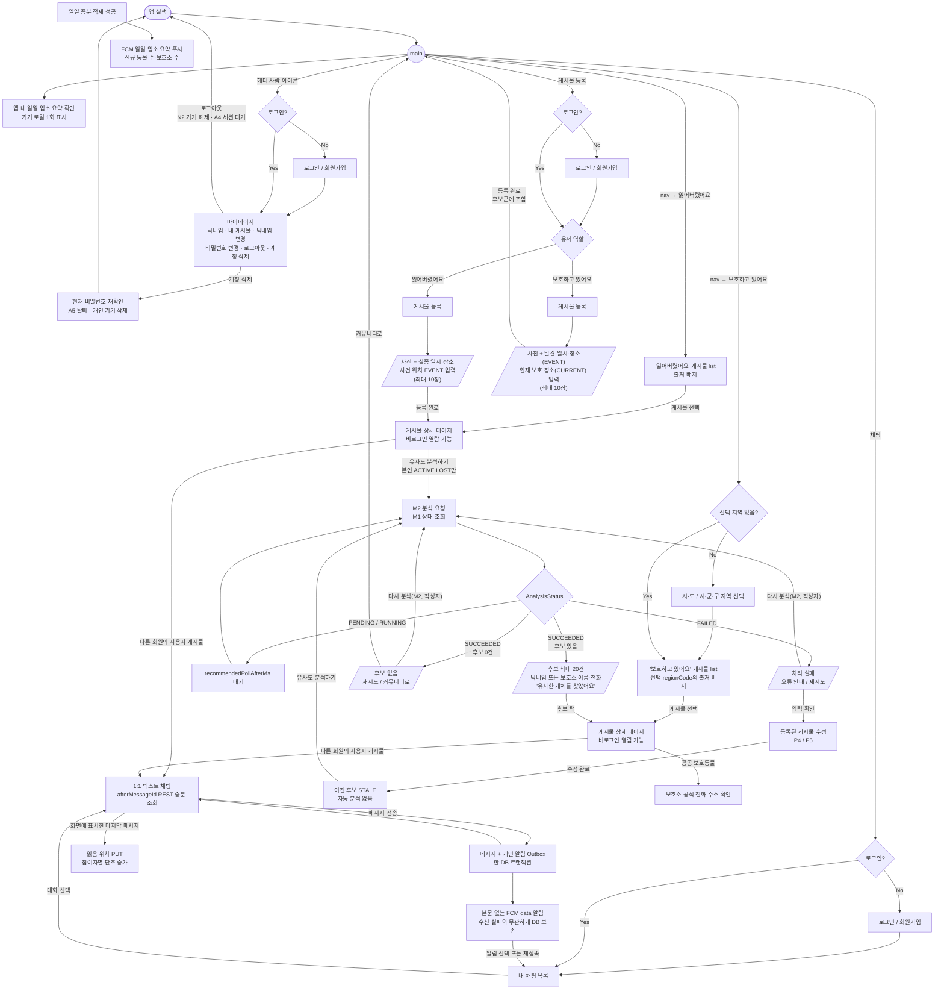

# 유저 플로우

> 상태: **개발 기준** — 이 Markdown이 현재 흐름의 단일 기준이다. [user-flow.svg](user-flow.svg)는
> 핵심 게시물 흐름만 그린 시각 요약이며 인증·탈퇴 등 세부 분기는 이 문서를 우선한다.

## 핵심 모델

- 모든 것이 **게시물(post)** 이다. 유저 역할에 따라 두 종류:
  - **"잃어버렸어요"**: 반려동물을 잃어버린 보호자가 사진 + 메타데이터로 등록
  - **"보호하고 있어요"**: 동물을 보호 중인 쪽(보호소 등)이 등록
- MVP 매칭은 **`잃어버렸어요 → 보호 중 동물` 단방향 연결**이다. `잃어버렸어요` 상세에서 사용자 `보호하고 있어요` 게시물과 공공 보호동물의 후보를 유사도 순으로 최대 20건 나열하고, 각 후보는 해당 상세 페이지로 이동한다.
- `잃어버렸어요` 등록만으로는 분석하지 않는다. 작성자가 활성 게시물 상세의 `유사도 분석하기`를 선택하면 처리 중 상태를 조회하고, 완료 결과를 후보 있음·후보 없음·처리 실패로 구분한다.
- `보호하고 있어요` 상세에서 `잃어버렸어요` 후보를 역방향으로 제공하거나 개별 후보를 자동 알림으로 보내는 기능은 MVP 이후(P1) 범위다.
- 비로그인 사용자는 두 게시물 목록·상세와 `사용자` 또는 `보호소` 출처 배지까지 열람할 수 있다 (2026-09-21 QA로 상세 열람을 공개 전환). 목록에는 출처 배지만, 작성자 닉네임·보호소 이름·공식 전화번호는 상세에서 제공하고, 유사 후보에는 후보 확인에 필요한 출처별 정보를 표시한다.
- 후보 조회, 등록·수정·종료, 채팅 등 쓰기·개인화 기능은 로그인해야 사용할 수 있다. 정확한 위치는 로그인 상세에서만 표시한다.
- 회원가입 비밀번호는 NFC 기준 8~64자이며 공백·제어·형식 문자를 허용하지 않는다. Android는 비밀번호와 확인값을 NFC로 정규화해 비교하고, 일치할 때 확인값을 제외한 A1 요청을 보낸다.
- 로그인 실패는 아이디 존재 여부를 구분하지 않는다. 계정 15분 내 5회 또는 IP 10분 내 20회 실패 제한에 걸리면 남은 대기 시간을 안내하며, 15분 뒤 다시 시도할 수 있고 영구 잠금하지 않는다.
- 가입 인코딩·로그인 실제/dummy 비교·프로필 상향 재인코딩은 같은 Argon2 공용 실행권을 사용한다. 포화는 로그인 실패 제한과 구분해 1초 뒤 재시도를 안내하고 실패 횟수에는 포함하지 않는다.
- 휴대전화 인증 성공은 10분·1회용 `pv1` 불투명 가입 증명을 발급하며, 현재 `privacy-collection-v1` 고지 동의가 있어야 가입할 수 있다. 닉네임 중복은 허용한다.
- 회원 탈퇴는 현재 비밀번호 재확인 뒤 즉시 모든 세션과 게시물 공개를 차단한다. 계정 보호값 파기가 30일 뒤 완료되면 같은 번호로 다시 가입할 수 있으며 영구 차단하지 않는다. 사용자 게시물·위치·매칭·채팅과 HDFS 사진도 30일 이내 삭제·익명화하고 실패는 완료까지 재시도한다.
- 사용자 게시물에서는 개인 연락처 대신 상세의 작성자 닉네임과 1:1 텍스트 채팅(로그인 필수)을 제공한다.
  채팅 목록은 안 읽은 메시지 수를 표시하고 열린 대화는 REST 증분 조회로 갱신한다. 공공
  보호동물의 보호소 이름·공식 전화번호와 보호소 주소는 상세에서 제공한다.
- 목록 지역 검색은 사건 위치의 5자리 `EVENT.regionCode`로 수행하고 `EVENT.publicLocation`은 코드에서 만든 표시값이다. 비로그인 목록에는 정확한 주소·건물명·좌표를 표시하지 않는다.
- 두 공개 목록은 최신순을 기본으로 하고 오래된순으로 전환할 수 있다. 정렬을 바꾸면 기존 목록과 커서를 비우고 검색어·선택 지역을 유지한 채 첫 페이지부터 다시 조회한다.
- 사용자 게시물의 실종·발견 날짜는 한국 시간 기준 오늘까지만 등록·수정할 수 있으며 미래 날짜는 허용하지 않는다.
- 정확한 위치 공개는 위치별 기본 `OFF`다. `exact-location-v1` 안내를 확인하고 켠 위치만 다른 회원이 활성 사용자 게시물의 로그인 상세에서 볼 수 있다. 공개 유지 중 정확한 위치를 바꿀 때도 재확인하며 정책 버전이 올라가면 재확인 전까지 노출하지 않는다. 작성자 관리 화면은 비공개 저장 위치와 스위치 상태를 복원하지만 목록·검색·후보에는 표시하지 않고 좌표는 작성자에게도 숨긴다.
- 일일 증분 적재가 성공하면 신규 보호동물 수·보호소 수를 FCM 푸시로 안내하고, 앱을 연 모든
  사용자는 같은 요약을 앱 안에서 한 번 확인한다. 개인 채팅의 새 메시지는 수신자의 활성 인증 세션 등록에
  본문 없는 data 알림으로 안내한다. 개별 유사 후보 알림은 제공하지 않는다.
- P1 입양 탐색은 실종 동물 유사도 매칭과 분리한다. 공고 종료 후에도 원천 상태가 `보호중`인 공공 보호동물을 지역·축종·성별로 조회해 공고 종료일이 오래된 순서로 보여 준다. 로그인 회원만 쓰며, 넘긴 건은 방향 없이 기록해 다음 조회에서 빼고 명시적 찜은 따로 저장한다(2026-09-25). 상세 계약은 [입양 탐색 P1 MVP 계약](adoption-discovery-mvp.md)을 따른다.

## 접근 정책

| 기능 | 비로그인 | 로그인 |
|---|:---:|:---:|
| `잃어버렸어요` 목록 | ○ | ○ |
| `보호하고 있어요` 목록 | ○ | ○ |
| 목록의 출처별 표시 정보 | `사용자` 또는 `보호소` 출처 배지 | 동일 |
| 게시물 상세 | ✕ | ○ |
| 매칭 상태·후보 조회 | ✕ | 본인 활성 사용자 `잃어버렸어요` 게시물의 작성자만 |
| 게시물 등록·수정·종료 | ✕ | ○ |
| 사용자 게시물 1:1 채팅 | ✕ | 다른 회원의 활성 게시물에서 ○ |
| 채팅 목록·읽음 위치·개인 채팅 알림 | ✕ | 참여한 대화와 본인 활성 인증 세션 등록만 |
| 보호소 주소 확인 | ✕ | 공공 보호동물 상세에서 ○ |
| 입양 후보 카드 탐색 | ○ | ○. 본인 찜 여부 표시 |
| 입양 찜 추가·해제·목록 | ✕ | 본인만 |
| 사건 위치(`EVENT`) 공개 지역 | 시·군·구 및 읍·면·동 수준으로 ○ | 동일 |
| 정확한 위치 확인 | ✕ | 다른 회원은 활성 사용자 게시물의 위치별 공개 선택 시 ○, 작성자는 자신의 관리용 값 확인 |

Android는 본인 활성 사용자 `잃어버렸어요` 상세에서만 M1 상태·후보 조회와 폴링을 시작한다.
타인·종료·삭제·공공·`보호하고 있어요` 상세에서는 분석 영역을 표시하거나 M1을 호출하지 않는다.
로그아웃·계정 전환·게시물 종료 또는 서버의 권한·상태 거부 시 폴링을 중단하고 기존 결과 표시를 제거한다.
서버는 화면 진입 경로와 관계없이 M1의 작성자 권한을 매 요청마다 검증한다.

## P1 입양 탐색 플로우

로그인한 회원만 들어간다. 넘긴 동물은 기록해 두고 다음 조회에서 빼므로, 앱을 다시 켜거나 기기를
바꿔도 같은 얼굴을 두 번 보지 않는다(2026-09-25). 찜한 아이는 히스토리의 찜 탭에서 확인하고
해제하며, 마이페이지에 따로 목록을 두지 않는다.

후보 카드에는 보호소 이름·전화번호·주소와 정확한 위치를 표시하지 않는다. 가정 프로필·성격 기반
개인화는 검증된 동물 특성 데이터와 개인정보 정책이 정해질 때까지 수집·계산하지 않는다.

## 전체 플로우

## 분기·예외 (TODO)

- [ ] 게시물 수정·삭제 상세 화면 흐름
- [ ] 매칭 완료 시(반환/입양) 게시물 상태 전환 흐름
- [ ] 게시물 종료 후 기존 채팅 읽기 전용 전환 흐름
- [ ] 휴대전화 인증 코드 재전송·만료·중복 번호 문의의 상세 화면 흐름 — 핵심 정책은 확정

## 확정된 결정

- 비로그인 사용자는 두 게시물 목록·상세와 출처 배지까지 열람 가능 (2026-09-21 QA로 상세 공개 전환. 정확한 위치는 로그인 상세만)
- 게시물 등록·수정·종료와 채팅은 로그인 필수
- 매칭 상태·후보 조회는 로그인한 본인 ACTIVE USER_POST/LOST 작성자만 허용하며, 타인 상세 열람 권한과 분리한다
- 게시물당 사진 최대 10장
- `잃어버렸어요`만 매칭 기준이 되고 사용자·공공 `보호하고 있어요` 데이터가 후보가 되는 단방향 MVP
- 후보는 임계값 통과 후 유사도 순으로 최대 20건 표시하며 원시 점수·백분율·정확한 거리 값은 사용자에게 노출하지 않음
- `잃어버렸어요` 등록만으로 분석하지 않고, 본인 활성 상세의 `유사도 분석하기` 선택 뒤 처리 중·후보 있음·후보 없음·처리 실패를 구분하며, 작성자는 후보 없음·실패 상태에서 다시 분석 가능
- `보호하고 있어요` 등록 후에는 역방향 매칭 화면을 열지 않고 향후 `잃어버렸어요`의 후보군에 포함됐음을 안내
- 사용자 `보호하고 있어요` 게시물과 공공 보호동물은 같은 목록에서 출처를 구분해 표시
- 회원 휴대전화 번호는 가입 시 인증·보호 저장하고 다른 회원에게 노출하지 않으며, 사용자 게시물 작성자 닉네임은 상세에서 표시
- 휴대전화 인증은 국내 `010` 번호에 3분 유효한 6자리 코드를 전송하고, 60초 재전송 간격과 번호·IP별 발송 제한 및 코드당 확인 실패 5회를 적용하며, 성공 시 10분 유효·1회용 가입 증명을 발급
- 회원 탈퇴는 현재 비밀번호 재확인 후 즉시 전체 세션과 공개를 차단하고, 30일 개인정보 파기 뒤 번호 재가입을 허용
- 회원가입 비밀번호는 NFC 기준 8~64자이고 모든 공백·제어·형식 문자를 금지하며 문자 종류 조합은 강제하지 않음. Android의 확인 입력은 NFC 기준 일치만 검사하고 A1에 보내지 않음
- 로그인은 아이디 미존재·비밀번호 불일치·형식 불일치를 같은 오류로 안내하고, 계정 15분 내 5회 또는 IP 10분 내 20회 실패부터 15분 동안 일시 제한하되 영구 잠금하지 않음
- 모든 요청 경로의 Argon2 작업은 같은 공용 실행권으로 동시 최대 4개만 수행하고, 포화 시 로그인 제한과 다른 일시 과부하로 안내
- 공공 보호동물은 유사 후보·상세에 보호소 이름·공식 전화번호를 표시하고 보호소 주소는 상세에서만 표시
- 목록 검색은 항상 사건 위치 `EVENT.regionCode`, 표시는 코드에서 만든 `EVENT.publicLocation`을 사용하며 정확한 주소·건물명·좌표는 비로그인 사용자에게 표시하지 않음
- `잃어버렸어요`와 `보호하고 있어요` 목록은 최신순을 기본으로 하고 오래된순을 선택할 수 있으며 검색·재시도·더 보기에도 선택값을 유지
- 사용자 사건 날짜는 서버의 `Asia/Seoul` 기준 오늘까지 허용하고 미래 날짜는 등록·수정하지 않음
- 로그인 상세는 `EVENT`와 사용자 `보호하고 있어요`의 `CURRENT`를 구분하고, 다른 회원에게는 `exact-location-v1` 안내를 확인해 공개를 켠 활성 위치만 표시. 작성자 관리 화면은 자신의 저장 위치와 공개 상태를 복원
- 다른 회원의 활성 사용자 게시물에서만 1:1 텍스트 채팅을 생성하며, 본인 게시물과 공공 보호동물에는 채팅을 제공하지 않음
- 종료된 게시물의 기존 채팅은 읽기만 가능하며 이미지·파일·그룹 채팅·메시지 수정·삭제·차단·신고는 MVP에서 제외
- 참여자별 마지막 읽음 메시지 ID는 `chat_room`에서 앞으로만 이동하고, 채팅 목록은 상대가 보낸 안 읽은 메시지 수를 표시
- 열린 대화는 WebSocket·SSE 대신 `afterMessageId` REST 증분 조회를 약 3초마다 사용하며, GET 조회만으로 읽음 처리하지 않음
- 새 메시지와 개인 알림 Outbox는 한 DB 트랜잭션에 저장하고, 수신자의 현재 활성 인증 세션 등록에 채팅 본문 없는 FCM data 알림만 발송. 푸시 실패·연결 단절에도 DB 조회로 복구
- 일일 증분 적재 성공 시 신규 보호동물 수·보호소 수는 토픽 FCM 푸시와 앱 내 요약으로 제공하고, 개별 유사 후보 알림은 제공하지 않음
